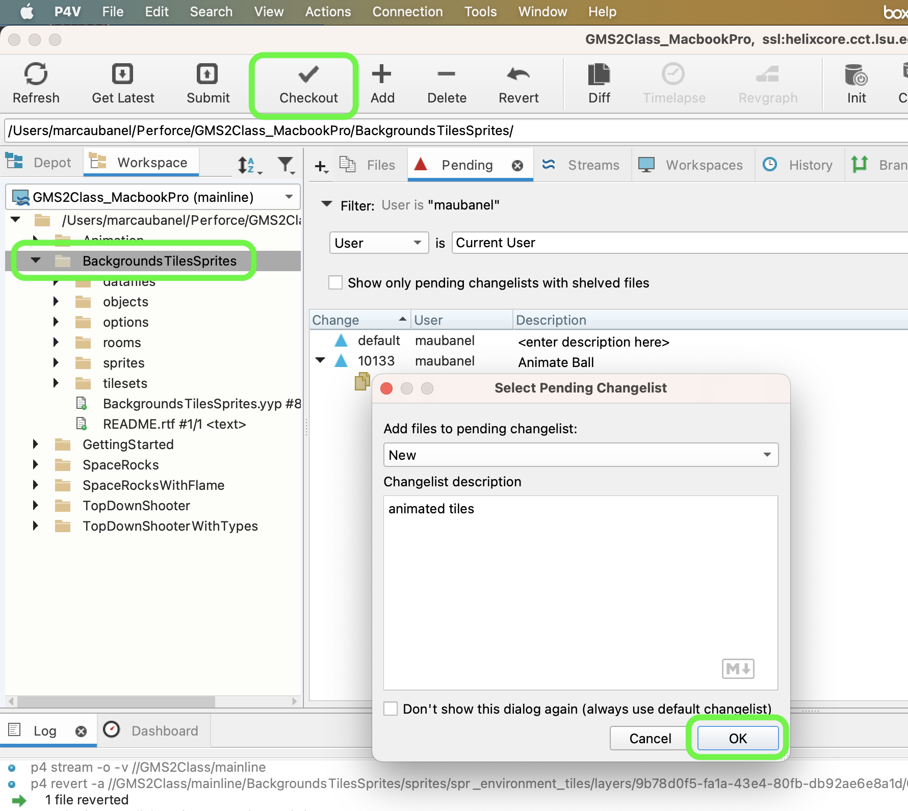
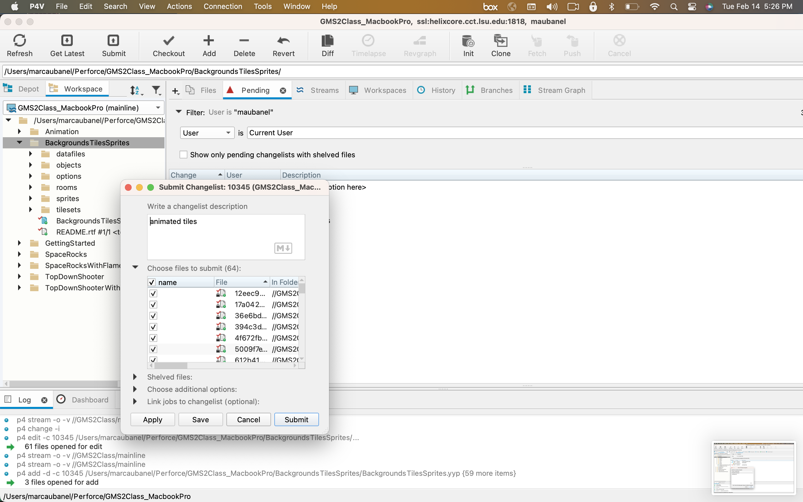
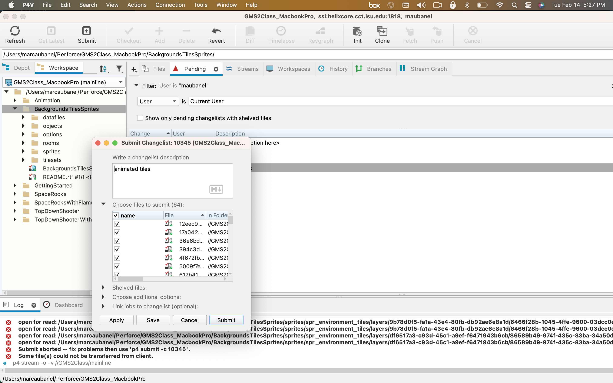

### Animated Tiles

[previous](../tile-brushes/README.md#user-content-tile-brushes) • [home](../README.md#user-content-gms2-background-tiles--sprites---table-of-contents) • [next](../transparent-tiles/README.md#user-content-transparent-tiles)

You can also have each tile animate along its x and y axis.  Lets give it a shot.

 

---

##### `Step 1.`\|`BTS`|:small_blue_diamond:

Open up **P4v**.  Select the top folder of the **GameMaker** project. Press the <kbd>Checkout</kbd> button.  Checkout out all files in P4V so that they are all writable (otherwise they will be read only and none of the changes will be saved). Select a **New** changelist and add a message describing the unit of work you will be performing. Press the <kbd>OK</kbd> button.

Open up the project you are working on in **GameMaker**. 

##### `Step 2.`\|`BTS`|:small_blue_diamond: :small_blue_diamond: 

*Download* [spr_animated_backgrounds.psd](../Assets/Photoshop/spr_animated_backgrounds.psd). I have provided an sprite sheet with an animated water sprite.  Copy and paste the 8 cells into **ts_environment**.  Make sure the grid is on so you can see the placement is on the grid boundary. Press **File | Export | Quick Export as PNG** and export the entire tilesheet as a `.png` file. Bring it into GameMaker by opening **spr_environment** and re-importing the new sprite sheet.  Also, reassign the texture to the tileset so it binds to teh new sprite sheet.

https://user-images.githubusercontent.com/5504953/218881916-1140eb43-0f75-4f91-9709-3a89d24b3568.mp4

##### `Step 3.`\|`BTS`|:small_blue_diamond: :small_blue_diamond: :small_blue_diamond:

Once a frame is marked as animated though it can no longer be used as a static file. *Press* the **Tile Animation** button.  THere are a few things to notice.  This animation sheet can only have one framerate for all the animations.  We will set it at `4` FPS to slow it down a bit.  The number of animation frames has to be a power of 2 either 2, 4, 8, 16, 32, 64, 128 or 256. Press the small downward arrow and select `8`.
	
Assign each frame from left to right and fill up all 8 slots, starting with the water tile on the far left and ending with the tile on the far right. There is a <kbd>Play</kbd> button to preview the animation and you can change the frame rate to your liking.  

##### `Step 4.`\|`BTS`|:small_blue_diamond: :small_blue_diamond: :small_blue_diamond: :small_blue_diamond:

##### `Step 5.`\|`BTS`| :small_orange_diamond:

Call this newly created library entry water_animation.

##### `Step 6.`\|`BTS`| :small_orange_diamond: :small_blue_diamond:
*Right click* on **Rooms** and select **Create | Room** and drag it to the top of the list in **Room Priorities**.  Call it `rm_water_animation`.  

Go to **Room Settings** and change the **Width** to `1920` and **Height** to `1080`. *Create* another **Tile Layer** and call it `Animation`.  *Drag* it between **Instances** and **Background**.
	
Select the new **Animation** layer and assign the new `tls_animated_background_tiles` tile set to it. This contains the static tiles and the animated water tiles you just created.

https://user-images.githubusercontent.com/5504953/143765241-a75324aa-87f4-48e8-8fe0-2458d706106c.mp4

##### `Step 7.`\|`BTS`| :small_orange_diamond: :small_blue_diamond: :small_blue_diamond:

While on the **Animation** layer *select* the **Room Edtior** tab. The **Water Animation** will appear at the bottom.  *Select* the **Libraries** tab in the **Room Editor** and select the new **water_animation** item. Click on the **fill** bucket tool and fill the screen with water hit the <kbd>Play</kbd> button. Notice that I forgot to move the **rm_water_animation** to the top of the **Room Order** list. Now this doesn't tile very well.

https://user-images.githubusercontent.com/5504953/143765492-7954b691-acc0-45d0-a32f-15055713c074.mp4

##### `Step 8.`\|`BTS`| :small_orange_diamond: :small_blue_diamond: :small_blue_diamond: :small_blue_diamond:

Now I did tile the water horizontally so we can offset which frame the animation begins on.  Increase the brush size and delete the old water tiles.  

We can go back to the **Brushes** tab and *shift* select all 8 of them as if they are static tiles.  Now once they are marked for animation, they will always animate.  But if I shift select all 8 they will all start on a different frame.  So rather than every tile starting on the same frame they will be offset and will lead to better looking water.  All 8 frames tile perfectly horizontally and we will offset them vertically so they will not stitch but the illusion should still hold. Paint the tiles on to the level 8 at a time offsetting them vertically by one tile. Now *press* the <kbd>Play</kbd> button in the top menu bar to launch the game and now you have much better looking water animation.

https://user-images.githubusercontent.com/5504953/143766412-96e33942-3704-45ea-b17d-3842424b52f5.mp4

##### `Step 9.`\|`BTS`| :small_orange_diamond: :small_blue_diamond: :small_blue_diamond: :small_blue_diamond: :small_blue_diamond:

Select the **File | Save Project**, then press **File | Quit** (PC) **Game Maker | Quit** on Mac to make sure everything in the game is saved.

##### `Step 10.`\|`BTS`| :large_blue_diamond:

Open up **P4V**.  Select the top folder and press the **Add** button.  We want to add all the new files we created during this last session.  Add these files to the last change list you used at the begining of the session (in my case it was `Spaceship I portion of walkthrough`). Press the <kbd>OK</kbd> button.

##### `Step 11.`\|`BTS`| :large_blue_diamond: :small_blue_diamond: 

Now you can submit the changelist by pressing both <kbd>Submit</kbd> buttons.

<!--  -->

| [previous](../tile-brushes/README.md#user-content-tile-brushes)| [home](../README.md#user-content-gms2-background-tiles--sprites---table-of-contents) | [next](../transparent-tiles/README.md#user-content-transparent-tiles)|
|---|---|---|
