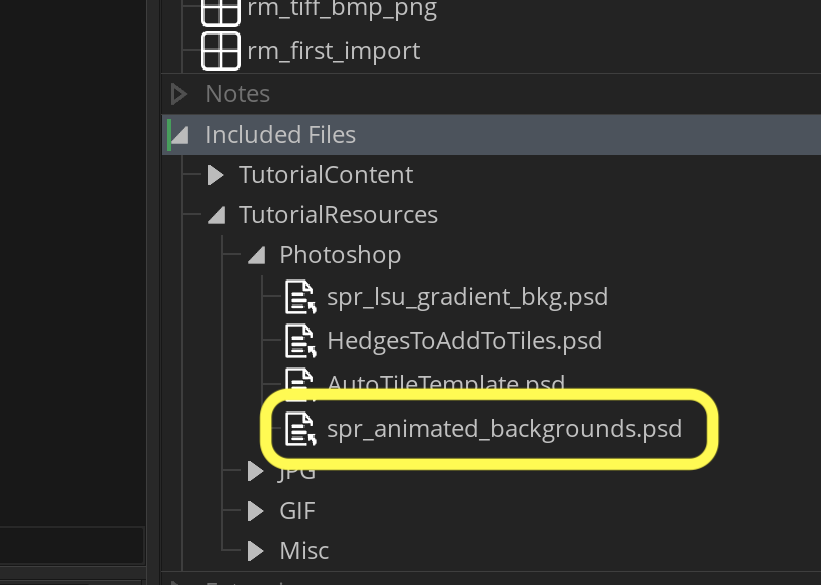
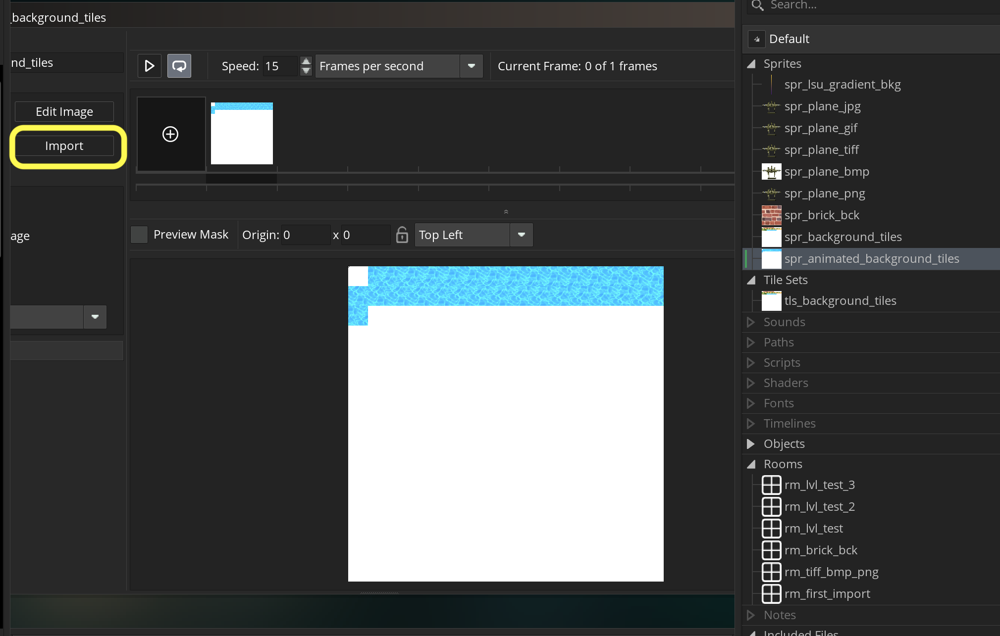

### Animated Tiles

[previous](../tile-brushes/README.md#user-content-tile-brushes) • [home](../README.md#user-content-gms2-background-tiles--sprites---table-of-contents) • [next](../transparent-tiles/README.md#user-content-transparent-tiles)

You can also have each tile animate along its x and y axis.  Lets give it a shot.

 

---

##### `Step 1.`\|`BTS`|:small_blue_diamond:

*Download* [spr_animated_backgrounds.psd](../Assets/Photoshop/spr_animated_backgrounds.psd). I have provided an sprite sheet with a single animated water sprite.  

##### `Step 2.`\|`BTS`|:small_blue_diamond: :small_blue_diamond: 

*Open* the file in **Photoshop**.  Notice that the top left tile is **ALWAYS** left blank. **Export** it as a **PNG**.  

Go to **GameMaker** and create a new **Sprite**.  Call it `spr_animated_backgrounds` and press the <kbd>Import</kbd> button.  Select the **PNG** you just exported.

##### `Step 3.`\|`BTS`|:small_blue_diamond: :small_blue_diamond: :small_blue_diamond:

Create a new **Tileset** and call it *ts_animated_background_tiles*.  *Press* the **Tile Set Properties** button and set the **Tile Width** and **Tile Height** to `64`.

*Press* the **Tile Animation** button.  THere are a few things to notice.  This animation sheet can only have one framerate for all the animations.  We will leave it at `15` FPS.  The number of animation frames has to be a power of 2 either 2, 4, 8, 16, 32, 64, 128 or 256. Press the small downward arrow and select `32`.
	
Assign each frame from left to right and fill up all 32 slots.

##### `Step 4.`\|`BTS`|:small_blue_diamond: :small_blue_diamond: :small_blue_diamond: :small_blue_diamond:

##### `Step 5.`\|`BTS`| :small_orange_diamond:

##### `Step 6.`\|`BTS`| :small_orange_diamond: :small_blue_diamond:

##### `Step 7.`\|`BTS`| :small_orange_diamond: :small_blue_diamond: :small_blue_diamond:

##### `Step 8.`\|`BTS`| :small_orange_diamond: :small_blue_diamond: :small_blue_diamond: :small_blue_diamond:

##### `Step 9.`\|`BTS`| :small_orange_diamond: :small_blue_diamond: :small_blue_diamond: :small_blue_diamond: :small_blue_diamond:

##### `Step 10.`\|`BTS`| :large_blue_diamond:

##### `Step 11.`\|`BTS`| :large_blue_diamond: :small_blue_diamond: 

##### `Step 12.`\|`BTS`| :large_blue_diamond: :small_blue_diamond: :small_blue_diamond: 

##### `Step 13.`\|`BTS`| :large_blue_diamond: :small_blue_diamond: :small_blue_diamond:  :small_blue_diamond: 

##### `Step 14.`\|`BTS`| :large_blue_diamond: :small_blue_diamond: :small_blue_diamond: :small_blue_diamond:  :small_blue_diamond: 

##### `Step 15.`\|`BTS`| :large_blue_diamond: :small_orange_diamond: 

##### `Step 16.`\|`BTS`| :large_blue_diamond: :small_orange_diamond:   :small_blue_diamond: 

##### `Step 17.`\|`BTS`| :large_blue_diamond: :small_orange_diamond: :small_blue_diamond: :small_blue_diamond:

##### `Step 18.`\|`BTS`| :large_blue_diamond: :small_orange_diamond: :small_blue_diamond: :small_blue_diamond: :small_blue_diamond:

##### `Step 19.`\|`BTS`| :large_blue_diamond: :small_orange_diamond: :small_blue_diamond: :small_blue_diamond: :small_blue_diamond: :small_blue_diamond:

##### `Step 20.`\|`BTS`| :large_blue_diamond: :large_blue_diamond:

##### `Step 21.`\|`BTS`| :large_blue_diamond: :large_blue_diamond: :small_blue_diamond:

___

| [previous](../tile-brushes/README.md#user-content-tile-brushes)| [home](../README.md#user-content-gms2-background-tiles--sprites---table-of-contents) | [next](../transparent-tiles/README.md#user-content-transparent-tiles)|
|---|---|---|
