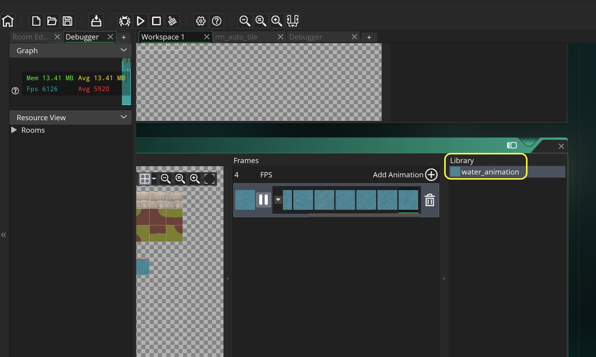

### Animated Tiles

[previous](../tile-brushes/README.md#user-content-tile-brushes) • [home](../README.md#user-content-gms2-background-tiles--sprites---table-of-contents) • [next](../transparent-tiles/README.md#user-content-transparent-tiles)

You can also have each tile animate along its x and y axis.  Lets give it a shot.

 

---

##### `Step 1.`\|`BTS`|:small_blue_diamond:

*Download* [spr_animated_backgrounds.psd](../Assets/Photoshop/spr_animated_backgrounds.psd). I have provided an sprite sheet with an animated water sprite.  *Right click* on **ts_environment_4.psd** and select **Duplicate**.  Call it `ts_environment_5`.  Open up **spr_animated_backgrounds.psd** and copy and paste the 8 cells into **ts_environment_5**.  Make sure the grid is on so you can see the placement is on the grid boundary. Press **File | Export | Quick Export as PNG** and export the entire tilesheet as a `.png` file.

https://user-images.githubusercontent.com/5504953/143681705-be25455d-867f-4eaf-b4ae-24fe6a59ceae.mp4

##### `Step 2.`\|`BTS`|:small_blue_diamond: :small_blue_diamond: 

Go to **GameMaker** and *right click* on **spr_environment_tiles_4** and select **Duplicate**. Call the duplicated **Sprite** `spr_environment_tiles_5`.  *Press* the <kbd>Import</kbd> button.  Select the **PNG** you just exported. *Right click* on **ts_environment_4** and call it `ts_environment_5`.  Bind the **spr_environment_tiles_5** sprite to this tile.
Notice that you can combine static tiles (grass, dirt) with animated tiles (water).  Once a frame is marked as animated though it can no longer be used as a static file.

https://user-images.githubusercontent.com/5504953/143682055-a07eaf41-c4da-443e-8324-00f30ea567a2.mp4

##### `Step 3.`\|`BTS`|:small_blue_diamond: :small_blue_diamond: :small_blue_diamond:

Open up *ts_environment_5*.  *Press* the **Tile Set Properties** button and make sure the **Tile Width** and **Tile Height** is sert to `64`.

*Press* the **Tile Animation** button.  THere are a few things to notice.  This animation sheet can only have one framerate for all the animations.  We will set it at `4` FPS to slow it down a bit.  The number of animation frames has to be a power of 2 either 2, 4, 8, 16, 32, 64, 128 or 256. Press the small downward arrow and select `8`.
	
Assign each frame from left to right and fill up all 8 slots, starting with the water tile on the far left and ending with the tile on the far right.

https://user-images.githubusercontent.com/5504953/143683488-77da8028-1abc-4379-907a-05ee7a75b8db.mp4

##### `Step 4.`\|`BTS`|:small_blue_diamond: :small_blue_diamond: :small_blue_diamond: :small_blue_diamond:

Call this newly created library entry water_animation.

##### `Step 5.`\|`BTS`| :small_orange_diamond:

*Right* click on your last room.  Select **Duplicate** and drag it to the top of the list in **Room Priorities**.  Call it `rm_lvl_test_3`.  *Create* another **Tile Layer** and call it `Tile_Animation`.  *Drag* it between **Instances** and **Tiles_Background**.
	
Select the new **Tiles_Animation** layer and assign the new `tls_animated_background_tiles` tile set to it.

*Select* the **Libraries** tab in the **Room Editor** and select the new **water_animation** item.  *Start* painting the water where you want it.

Now *press* the <kbd>Play</kbd> button in the top menu bar to launch the game. Now you should have nice animating water!

##### `Step 6.`\|`BTS`| :small_orange_diamond: :small_blue_diamond:

Select the **File | Save Project** then press **File | Quit** to make sure everything in the game is saved. If you are using **GitHub** open up **GitHub Desktop** and add a title and longer description (if necessary) and press the <kbd>Commit to main</kbd> button. Finish by pressing **Push origin** to update the server with the latest changes.

___

| [previous](../tile-brushes/README.md#user-content-tile-brushes)| [home](../README.md#user-content-gms2-background-tiles--sprites---table-of-contents) | [next](../transparent-tiles/README.md#user-content-transparent-tiles)|
|---|---|---|
