### Animations

[previous](../transparent-tiles/README.md#user-content-transparent-tiles) • [home](../README.md#user-content-gms2-background-tiles--sprites---table-of-contents) • [next](../importing-animations/README.md#user-content-importing-animations)

Animation for games is very different than those for film and animated television.  Animations have to flow between one and another and are often played cyclicly and in short pieces.  Lets take a look.

 

---

##### `Step 1.`\|`BTS`|:small_blue_diamond:

Now lets look at character animations. Animations for games are very different than ones for movies or cartoons. Each animation is atomic (each animation represents an individual action), mostly loopable and connect to each other in a logical manner. We also want animations to be short and crisp so that the player has maximum control over the player actions.  

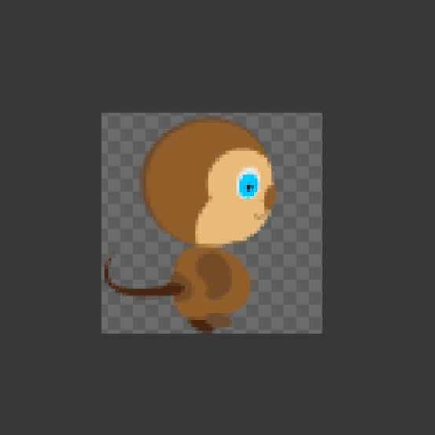

##### `Step 2.`\|`BTS`|:small_blue_diamond: :small_blue_diamond: 

What is this composed of? This breaks a run cycle into 8 frames.

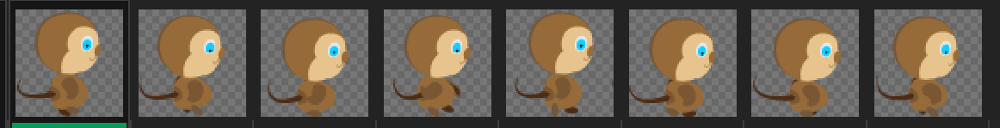

##### `Step 3.`\|`BTS`|:small_blue_diamond: :small_blue_diamond: :small_blue_diamond:

The other element of animation that is not intuitive is that we translate movement within the physics of the game engine and it is usually not part of the animation. So we animate our character to move on the spot and even jumping we do not move them through space, we animate the key frames without translation.

##### `Step 4.`\|`BTS`|:small_blue_diamond: :small_blue_diamond: :small_blue_diamond: :small_blue_diamond:

There are many tricks and techniques for animating characters. One of them is to start very simple and build more detail slowly.

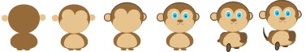

##### `Step 5.`\|`BTS`| :small_orange_diamond:

You can also build it piece by piece.

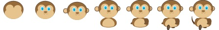

##### `Step 6.`\|`BTS`| :small_orange_diamond: :small_blue_diamond:

For most animations some vertical translation helps a lot - make it bouncy.  Take a look at this amazing animation from [Mercenary Kings](http://probertson.tumblr.com/post/82062175084/mercenary-kings-animations). Keep it simple and represent the animation in as few frames as possible. Just as we want to get rid of the “grid” in the tiles; we want to lose a sense of where the animation is looping. Can you see the stitch? Can you guess how many animation frames there are? Can you see that different animations start and stop and there is a good demonstration of overlap going on here.
	
Look at the shading above in the feet of the robot. The back legs are dark which clearly delinates the front and back legs. In the old 8 bit games there were not enough colors in the pallette (or enough pixels in the character) to give detail and shadows. 

##### `Step 7.`\|`BTS`| :small_orange_diamond: :small_blue_diamond: :small_blue_diamond:

And then finally go as big as you can, check out [Scott Pilgrim Vs. The World](https://scottpilgrim.fandom.com/wiki/File:Toddingram_freakout_a-1-.gif).

##### `Step 8.`\|`BTS`| :small_orange_diamond: :small_blue_diamond: :small_blue_diamond: :small_blue_diamond:

There are many tools that you can use to draw and animate sprite. Photoshop can be used and movies can be loaded as layers to use as reference. Film or find a good reference for the animation you want. 

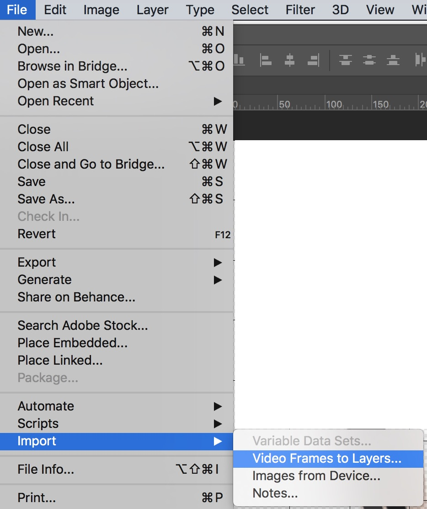

##### `Step 9.`\|`BTS`| :small_orange_diamond: :small_blue_diamond: :small_blue_diamond: :small_blue_diamond: :small_blue_diamond:

You can use a **Wacom** tablet and trace over key frames you select.

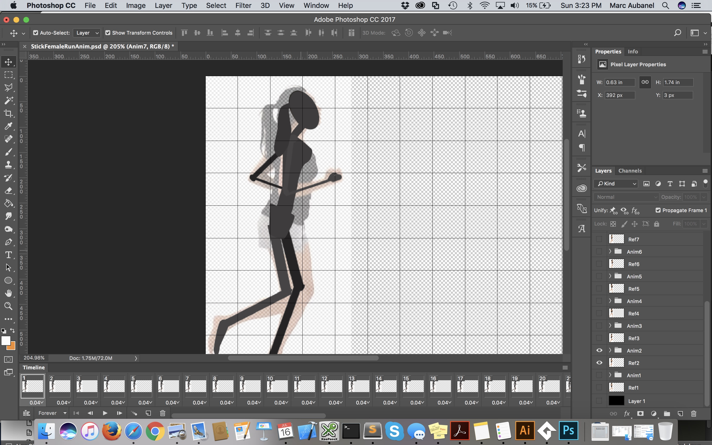

##### `Step 10.`\|`BTS`| :large_blue_diamond:

Make sure you can export them in a sprite sheet that can be easily imported into **GameMaker**. This tilesheet was a `128 x 64` pixel sprite sheet.

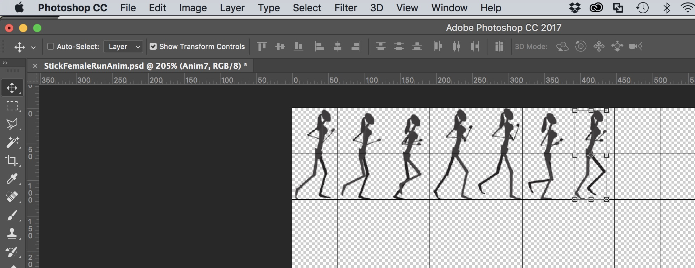

##### `Step 11.`\|`BTS`| :large_blue_diamond: :small_blue_diamond: 

If you are very ambitious you could export your photoshop file as layers with each animated limb to be animated in software like [Brash Monkey's Spriter](https://brashmonkey.com).

If you want a clean vector look you can use Illustrator and use reference. I suggest setting up your artboards right next to each other so you can easily export it as a png sprite sheet that can be easily absorbed into GameMaker.

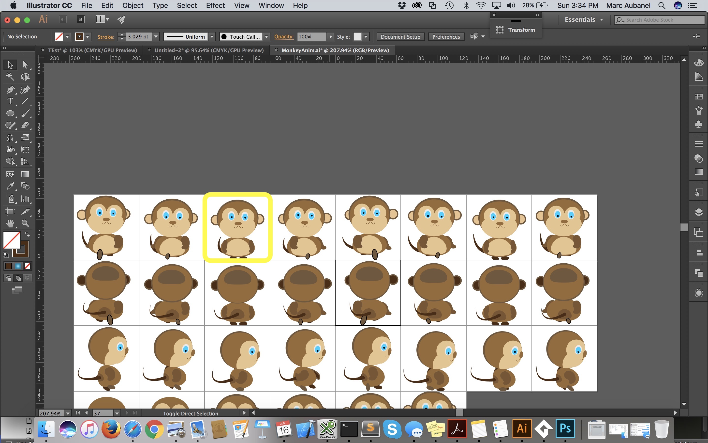

##### `Step 12.`\|`BTS`| :large_blue_diamond: :small_blue_diamond: :small_blue_diamond: 

To export from **Illustrator** press **File | Export | Export For Screens**. It defaults to exporting each artboard as a separate file. You can press the Full Document radial button to get a tilesheet. It also preserves the alpha (the white default artboard is not exported) but trims the image so it needs to be set back in a tool like photoshop. Mine went from 512 to 502 pixels, which I then resized the canvas back to 512 so that it would import properly.

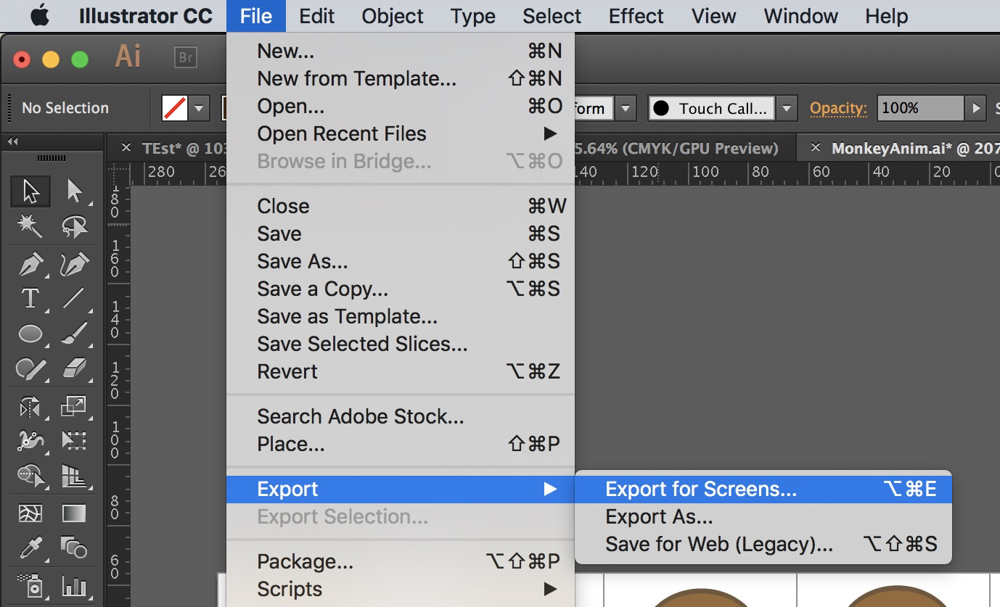

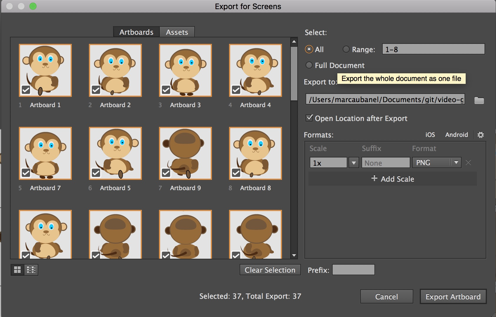

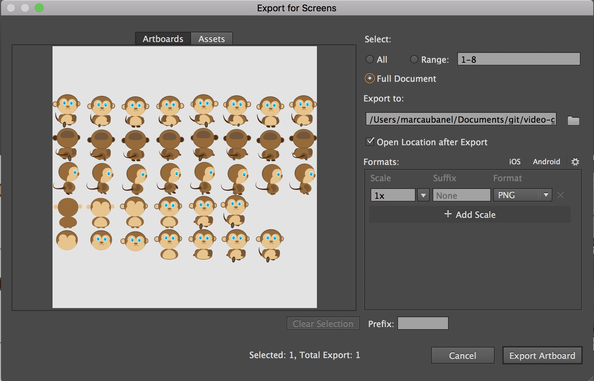

##### `Step 13.`\|`BTS`| :large_blue_diamond: :small_blue_diamond: :small_blue_diamond:  :small_blue_diamond: 

Select the **File | Save Project**, then press **File | Quit** (PC) **Game Maker | Quit** on Mac to make sure everything in the game is saved.

Open up **P4V**.  Select the top folder and press the **Add** button.  We want to add all the new files we created during this last session.  Add these files to the last change list you used at the begining of the session (in my case it was `Spaceship I portion of walkthrough`). Press the <kbd>OK</kbd> button.

Now you can submit the changelist by pressing both <kbd>Submit</kbd> buttons.

___

<!--  -->

| [previous](../transparent-tiles/README.md#user-content-transparent-tiles)| [home](../README.md#user-content-gms2-background-tiles--sprites---table-of-contents) | [next](../importing-animations/README.md#user-content-importing-animations)|
|---|---|---|
