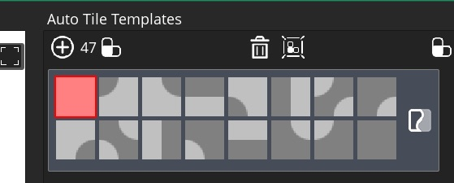
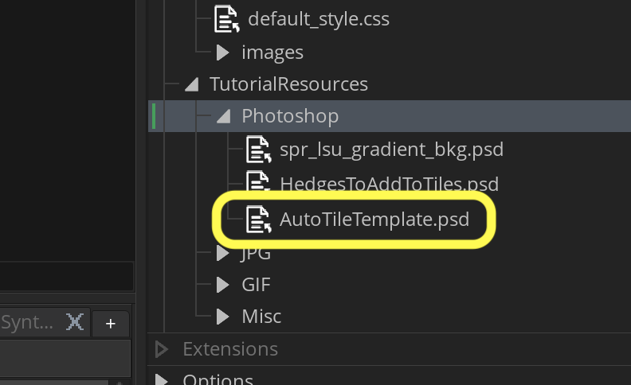
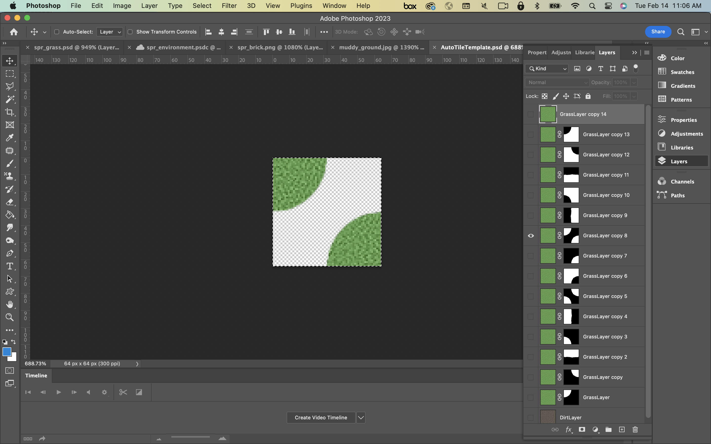
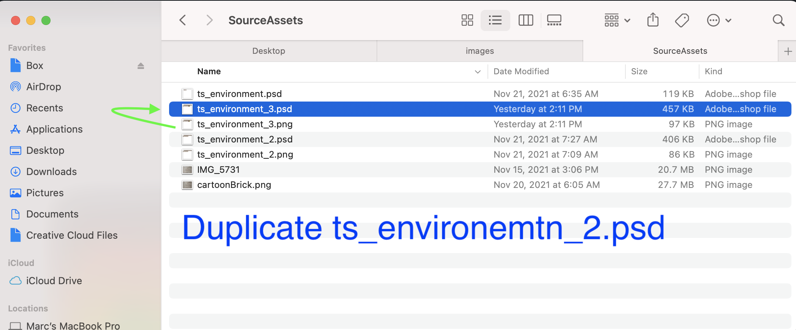
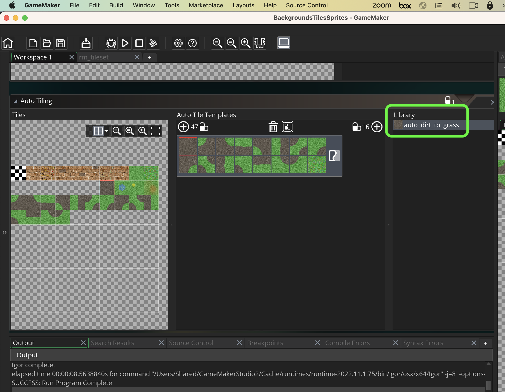
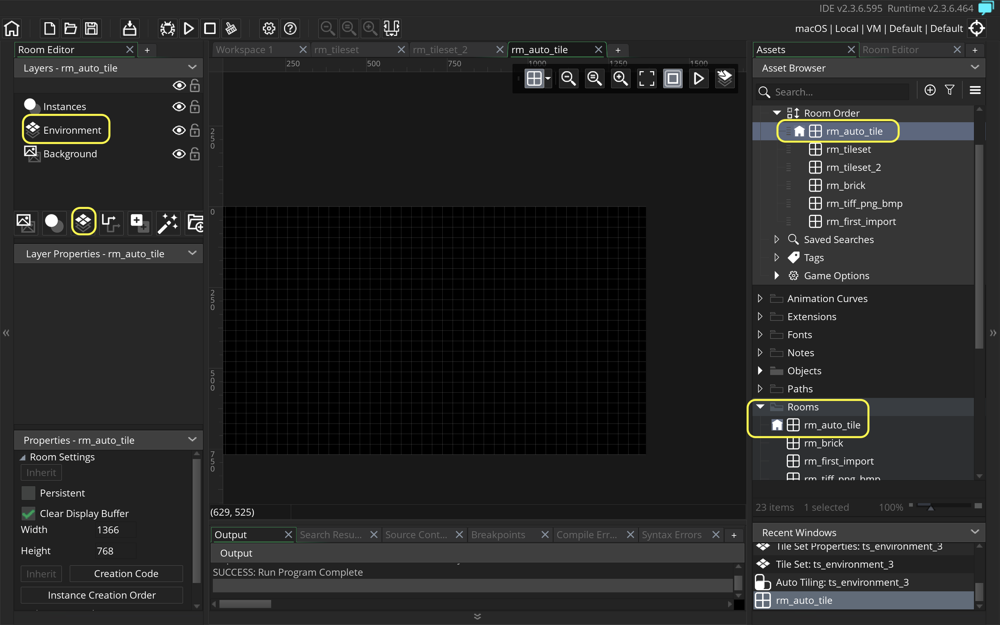
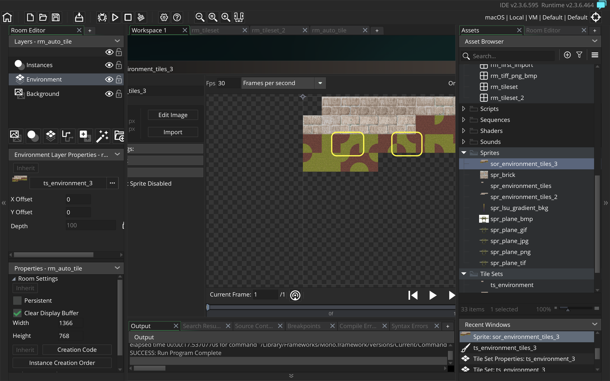

### Auto Tile Template

[previous](../first-tileset-ii/README.md#user-content-creating-your-first-tileset-ii) • [home](../README.md#user-content-gms2-background-tiles--sprites---table-of-contents) • [next](../tile-brushes/README.md#user-content-tile-brushes)

There are a cool tiling features in **GameMaker** and auto tiling is one of them.  It allows us to construct levels much faster.  There is a fair amount of set up time to prep for them.  Lets get started.

 

---

##### `Step 1.`\|`BTS`|:small_blue_diamond:

Auto tiling allows us to more quickly paint a transition between two tiles.  It allows for much quicker level design.

There are two auto tile configurations.  We are going to use the 16 tile configuration that is good for top down games. 

##### `Step 2.`\|`BTS`|:small_blue_diamond: :small_blue_diamond: 

*Download* [AutoTileTemplate.psd](../Assets/Photoshop/AutoTileTemplate.psd). It is a PSD (photoshop file) with a grass and sand tile.  I have also included masks for all the transitional states. 

##### `Step 3.`\|`BTS`|:small_blue_diamond: :small_blue_diamond: :small_blue_diamond:

The Photoshop file should have 16 layers in it starting at the top with the 1st grass layer with the one at the bottom being dirt.

##### `Step 4.`\|`BTS`|:small_blue_diamond: :small_blue_diamond: :small_blue_diamond: :small_blue_diamond:

Duplicate **ts_environment_2.psd** and call the new file `ts_environment_3.psd`. We will add these auto tiles to this tilesheet.

##### `Step 5.`\|`BTS`| :small_orange_diamond:

Open up **ts_environment_3** in **Photoshop**. We will be copying tiles back and forth to create an automatic tiling layout for the tilesheet.

Open up AutoTileTemplate. Make sure you have the bottom dirt layer selected and turned on.  Now you will start with the first layer and select all and choose **Edit | Copy Merged** (if you just copy you will only grab one layer, we want to have at least two layers copied for most of these tiles).  Then paste it into the next open slot in your your **spr_background_tiles_3.psd** file that has your previous work.  
	
Work you way up to the second to the top layer leaving both the bottom dirt later selected and the one layer with a mask above it. Notice that the masks will allow certain parts of the foreground to appear over the background. Copy merged and paste back into the other sheet.  Repeat this for all 16 frames:

https://user-images.githubusercontent.com/5504953/143026051-079eb3c9-9116-4f80-8b17-7c48daf86720.mp4

##### `Step 6.`\|`BTS`| :small_orange_diamond: :small_blue_diamond:

*Export* the tiles again from Photoshop as a `.png` and call it `tls_environment_3`.  Create a new **Sprite** and **Import** **spr_environment_3**. Call this `spr_envioronment_tiles_3`.  *Right* click on **Tilesheets** and select **Create | Tilesheet** and call it `tls_environment_3` and assign the agove sprite. 

https://user-images.githubusercontent.com/5504953/143025571-3092e6b4-bfd3-4c0f-9a75-830ebb4cc38c.mp4

##### `Step 7.`\|`BTS`| :small_orange_diamond: :small_blue_diamond: :small_blue_diamond:

Change the **Tile Height** and **Tile Width** to `64. *Press* the **Auto Tiling** button.  This puts up the autotiling node.  Click on the **plus** symbol next to 16.  Then if you put the layers in order it should be from the dirt all the way to grass, assign each layer. Look at the which pattern is light and dark and make sure the light one is dirt and the dark one is grass.

https://user-images.githubusercontent.com/5504953/143030131-6609fc3d-631d-4c4f-b063-38433af5fa7d.mp4

##### `Step 8.`\|`BTS`| :small_orange_diamond: :small_blue_diamond: :small_blue_diamond: :small_blue_diamond:

Name this auto tile under the Library tab `auto_dirt_to_grass`. This will be dirt surrounded by grass.

##### `Step 9.`\|`BTS`| :small_orange_diamond: :small_blue_diamond: :small_blue_diamond: :small_blue_diamond: :small_blue_diamond:

*Create* a new room and call it `rm_auto_tile`.  *Move* it to the top of the list in **Room Priority**. Add a new **Tile Layer** called `Environment`.  Place it *beneath* the Instance layer.

##### `Step 10.`\|`BTS`| :large_blue_diamond:

Assign the **tls_environment_3** sprite to the tile layer. Make sure you are on the **Tiles_Brackground** layer.  Now the tile on the left will be inside the tile on the right.  So lets select the paint bucket tool on the top toolbar and fill the entire level with grass.  Then we can go in and paint with dirt inside the grass by selecting the auto tile tool. Paint and see the pattern follows the the flow and we get nice rounded corners between the two tiles. Now *press* the <kbd>Play</kbd> button in the top menu bar to admire your work.

https://user-images.githubusercontent.com/5504953/143032767-b688f498-ca52-4bcf-8cfa-dccd122c5122.mp4

##### `Step 11.`\|`BTS`| :large_blue_diamond: :small_blue_diamond: 

Now what happens if we want to paint grass inside of dirt?  We have all the tiles we need (all mirrored tiles) except for two diagonal pieces. We need them with grass diagonals.

##### `Step 12.`\|`BTS`| :large_blue_diamond: :small_blue_diamond: :small_blue_diamond: 

Go back to **Photoshop** and our grass to sand file.  *Duplicate* the two diagonal tiles with amsk. Drag both layers to the top of the layers just below the grass.  

Now we want dirt to be inside of the grass so we want to reverse the mask.  We do this by clicking on the mask then press the **Image | Adjustments | Invert** menu item.  Do this for both masks and check tha they both has dirt inside of grass.

Copy merged and paste these two layers onto your photoshop tilesheet.

https://user-images.githubusercontent.com/5504953/143039314-8e457336-d00f-464c-9921-c7e770c06c3b.mp4

##### `Step 13.`\|`BTS`| :large_blue_diamond: :small_blue_diamond: :small_blue_diamond:  :small_blue_diamond: 

Export and reimport this into gamemaker.  Go back to your tilesheet and create another 16 auto tile section.  *Assign* the opposite of the grass to sand in the sand to grass configuration.  Double check your work at the end.  Each tile should mirror the one above. Name the autotile `auto_grass_to_dirt`.
All the tiles should be the exact inverse of the auto tilesheet above it.  Double check your work.

https://user-images.githubusercontent.com/5504953/143041839-b38e0cdc-68a5-4406-a498-25f687e9cf4e.mp4

##### `Step 14.`\|`BTS`| :large_blue_diamond: :small_blue_diamond: :small_blue_diamond: :small_blue_diamond:  :small_blue_diamond: 

Go back to **rm_auto_tile** and select the eraser. Delete the old dirt tiles.  Fill it again so the entire room is grass.  Go to the **Libraries** *tab* and select the newly created **auto_dirt_to_grass** tile.  Then paint dirt inside of grass.  Now you can change the autotiler then paint grass inside of dirt again by selecting**auto_grass_to_dirt** and this will  allow for quicker assembly of levels. Now *press* the <kbd>Play</kbd> button in the top menu bar and check out your work!

https://user-images.githubusercontent.com/5504953/143062703-146bc615-7e53-4932-8d1b-18b169987bcd.mp4

##### `Step 15.`\|`BTS`| :large_blue_diamond: :small_orange_diamond: 

Select the **File | Save Project** then press **File | Quit** to make sure everything in the game is saved. If you are using **GitHub** open up **GitHub Desktop** and add a title and longer description (if necessary) and press the <kbd>Commit to main</kbd> button. Finish by pressing **Push origin** to update the server with the latest changes.

___

<!--  -->

| [previous](../first-tileset-ii/README.md#user-content-creating-your-first-tileset-ii)| [home](../README.md#user-content-gms2-background-tiles--sprites---table-of-contents) | [next](../tile-brushes/README.md#user-content-tile-brushes)|
|---|---|---|
