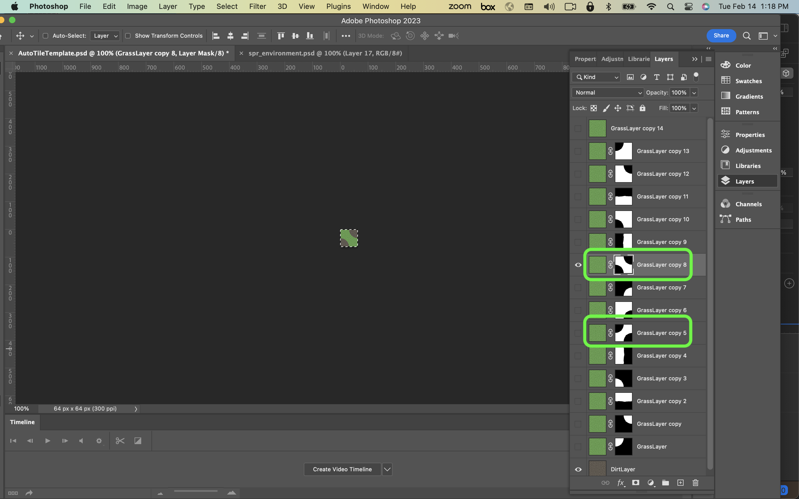

### Auto Tile Template

[previous](../first-tileset-ii/README.md#user-content-creating-your-first-tileset-ii) • [home](../README.md#user-content-gms2-background-tiles--sprites---table-of-contents) • [next](../tile-brushes/README.md#user-content-tile-brushes)

There are a cool tiling features in **GameMaker** and auto tiling is one of them.  It allows us to construct levels much faster.  There is a fair amount of set up time to prep for them.  Lets get started.

 

---

##### `Step 1.`\|`BTS`|:small_blue_diamond:

Auto tiling allows us to more quickly paint a transition between two tiles.  It allows for much quicker level design.

There are two auto tile configurations.  We are going to use the 16 tile configuration that is good for top down games. 

##### `Step 2.`\|`BTS`|:small_blue_diamond: :small_blue_diamond: 

*Download* [AutoTileTemplate.psd](../Assets/Photoshop/AutoTileTemplate.psd). It is a PSD (photoshop file) with a grass and sand tile.  I have also included masks for all the transitional states. 

##### `Step 3.`\|`BTS`|:small_blue_diamond: :small_blue_diamond: :small_blue_diamond:

The Photoshop file should have 16 layers in it starting at the top with the 1st grass layer with the one at the bottom being dirt.

##### `Step 4.`\|`BTS`|:small_blue_diamond: :small_blue_diamond: :small_blue_diamond: :small_blue_diamond:

Make sure you have the bottom sand layer selected.  Now you will start with the first layer and select all and choose **Edit | Copy Merged** (if you just copy you will only grab one layer, we want to have at least two layers copied for most of these tiles).  Then paste it into the second row of your **spr_background_tiles.psd** file that has your previous work.  
	
Work you way down to the second from the top selected and the sand layer at the bottom. Notice that the masks will allow certain parts of the foreground to appear over the background. Copy merged and paste back into the other sheet.  Repeat this for all 16 frames:

##### `Step 5.`\|`BTS`| :small_orange_diamond:

*Export* the tiles again from Photoshop as a png.  *Double click* on **spr_background_tiles** in **GameMaker** and *re-import* the tilesheet with the grass to sand transition.

##### `Step 6.`\|`BTS`| :small_orange_diamond: :small_blue_diamond:

*Double click* **tls_background_tiles** and *press* the **Auto Tiling** button.  This puts up the autotiling node.  Click on the **plus** symbol next to 16.  Then if you put the layers in order it should be from the solid grass all the way to sand, assign each layer. Look at the which pattern is light and dark and make sure that one is consistently sand and the other is consistently grass.

##### `Step 7.`\|`BTS`| :small_orange_diamond: :small_blue_diamond: :small_blue_diamond:

Name this auto tile under the Library tab `auto_grass_to_sand`. This will be grass surrounded by sand.

##### `Step 8.`\|`BTS`| :small_orange_diamond: :small_blue_diamond: :small_blue_diamond: :small_blue_diamond:

*Create* a new room and call it `rm_lvl_test_2`.  *Move* it to the top of the list in **Room Priority**. Add a new **Tile Layer** called `Tiles_Background`.  Place it *beneath* the Instance layer:

##### `Step 9.`\|`BTS`| :small_orange_diamond: :small_blue_diamond: :small_blue_diamond: :small_blue_diamond: :small_blue_diamond:

Make sure you are on the **Tiles_Brackground** layer.  Now the tile on the left will be inside the tile on the right.  So lets select the paint bucket tool on the top toolbar and fill the entire level with sand.  Then we can go in and paint with grass inside by selecting the auto tile tool.

##### `Step 10.`\|`BTS`| :large_blue_diamond:

Now what happens if we want to paint sand inside of grass?  We have all the tiles we need (all mirrored tiles) except for two diagonal pieces. We need them with grass diagonals.

##### `Step 11.`\|`BTS`| :large_blue_diamond: :small_blue_diamond: 

Go back to **Photoshop** and our grass to sand file.  *Duplicate* the top grass layer twice and drag both layers to the bottom on top of the sand.  Name these layers **Frame 17** and **Frame 18**.  
	
We need to copy and paste the two diagonal masks to these grass layers.  You can do this by dragging them from the previous layers by clicking on the mask while pressing <kbd>Alt</kbd> (PC) or <kbd>Option</kbd> (Mac) to copy to another layer.  Drag it over the new grass layer you built. Do this for both diagonal masks.

Now we want grass inside of sand so we want to reverse the mask.  We do this by double clicking on the mask then press the Reverse button.  Do this for both masks and check tha they both has grass inside of sand.

##### `Step 12.`\|`BTS`| :large_blue_diamond: :small_blue_diamond: :small_blue_diamond: 

Copy merged and paste these two layers onto your photoshop tilesheet.

##### `Step 13.`\|`BTS`| :large_blue_diamond: :small_blue_diamond: :small_blue_diamond:  :small_blue_diamond: 

Export and reimport this into gamemaker.  Go back to your tilesheet and create another 16 auto tile section.  *Assign* the opposite of the grass to sand in the sand to grass configuration.  Double check your work at the end.  Each tile should mirror the one above.

##### `Step 14.`\|`BTS`| :large_blue_diamond: :small_blue_diamond: :small_blue_diamond: :small_blue_diamond:  :small_blue_diamond: 

Name the autotile `auto_sand_to_grass`.

##### `Step 15.`\|`BTS`| :large_blue_diamond: :small_orange_diamond: 

Go back to **rm_lvl_test_2** and select the eraser. Make the brush size larger than one.  *Delete* the room.  Put the brush back to a size of 1.  Now fill the room with grass.  Go to the Libraries tab and select the newly created **auto_sand_to_grass** tile.  Then paint sand inside of grass.  Now you can change the autotiler then paint grass inside of sand again allowing for a quicker way of assembling levels.

##### `Step 16.`\|`BTS`| :large_blue_diamond: :small_orange_diamond:   :small_blue_diamond: 

Select the **File | Save Project** then press **File | Quit** to make sure everything in the game is saved. If you are using **GitHub** open up **GitHub Desktop** and add a title and longer description (if necessary) and press the <kbd>Commit to main</kbd> button. Finish by pressing **Push origin** to update the server with the latest changes.

___

| [previous](../first-tileset-ii/README.md#user-content-creating-your-first-tileset-ii)| [home](../README.md#user-content-gms2-background-tiles--sprites---table-of-contents) | [next](../tile-brushes/README.md#user-content-tile-brushes)|
|---|---|---|
