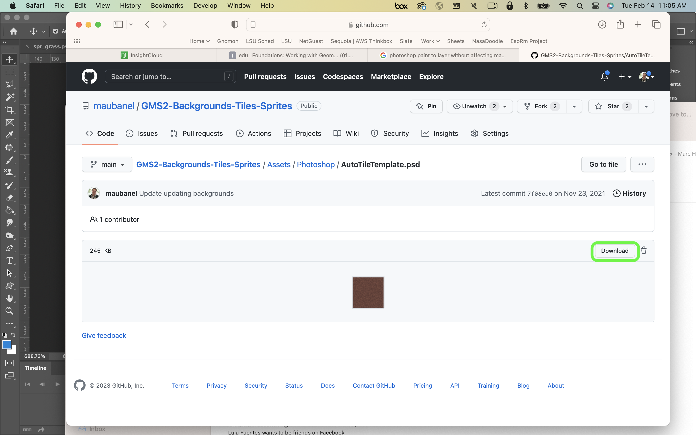
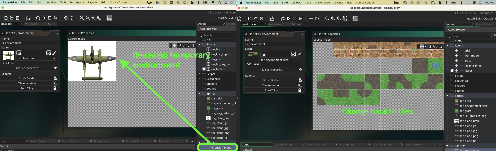

### Auto Tile Template

[previous](../first-tileset-ii/README.md#user-content-creating-your-first-tileset-ii) • [home](../README.md#user-content-gms2-background-tiles--sprites---table-of-contents) • [next](../tile-brushes/README.md#user-content-tile-brushes)

There are a cool tiling features in **GameMaker** and auto tiling is one of them.  It allows us to construct levels much faster.  There is a fair amount of set up time to prep for them.  Lets get started.

 

---

##### `Step 1.`\|`BTS`|:small_blue_diamond:

Open up **P4v**.  Select the top folder of the **GameMaker** project. Press the <kbd>Checkout</kbd> button.  Checkout out all files in P4V so that they are all writable (otherwise they will be read only and none of the changes will be saved). Select a **New** changelist and add a message describing the unit of work you will be performing. Press the <kbd>OK</kbd> button.

Open up the project you are working on in **GameMaker**. 

##### `Step 2.`\|`BTS`|:small_blue_diamond: :small_blue_diamond: 

Download the [spr_dirt.png](../Assets/PNG/spr_dirt.png) to add another image to our tilesheet.  Now you should have multiple grass and brick tiles and one dirt tile.

##### `Step 3.`\|`BTS`|:small_blue_diamond: :small_blue_diamond: :small_blue_diamond:

Reimport the sprite into **spr_environment**.  Also, on my computer I had to reassign the Tileset to another sprite and then reassign it back to `spr_environment` for it to stick.

##### `Step 4.`\|`BTS`|:small_blue_diamond: :small_blue_diamond: :small_blue_diamond: :small_blue_diamond:

Add the dirt tileset to the room.  Now notice that the transition from grass to dirt is not very natural.  This is where tile templates can help!

##### `Step 5.`\|`BTS`| :small_orange_diamond:

Auto tiling allows us to more quickly paint a transition between two tiles.  It allows for much quicker level design.

There are two auto tile configurations.  We are going to use the 16 tile configuration that is good for top down games. 

##### `Step 6.`\|`BTS`| :small_orange_diamond: :small_blue_diamond:

*Download* [AutoTileTemplate.psd](../Assets/Photoshop/AutoTileTemplate.psd). It is a PSD (photoshop file) with a grass and sand tile.  I have also included masks for all the transitional states. 

##### `Step 7.`\|`BTS`| :small_orange_diamond: :small_blue_diamond: :small_blue_diamond:

The Photoshop file should have 16 layers in it starting at the top with the 1st grass layer with the one at the bottom being dirt.

##### `Step 8.`\|`BTS`| :small_orange_diamond: :small_blue_diamond: :small_blue_diamond: :small_blue_diamond:

Now you will start to drag over a combination of the grass and dirt layer by selecting the bottom most two layers.  Copy merged the tile and paste it into your tilesheet on the third row.

Work you way up to the second to the top layer leaving both the bottom dirt later selected and the one layer with a mask above it. Notice that the masks will allow certain parts of the foreground to appear over the background. Copy merged and paste back into the other sheet.  Repeat this for all 16 frames:

Duplicate **ts_environment_2.psd** and call the new file `ts_environment_3.psd`. We will add these auto tiles to this tilesheet.

https://user-images.githubusercontent.com/5504953/218809791-83870218-0235-417c-9112-df4f141b51da.mp4

##### `Step 9.`\|`BTS`| :small_orange_diamond: :small_blue_diamond: :small_blue_diamond: :small_blue_diamond: :small_blue_diamond:

Save the file in photoshop and re-export the png `spr_environment`.

##### `Step 10.`\|`BTS`| :large_blue_diamond:

Bring it into GameMaker and replace the **spr_environment_background** with this new texture.

##### `Step 11.`\|`BTS`| :large_blue_diamond: :small_blue_diamond: 

Now I reassigned the tileset so that it reloads the new set of art. On the mac I had to do it so it would bind and work in the room.

##### `Step 12.`\|`BTS`| :large_blue_diamond: :small_blue_diamond: :small_blue_diamond: 

*Press* the **Auto Tiling** button.  This puts up the autotiling node.  Click on the **plus** symbol next to 16.  Then if you put the layers in order it should be from the dirt all the way to grass, assign each layer. Look at the which pattern is light and dark and make sure the light one is dirt and the dark one is grass. Be careful to not make any errors with this step.

https://user-images.githubusercontent.com/5504953/218832006-bfe72590-5851-40a5-a1a0-dc10044596e7.mp4

##### `Step 13.`\|`BTS`| :large_blue_diamond: :small_blue_diamond: :small_blue_diamond: :small_blue_diamond: 

Name this auto tile under the Library tab `auto_dirt_to_grass`. This will be dirt surrounded by grass.

##### `Step 14.`\|`BTS`| :large_blue_diamond: :small_blue_diamond: :small_blue_diamond: :small_blue_diamond:  :small_blue_diamond: 

*Create* a new room and call it `rm_auto_tile`.  *Move* it to the top of the list in **Room Priority**. Add a new **Tile Layer** called `Environment`.  Place it *beneath* the Instance layer.

##### `Step 15.`\|`BTS`| :large_blue_diamond: :small_orange_diamond: 

Assign the **ts_environment** sprite to the tile layer. 

##### `Step 16.`\|`BTS`| :large_blue_diamond: :small_orange_diamond:   :small_blue_diamond: 

Make sure you are on the **Tiles_Brackground** layer.  Now the tile on the left will be inside the tile on the right.  So lets select the paint bucket tool on the top toolbar and fill the entire level with grass.  Then select the **Libraries** tab and double click the auto tiling library we just made. Then we can go in and paint with dirt inside the grass by selecting the auto tile tool. Paint and see the pattern follows the the flow and we get nice rounded corners between the two tiles. Now *press* the <kbd>Play</kbd> button in the top menu bar to admire your work

https://user-images.githubusercontent.com/5504953/218834581-065ea600-0e85-4560-89f7-b58c95eef6e2.mp4

##### `Step 17.`\|`BTS`| :large_blue_diamond: :small_orange_diamond: :small_blue_diamond: :small_blue_diamond:

Now what happens if we want to paint grass inside of dirt?  We have all the tiles we need (all mirrored tiles) except for two diagonal pieces. We need them with grass diagonals.

##### `Step 18.`\|`BTS`| :large_blue_diamond: :small_orange_diamond: :small_blue_diamond: :small_blue_diamond: :small_blue_diamond:

Go back to **Photoshop** and our grass to sand file.  *Duplicate* the two diagonal tiles with mask. Drag both layers to the top of the layers just below the grass.  

Now we want dirt to be inside of the grass so we want to reverse the mask.  We do this by clicking on the mask then press the **Image | Adjustments | Invert** menu item.  Do this for both masks and check tha they both has dirt inside of grass.

Copy merged and paste these two layers onto your photoshop tilesheet. Export and reimport this into gamemaker. Unload and reload the tilesheet to make sure this new one binds.

https://user-images.githubusercontent.com/5504953/218837399-d2697f9d-5441-4ef3-b968-237ff0983a18.mp4

##### `Step 19.`\|`BTS`| :large_blue_diamond: :small_orange_diamond: :small_blue_diamond: :small_blue_diamond: :small_blue_diamond: :small_blue_diamond:

 Go back to your tilesheet and create another 16 auto tile section.  *Assign* the opposite of the grass to sand in the sand to grass configuration.  Double check your work at the end.  Each tile should mirror the one above. Name the autotile `auto_grass_to_dirt`.
All the tiles should be the exact inverse of the auto tilesheet above it.  Double check your work.

https://user-images.githubusercontent.com/5504953/143041839-b38e0cdc-68a5-4406-a498-25f687e9cf4e.mp4

##### `Step 20.`\|`BTS`| :large_blue_diamond: :large_blue_diamond:

Go back to **rm_auto_tile** and select the eraser. Delete the old dirt tiles.  Fill it again so the entire room is grass.  Go to the **Libraries** *tab* and select the newly created **auto_dirt_to_grass** tile.  Then paint dirt inside of grass.  Now you can change the autotiler then paint grass inside of dirt again by selecting**auto_grass_to_dirt** and this will  allow for quicker assembly of levels. Now *press* the <kbd>Play</kbd> button in the top menu bar and check out your work!

https://user-images.githubusercontent.com/5504953/143062703-146bc615-7e53-4932-8d1b-18b169987bcd.mp4

##### `Step 21.`\|`BTS`| :large_blue_diamond: :large_blue_diamond: :small_blue_diamond:

Select the **File | Save Project**, then press **File | Quit** (PC) **Game Maker | Quit** on Mac to make sure everything in the game is saved.

##### `Step 22.`\|`BTS`| :large_blue_diamond: :large_blue_diamond: :small_blue_diamond: :small_blue_diamond:

Open up **P4V**.  Select the top folder and press the **Add** button.  We want to add all the new files we created during this last session.  Add these files to the last change list you used at the begining of the session (in my case it was `Spaceship I portion of walkthrough`). Press the <kbd>OK</kbd> button.

##### `Step 23.`\|`BTS`| :large_blue_diamond: :large_blue_diamond: :small_blue_diamond: :small_blue_diamond: :small_blue_diamond:

Now you can submit the changelist by pressing both <kbd>Submit</kbd> buttons.

<!--  -->

| [previous](../first-tileset-ii/README.md#user-content-creating-your-first-tileset-ii)| [home](../README.md#user-content-gms2-background-tiles--sprites---table-of-contents) | [next](../tile-brushes/README.md#user-content-tile-brushes)|
|---|---|---|
