### Background and Single Tile

[previous](../raster-vector/README.md#user-content-raster-and-vector) • [home](../README.md#user-content-gms2-background-tiles--sprites---table-of-contents) • [next](../first-tileset/README.md#user-content-creating-your-first-tileset)

Textures take a lot of space so we want to not have an entire game use discrete pixels. As tempting as it is to have a 6000 x 1000 pixel level with a single matte painting in the background, there are limitations to what a video card can store and render. 
	
We usually break our artwork down into reusable *lego* pieces into their smallest common denominator. We will pick a resolution and make all of our tiles a multiple of this size (usually the sames size as our character). Gamemaker supports any pixel resolution, they don't need to be a power of 2.  The background we used initially would not be commonly found in games. Common sizes include:
		
* 16 x 16	
* 32 x 32
* 64 x 64
* 96 x 96
* 128 x 128	

There are many techniques we can use.

 

---

##### `Step 1.`\|`BTS`|:small_blue_diamond:

Open up **P4v**.  Select the top folder of the **GameMaker** project. Press the <kbd>Checkout</kbd> button.  Checkout out all files in P4V so that they are all writable (otherwise they will be read only and none of the changes will be saved). Select a **New** changelist and add a message describing the unit of work you will be performing. Press the <kbd>OK</kbd> button.

Open up the project you are working on in **GameMaker**. 

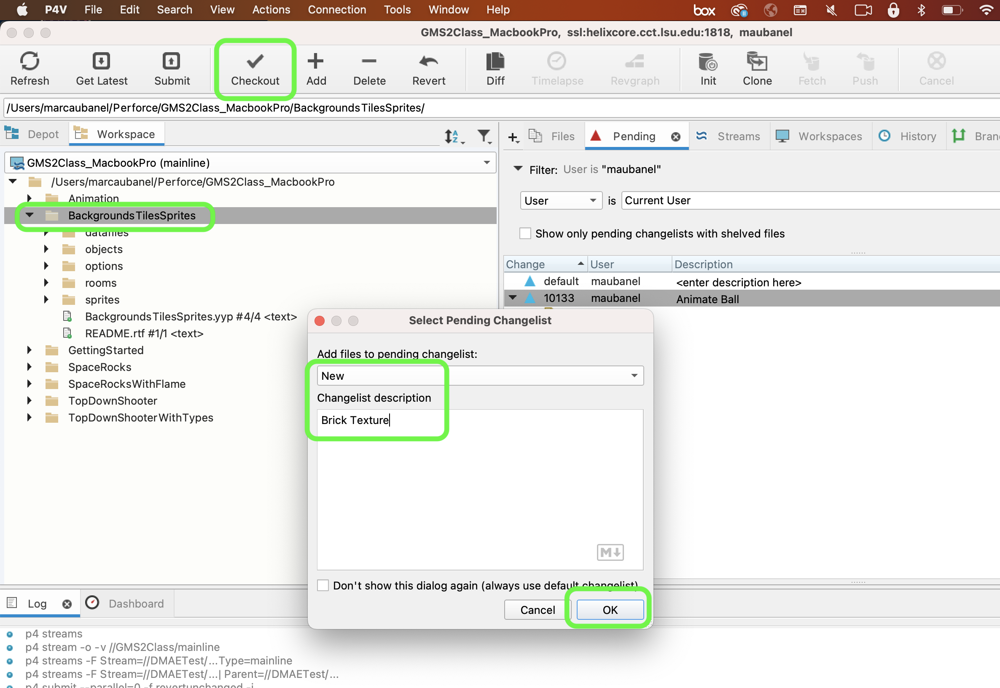

##### `Step 2.`\|`BTS`|:small_blue_diamond: :small_blue_diamond: 

The first technique is to alter an existing photo and make it tilable.

We are going to go with 64 by 64 for this exercise.  Download the image used here: [spr_brick_1.png](../Assets/PNG/spr_brick_1.png). 
    
There are two things we need to worry about.  One is making it tile, and secondly removing any complexity in the image that makes the repeat a very obvious pattern.  I also want to make it look a bit more "8-bit" and not photo realistic.  For prototyping we will do this using some quick tricks.  Open the file up in photoshop.

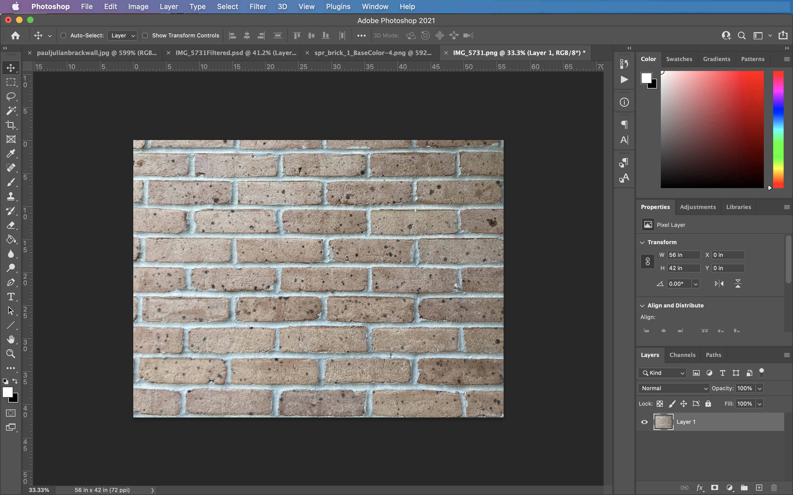

##### `Step 3.`\|`BTS`|:small_blue_diamond: :small_blue_diamond: :small_blue_diamond:

Grab the square selection tool and press the <kbd>Shift</kbd> key and select a small section of the brick texture.  I want to have it wrap the best I can so ideally it cuts on the grout line vertically then halfway between bricks horizontally.  Make sure the seletion is a square aspect ration (1:1).

##### `Step 4.`\|`BTS`|:small_blue_diamond: :small_blue_diamond: :small_blue_diamond: :small_blue_diamond:

Select **Image | Image Size** and set it to a larger size than we need.  We will target our final tile at 64 by 64, but lets work on a larger resolution tile.  Set the image size ot `512` square.

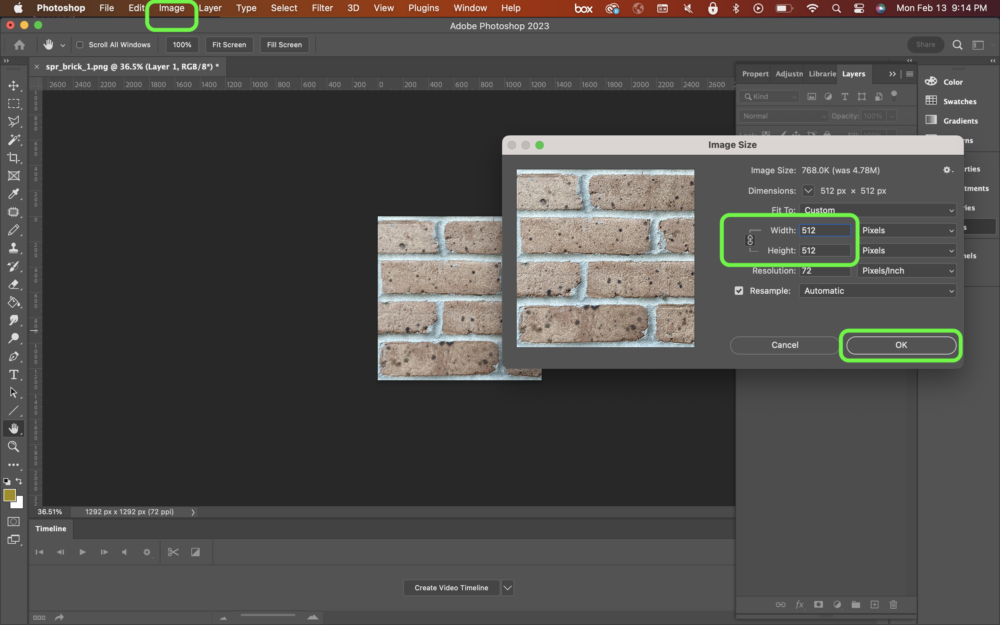

##### `Step 5.`\|`BTS`| :small_orange_diamond:

Now this texture is not tilable.  The edges won't line up.  What we will do is shift the edges to the center so we can clone tool them out.  Select **Filter | Other | Offset** and alter the vertical and horizontal alignment by `256`.

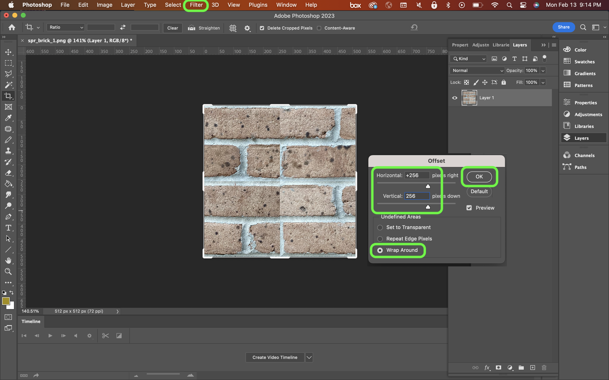

##### `Step 6.`\|`BTS`| :small_orange_diamond: :small_blue_diamond:

Now drag the photo that you applied the neural filter to into the **LAYER** panel on the right.

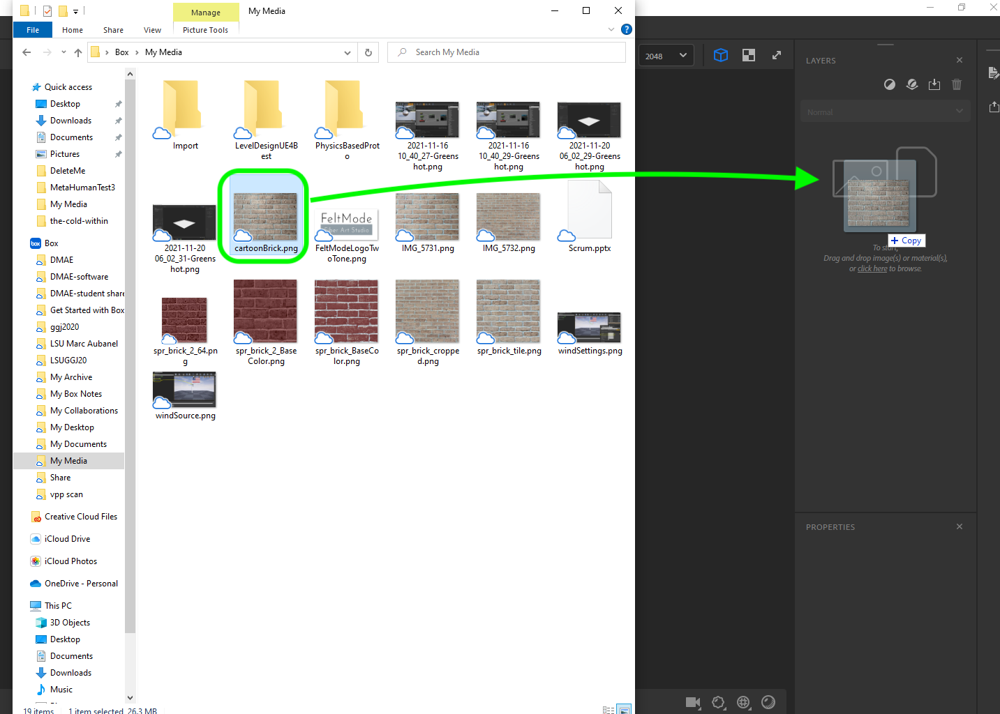

##### `Step 7.`\|`BTS`| :small_orange_diamond: :small_blue_diamond: :small_blue_diamond:

This software tries to create all your 3-D maps for a PBR material.  All we want is the **Base Color** and don't need any of the other maps.  Select **Use as bitmap** and the press the <kbd>OK</kbd> button.

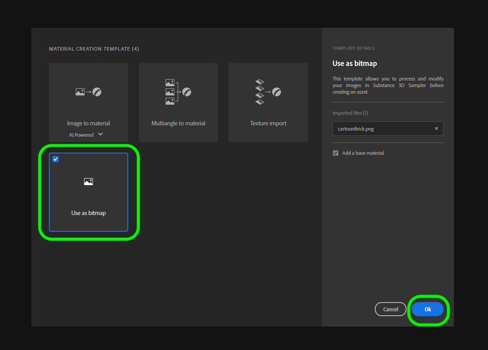

##### `Step 8.`\|`BTS`| :small_orange_diamond: :small_blue_diamond: :small_blue_diamond: :small_blue_diamond:

Now we do not see the texture with the default settings.  Select the **Output image** and choose `Base Color`.  Then press the **3D-Icon** next to the plane so we have two windows, one with the 3-D view showing the tiling and one with the 2-D view on the right hand side.

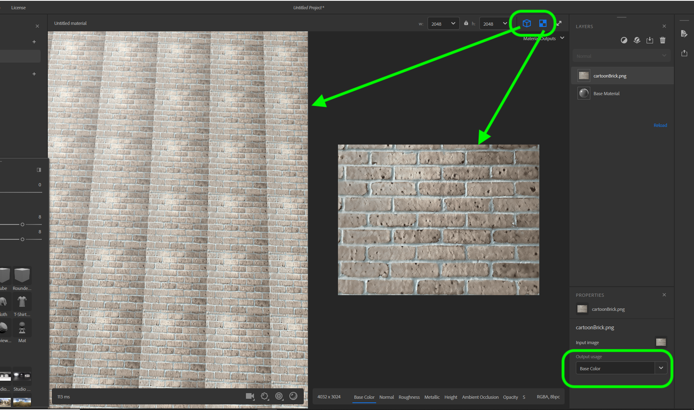

##### `Step 9.`\|`BTS`| :small_orange_diamond: :small_blue_diamond: :small_blue_diamond: :small_blue_diamond: :small_blue_diamond:

Now the picture doesn't have even lighting and the bricks on the right are noticably darker than the ones on the left.  This makes it look like we have a repeating dark splotch.  Press the **Add a layer** icon to add a **Equalize** filter. Play with the settings to remove as much as the shading variation as you like.

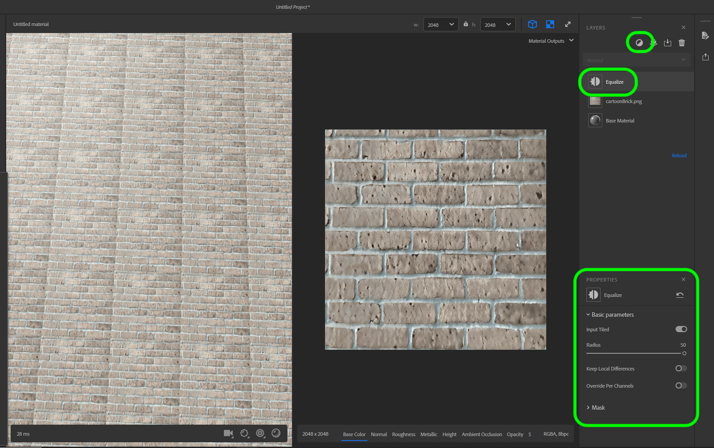

##### `Step 10.`\|`BTS`| :large_blue_diamond:

Now we need to crop an area.  You can select the same **Add a layer** button and search for **Crop** or drag the icon form the most common layers on the left hand panel under **File**.

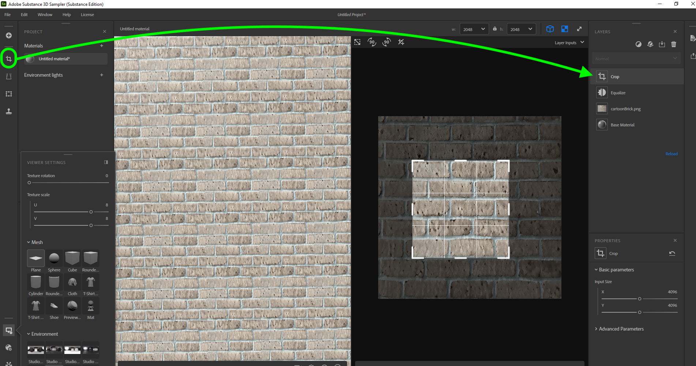

##### `Step 11.`\|`BTS`| :large_blue_diamond: :small_blue_diamond: 

Now this texture will be 64 by 64 so we don't want a lot of bricks.  I want three bricks per tile. I want it as square as possible but place the crop lines along the grout line.  Now our texture is square so we don't have to skew the perspective.  After trian and error and moving around I found a location where it repeats nicely.  We cannot use their built in layer for tiling as it doesn't work with textures with existing patterns like bricks and tile.

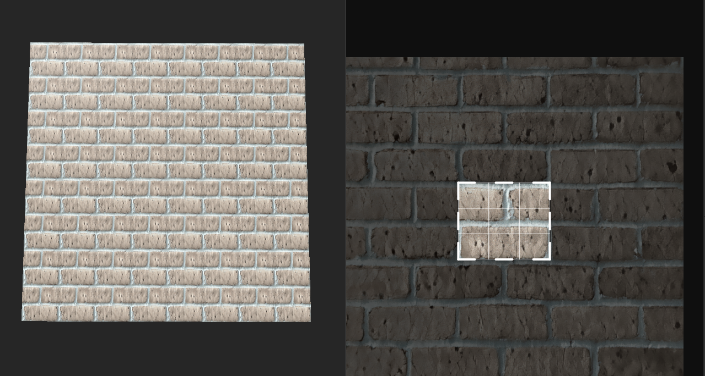

##### `Step 12.`\|`BTS`| :large_blue_diamond: :small_blue_diamond: :small_blue_diamond: 

When you got what you want press the **Export** icon.  Call the file `spr_brick_1`.  Select the **Format** as `png`.  Put it in a working directory. Leave the high resolution as this software doesn't handle reducing the texture size to `64` by `64` nearly as well as photoshop does and it becomes to blurry in the reduction process.  Select **only** the **Base Color** layer as we do not need any other textures. Press the <kbd>Export</kbd> button.

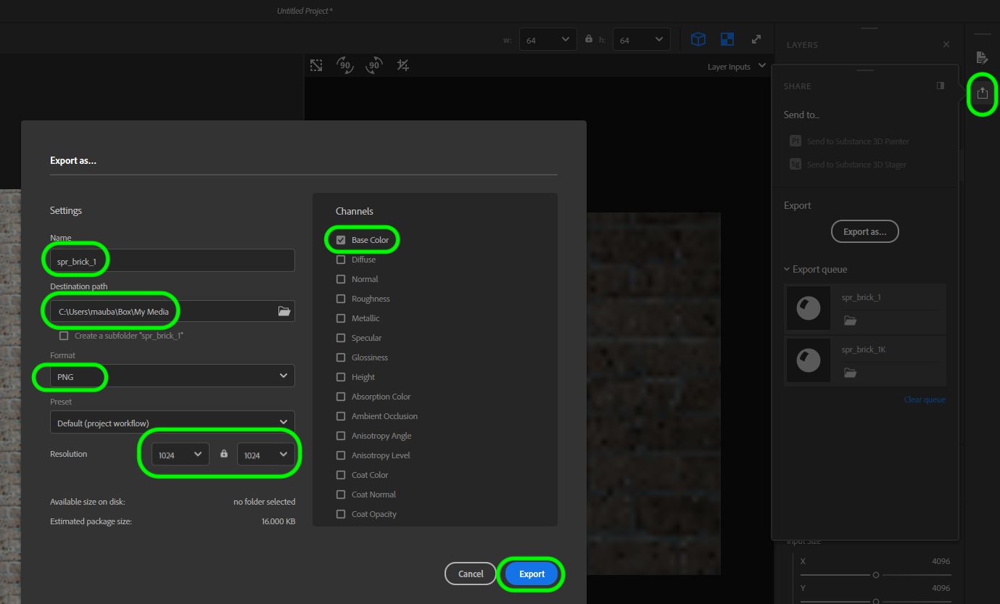

##### `Step 13.`\|`BTS`| :large_blue_diamond: :small_blue_diamond: :small_blue_diamond:  :small_blue_diamond: 

Open up the image you exported in **Photoshop**.  Please note that it adds `_BaseColor` at the end of the name.Press the **Image | Resize Image** item and rescale the image to `64` by `64`. Keep the **Resample** at `automatic`. Press the <kbd>OK</kbd> button.

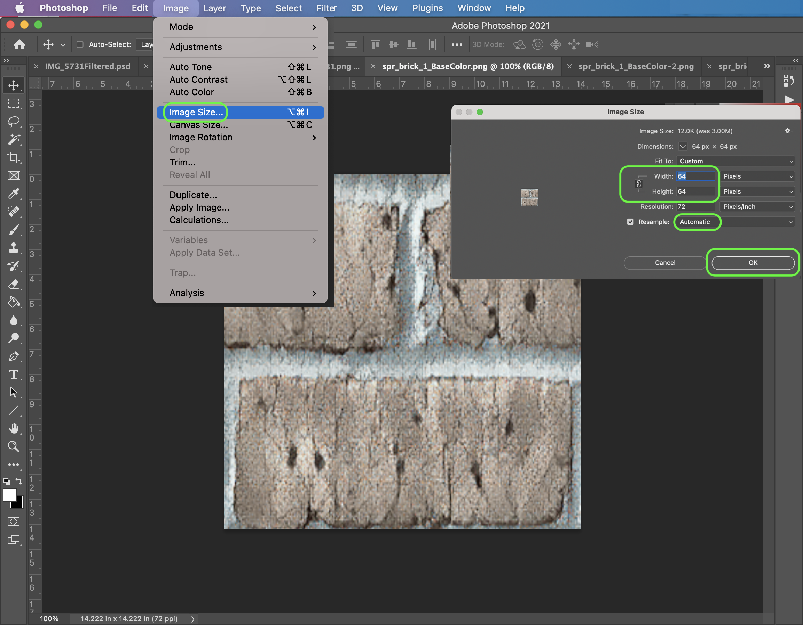

##### `Step 14.`\|`BTS`| :large_blue_diamond: :small_blue_diamond: :small_blue_diamond: :small_blue_diamond:  :small_blue_diamond: 

Select **Image | Image Color...** and select a small number of colors.  This will give you an 8-bit look.  I picked a **Palette** and adjusted the dithering.  

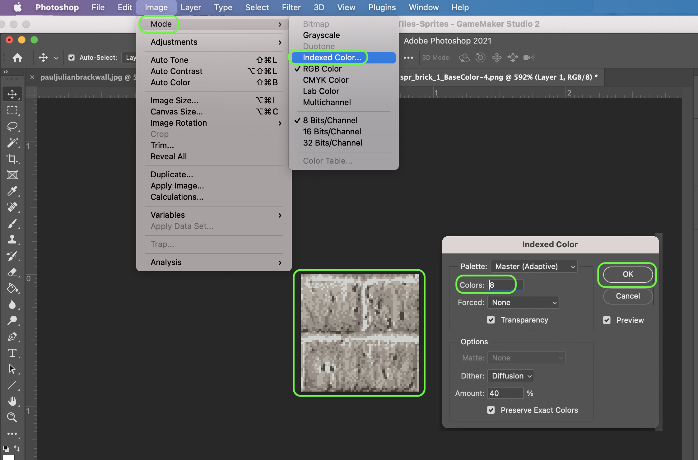

##### `Step 15.`\|`BTS`| :large_blue_diamond: :small_orange_diamond: 

Select the **File | Export | Quick Export as PNG**.  Call the file `spr_brick_1` and save it to another location (to not erase any of your other files we have craated). Press th e<kbd>Save</kbd> button.

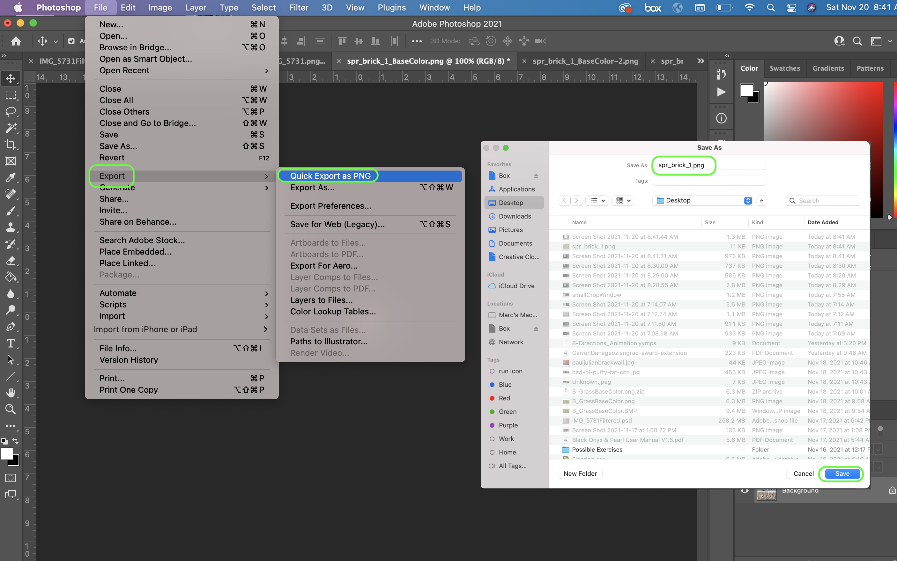

##### `Step 16.`\|`BTS`| :large_blue_diamond: :small_orange_diamond:   :small_blue_diamond: 

Open **Gamemaker** and right click on **Sprites** and select **Create | Sprite**.  Press the <kbd>Import</kbd> button and import **spr_brick_1.png** and call it `spr_brick`.

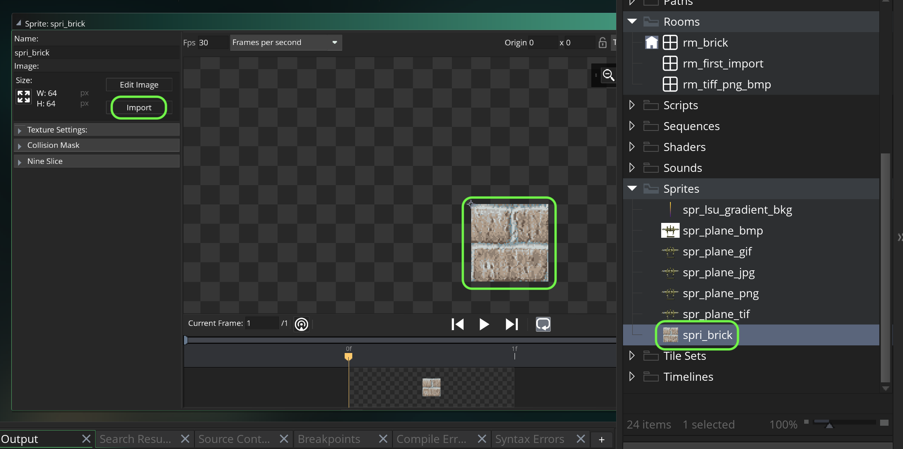

##### `Step 17.`\|`BTS`| :large_blue_diamond: :small_orange_diamond: :small_blue_diamond: :small_blue_diamond:

*Right click* on **Rooms** and select **New | Room** and name it `rm_brick`. Change the **Room Order** to place this room on the top of the list. In **Background Layer Properties** sledt the `spr_brick` sprite and check **Horizontal Tile** and **Vertical Tile** to see your texture tiled.

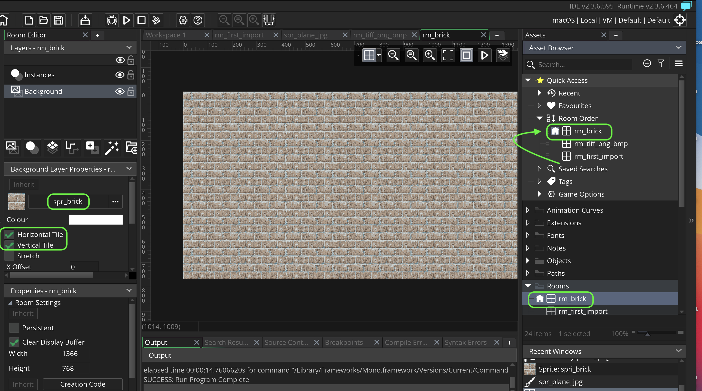

##### `Step 18.`\|`BTS`| :large_blue_diamond: :small_orange_diamond: :small_blue_diamond: :small_blue_diamond: :small_blue_diamond:

Now *press* the <kbd>Play</kbd> button in the top menu bar to launch the game.  It is rare that it will look good the first time.  Often the repeat is obvious and you have to go back and make adjustments.  This was my third time making small tweaks to a point to where I thought the results were acceptable for a prototype.

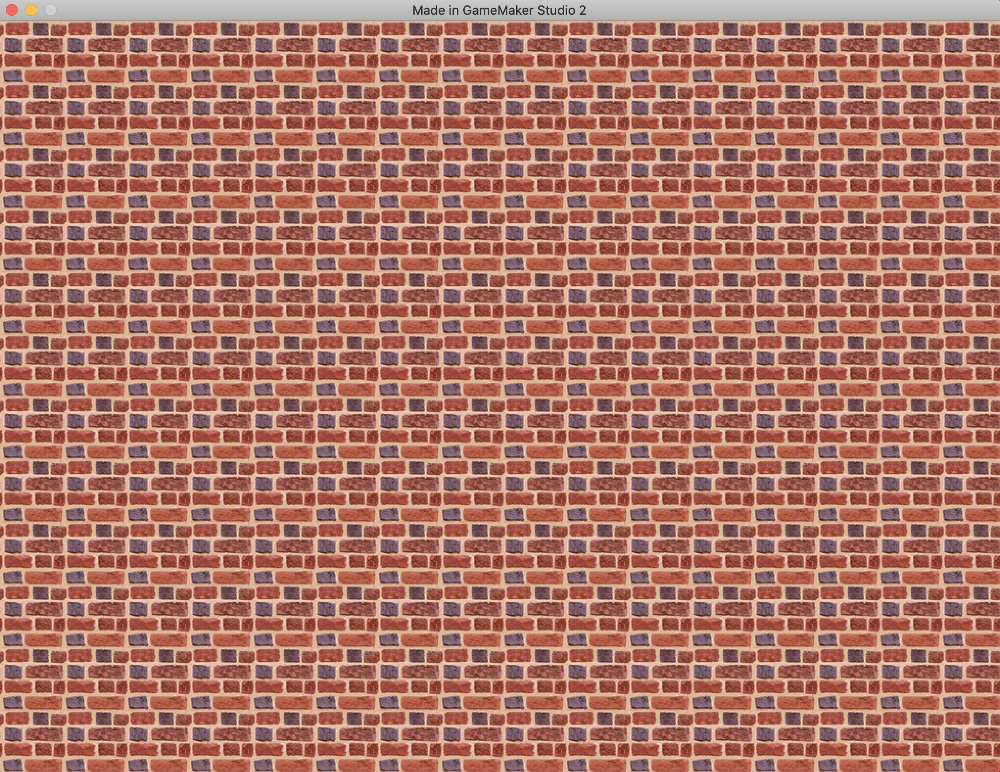

##### `Step 19.`\|`BTS`| :large_blue_diamond: :small_orange_diamond: :small_blue_diamond: :small_blue_diamond: :small_blue_diamond: :small_blue_diamond:

Select the **File | Save Project**, then press **File | Quit** (PC) **Game Maker | Quit** on Mac to make sure everything in the game is saved.

##### `Step 20.`\|`BTS`| :large_blue_diamond: :large_blue_diamond:

Open up **P4V**.  Select the top folder and press the **Add** button.  We want to add all the new files we created during this last session.  Add these files to the last change list you used at the begining of the session (in my case it was `Spaceship I portion of walkthrough`). Press the <kbd>OK</kbd> button.

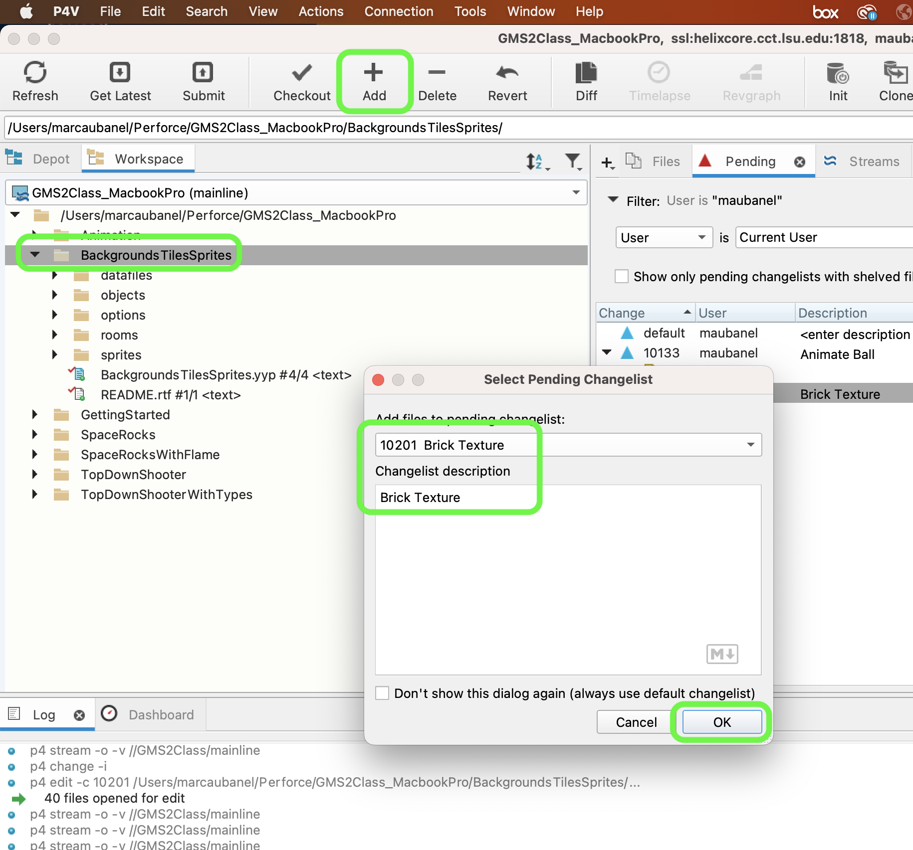

##### `Step 21.`\|`BTS`| :large_blue_diamond: :large_blue_diamond: :small_blue_diamond:

Now you can submit the changelist by pressing both <kbd>Submit</kbd> buttons.

<!--  -->
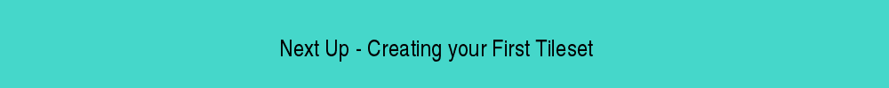

| [previous](../raster-vector/README.md#user-content-raster-and-vector)| [home](../README.md#user-content-gms2-background-tiles--sprites---table-of-contents) | [next](../first-tileset/README.md#user-content-creating-your-first-tileset)|
|---|---|---|
