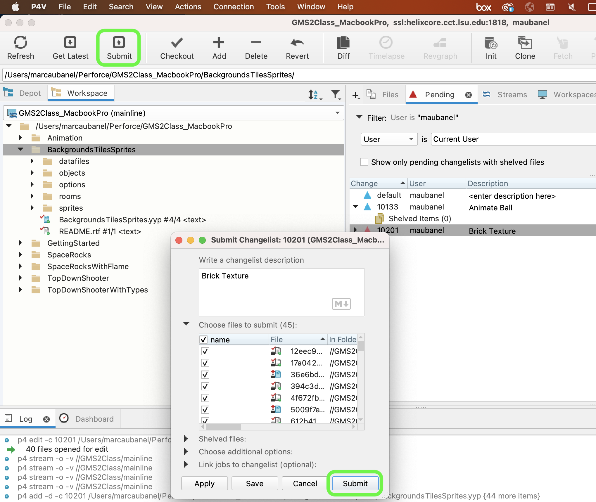

### Background and Single Tile

[previous](../raster-vector/README.md#user-content-raster-and-vector) • [home](../README.md#user-content-gms2-background-tiles--sprites---table-of-contents) • [next](../first-tileset/README.md#user-content-creating-your-first-tileset)

Textures take a lot of space so we want to not have an entire game use discrete pixels. As tempting as it is to have a 6000 x 1000 pixel level with a single matte painting in the background, there are limitations to what a video card can store and render. 
	
We usually break our artwork down into reusable *lego* pieces into their smallest common denominator. We will pick a resolution and make all of our tiles a multiple of this size (usually the sames size as our character). Gamemaker supports any pixel resolution, they don't need to be a power of 2.  The background we used initially would not be commonly found in games. Common sizes include:
		
* 16 x 16	
* 32 x 32
* 64 x 64
* 96 x 96
* 128 x 128	

There are many techniques we can use.

 

---

##### `Step 1.`\|`BTS`|:small_blue_diamond:

Open up **P4v**.  Select the top folder of the **GameMaker** project. Press the <kbd>Checkout</kbd> button.  Checkout out all files in P4V so that they are all writable (otherwise they will be read only and none of the changes will be saved). Select a **New** changelist and add a message describing the unit of work you will be performing. Press the <kbd>OK</kbd> button.

Open up the project you are working on in **GameMaker**. 

##### `Step 2.`\|`BTS`|:small_blue_diamond: :small_blue_diamond: 

The first technique is to alter an existing photo and make it tilable.

We are going to go with 64 by 64 for this exercise.  Download the image used here: [spr_brick_1.png](../Assets/PNG/spr_brick_1.png). 
    
There are two things we need to worry about.  One is making it tile, and secondly removing any complexity in the image that makes the repeat a very obvious pattern.  I also want to make it look a bit more "8-bit" and not photo realistic.  For prototyping we will do this using some quick tricks.  Open the file up in photoshop.

##### `Step 3.`\|`BTS`|:small_blue_diamond: :small_blue_diamond: :small_blue_diamond:

Grab the square selection tool and press the <kbd>Shift</kbd> key and select a small section of the brick texture.  I want to have it wrap the best I can so ideally it cuts on the grout line vertically then halfway between bricks horizontally.  Make sure the seletion is a square aspect ration (1:1).

##### `Step 4.`\|`BTS`|:small_blue_diamond: :small_blue_diamond: :small_blue_diamond: :small_blue_diamond:

Select **Image | Image Size** and set it to a larger size than we need.  We will target our final tile at 64 by 64, but lets work on a larger resolution tile.  Set the image size ot `512` square.

##### `Step 5.`\|`BTS`| :small_orange_diamond:

Now this texture is not tilable.  The edges won't line up.  What we will do is shift the edges to the center so we can clone tool them out.  Select **Filter | Other | Offset** and alter the vertical and horizontal alignment by `256`. Make sure **Wrap Around** is set to `true`.

##### `Step 6.`\|`BTS`| :small_orange_diamond: :small_blue_diamond:

Use the clone stamp tool and fix the center lines that show an abrupt change.  Pick a brush with a soft edge and adjust the size. Try and pick areas that make sense following the ground line and making sure the bricks are not too long or short.

https://user-images.githubusercontent.com/5504953/218638170-b9e66799-c477-4a83-bba9-9f77686755f5.mp4

##### `Step 7.`\|`BTS`| :small_orange_diamond: :small_blue_diamond: :small_blue_diamond:

Now lets make it look like an illustration/cartoon.  Go to **Filter | Filter Gallery** and look for **Poster Edges**.  Adjust the settings to taste then lock in the changes by press the <kbd>OK</kbd> button.

##### `Step 8.`\|`BTS`| :small_orange_diamond: :small_blue_diamond: :small_blue_diamond: :small_blue_diamond:

Go back to **Image | Image Size** and change to our final size of `64` by `64`.

##### `Step 9.`\|`BTS`| :small_orange_diamond: :small_blue_diamond: :small_blue_diamond: :small_blue_diamond: :small_blue_diamond:

Press **File | Export | Quick Export as PNG**.  Save the file and call it `spr_brick`.

##### `Step 10.`\|`BTS`| :large_blue_diamond:

Open **GameMaker** back up and create a new sprite.  Press the <kbd>Import</kbd> button and select the png file you just exported.  Call it `spr_brick`. Change **Horizontal Tile** and **Vertical Tile** to true.

##### `Step 11.`\|`BTS`| :large_blue_diamond: :small_blue_diamond: 

Now lets create a new room and call it `rm_brick`.  Select the **Background** layer then add to the background the `spr_brick`.  

##### `Step 12.`\|`BTS`| :large_blue_diamond: :small_blue_diamond: :small_blue_diamond: 

Now the repeat is not very convincing.  The contrast between the bricks is so great that it doesn't look like a single texture.

##### `Step 13.`\|`BTS`| :large_blue_diamond: :small_blue_diamond: :small_blue_diamond:  :small_blue_diamond: 

Lets reduce the color shifts by selecting **Filter | Other | High Pass**.  Change the values to get a smooth even color and contrast across the bricks.

##### `Step 14.`\|`BTS`| :large_blue_diamond: :small_blue_diamond: :small_blue_diamond: :small_blue_diamond:  :small_blue_diamond: 

The brick now looks like:

##### `Step 15.`\|`BTS`| :large_blue_diamond: :small_orange_diamond: 

Re-export the brick and import it into the same **spr_brick** sprite.  Now change the `rm_brick` to the top of the **Room Order** and press play.  The tiling is now much better.  Make the needed tweaks to hide thepeat.

##### `Step 16.`\|`BTS`| :large_blue_diamond: :small_orange_diamond:   :small_blue_diamond: 

Now back in photoshop lets add some of the color we drained from the image.  Add a **Color Overlay** effect and select a brick color and mix it in.

Now the new brick looks like:

##### `Step 17.`\|`BTS`| :large_blue_diamond: :small_orange_diamond: :small_blue_diamond: :small_blue_diamond:

Export it again and re-import the sprite. Now you have hidden the repeat and put some color back in the texture.

##### `Step 18.`\|`BTS`| :large_blue_diamond: :small_orange_diamond: :small_blue_diamond: :small_blue_diamond: :small_blue_diamond:

Select the **File | Save Project**, then press **File | Quit** (PC) **Game Maker | Quit** on Mac to make sure everything in the game is saved.

##### `Step 19.`\|`BTS`| :large_blue_diamond: :small_orange_diamond: :small_blue_diamond: :small_blue_diamond: :small_blue_diamond: :small_blue_diamond:

Open up **P4V**.  Select the top folder and press the **Add** button.  We want to add all the new files we created during this last session.  Add these files to the last change list you used at the begining of the session (in my case it was `Spaceship I portion of walkthrough`). Press the <kbd>OK</kbd> button.

##### `Step 20.`\|`BTS`| :large_blue_diamond: :large_blue_diamond:

Now you can submit the changelist by pressing both <kbd>Submit</kbd> buttons.

<!--  -->

| [previous](../raster-vector/README.md#user-content-raster-and-vector)| [home](../README.md#user-content-gms2-background-tiles--sprites---table-of-contents) | [next](../first-tileset/README.md#user-content-creating-your-first-tileset)|
|---|---|---|
