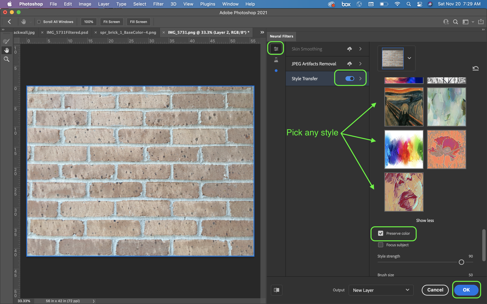
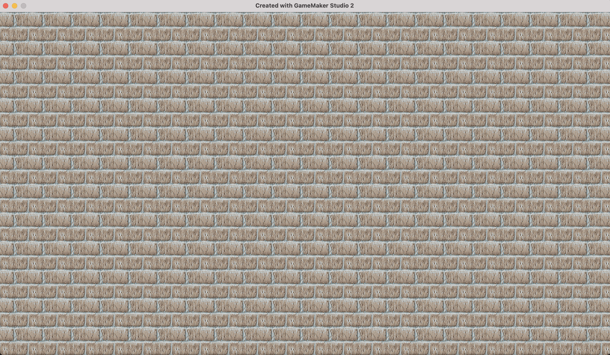

### Background and Single Tile

[previous](../raster-vector/README.md#user-content-raster-and-vector) • [home](../README.md#user-content-gms2-background-tiles--sprites---table-of-contents) • [next](../first-tileset/README.md#user-content-creating-your-first-tileset)

Textures take a lot of space so we want to not have an entire game use discrete pixels. As tempting as it is to have a 6000 x 1000 pixel level with a single matte painting in the background, there are limitations to what a video card can store and render. 
	
We usually break our artwork down into reusable *lego* pieces into their smallest common denominator. We will pick a resolution and make all of our tiles a multiple of this size (usually the sames size as our character). Gamemaker supports any pixel resolution, they don't need to be a power of 2.  The background we used initially would not be commonly found in games. Common sizes include:
		
* 16 x 16	
* 32 x 32
* 64 x 64
* 96 x 96
* 128 x 128	

 

---

##### `Step 1.`\|`BTS`|:small_blue_diamond:

We are going to go with 64 by 64 for this exercise.  Start a new photoshop file and import a large texture you like. Pick one you took with your camera or grab a free one that is copyright cleared to use on the internet.  I grabbed a photorealistic brick wall texture and made sure it has a lot more surface area than I need.  This way I can use different parts of this texture to build variety. If you don't have a camera you can download the image used here: [spr_brick_1.png](../Assets/PNG/spr_brick_1.png).
    

There are two things we need to worry about.  One is making it tile, and secondly removing any complexity in the image that makes the repeat a very obvious pattern.  I also want to make it look a bit more "8-bit" and not photo realistic.  For prototyping we will do this using some quick tricks.  Open the file up in photoshop.

##### `Step 2.`\|`BTS`|:small_blue_diamond: :small_blue_diamond: 

Select **Filter | Neural Filter**.

##### `Step 3.`\|`BTS`|:small_blue_diamond: :small_blue_diamond: :small_blue_diamond:

Turn on **Style Transfer**.  Select **Show more**.  Press on **Preserve Color** so that we keep the same colors and only inherit the style.  Try out a few and pick one that speaks to you.  When you are happy press the <kbd>OK</kbd> button.

##### `Step 4.`\|`BTS`|:small_blue_diamond: :small_blue_diamond: :small_blue_diamond: :small_blue_diamond:

Open up **Substance Sampler**.  Now press **Viewer Settings** and set the **Texture scale | U & V** to `8`.  We will get 8 repeats.  Change the **Mesh** to a `Plane`. Since it is a brick we want to see it on a flat surface (we are a 2-D game none the less)

##### `Step 5.`\|`BTS`| :small_orange_diamond:

Now drag the photo that you applied the neural filter to into the **LAYER** panel on the right.

##### `Step 6.`\|`BTS`| :small_orange_diamond: :small_blue_diamond:

This software tries to create all your 3-D maps for a PBR material.  All we want is the **Base Color** and don't need any of the other maps.  Select **Use as bitmap** and the press the <kbd>OK</kbd> button.

##### `Step 7.`\|`BTS`| :small_orange_diamond: :small_blue_diamond: :small_blue_diamond:

Now we do not see the texture with the default settings.  Select the **Output image** and choose `Base Color`.  Then press the **3D-Icon** next to the plane so we have two windows, one with the 3-D view showing the tiling and one with the 2-D view on the right hand side.

##### `Step 8.`\|`BTS`| :small_orange_diamond: :small_blue_diamond: :small_blue_diamond: :small_blue_diamond:

Now the picture doesn't have even lighting and the bricks on the right are noticably darker than the ones on the left.  This makes it look like we have a repeating dark splotch.  Press the **Add a layer** icon to add a **Equalize** filter. Play with the settings to remove as much as the shading variation as you like.

##### `Step 9.`\|`BTS`| :small_orange_diamond: :small_blue_diamond: :small_blue_diamond: :small_blue_diamond: :small_blue_diamond:

Now we need to crop an area.  You can select the same **Add a layer** button and search for **Crop** or drag the icon form the most common layers on the left hand panel under **File**.

##### `Step 10.`\|`BTS`| :large_blue_diamond:

Now this texture will be 64 by 64 so we don't want a lot of bricks.  I want three bricks per tile. I want it as square as possible but place the crop lines along the grout line.  Now our texture is square so we don't have to skew the perspective.  After trian and error and moving around I found a location where it repeats nicely.  We cannot use their built in layer for tiling as it doesn't work with textures with existing patterns like bricks and tile.

##### `Step 11.`\|`BTS`| :large_blue_diamond: :small_blue_diamond: 

When you got what you want press the **Export** icon.  Call the file `spr_brick_1`.  Select the **Format** as `png`.  Put it in a working directory. Leave the high resolution as this software doesn't handle reducing the texture size to `64` by `64` nearly as well as photoshop does and it becomes to blurry in the reduction process.  Select **only** the **Base Color** layer as we do not need any other textures. Press the <kbd>Export</kbd> button.

##### `Step 12.`\|`BTS`| :large_blue_diamond: :small_blue_diamond: :small_blue_diamond: 

Open up the image in photoshop.  Please note that it adds `_BaseColor` at the end of the name.Press the **Image | Resize Image** item and rescale the image to `64` by `64`. Keep the **Resample** at `automatic`. Press the <kbd>OK</kbd> button.

##### `Step 13.`\|`BTS`| :large_blue_diamond: :small_blue_diamond: :small_blue_diamond:  :small_blue_diamond: 

This takes a lot more photoshop work.  I used the clone tool, I drew in grout where needed and cut and paste ends to reconnect pieces.  This takes some artistic liberty.  Again, Iit is important not to touch the top or bottom row of pixels or we will cause a new problem when this texture repeats. Here is what I got to.

##### `Step 14.`\|`BTS`| :large_blue_diamond: :small_blue_diamond: :small_blue_diamond: :small_blue_diamond:  :small_blue_diamond: 

Lets do one final check by going to **Filter | Other | Offset** and check both vertical and horizontal.  There should be no seams when scrolling.

##### `Step 15.`\|`BTS`| :large_blue_diamond: :small_orange_diamond: 

Export the png and open **Gamemaker** and *double click* the **spr_brick_bck** and then press <kbd>Import</kbd> button and select this new sprite with the better wrapping.

##### `Step 16.`\|`BTS`| :large_blue_diamond: :small_orange_diamond:   :small_blue_diamond: 

Now the sprite is updated with our tiling fixed.

##### `Step 17.`\|`BTS`| :large_blue_diamond: :small_orange_diamond: :small_blue_diamond: :small_blue_diamond:

Now *press* the <kbd>Play</kbd> button in the top menu bar to launch the game.  Now it looks a lot better but I can still see a repeated pattern.  It is not too bad but most of the time it turns out worse when working from a photographic source.

##### `Step 18.`\|`BTS`| :large_blue_diamond: :small_orange_diamond: :small_blue_diamond: :small_blue_diamond: :small_blue_diamond:

Our final step once the obvious repeat problems are removed is to try your best to hide the repeat.  This can be a combination of removing any outstanding artifacts, lowering contrast and reducing the number colors in the pallette.  There are many different techniques for this.  I have chosen to use **Filter | Filter Gallery | Cutout** to reduce the colors (I have also used the legacy web exporting to GIF and manually tweaking the color palette).

##### `Step 19.`\|`BTS`| :large_blue_diamond: :small_orange_diamond: :small_blue_diamond: :small_blue_diamond: :small_blue_diamond: :small_blue_diamond:

Now the palette is dramtically simplified. Since this will be scaled we will still get interesting results.  This is one reason to work in a larger format than the 64 by 64 we are ending up with.

##### `Step 20.`\|`BTS`| :large_blue_diamond: :large_blue_diamond:

Now export a 64 by 64 version of it and re-import into `spr_brick_bck`.

##### `Step 21.`\|`BTS`| :large_blue_diamond: :large_blue_diamond: :small_blue_diamond:

Now *press* the <kbd>Play</kbd> button in the top menu bar to launch the game.  Now we have fixed the repeat issue and massaged the colors to make it look more like one contiguous area than a repeated pattern.

##### `Step 22.`\|`BTS`| :large_blue_diamond: :large_blue_diamond: :small_blue_diamond: :small_blue_diamond:

Select the **File | Save Project** then press **File | Quit** to make sure everything in the game is saved. If you are using **GitHub** open up **GitHub Desktop** and add a title and longer description (if necessary) and press the <kbd>Commit to main</kbd> button. Finish by pressing **Push origin** to update the server with the latest changes.

___

| [previous](../raster-vector/README.md#user-content-raster-and-vector)| [home](../README.md#user-content-gms2-background-tiles--sprites---table-of-contents) | [next](../first-tileset/README.md#user-content-creating-your-first-tileset)|
|---|---|---|
