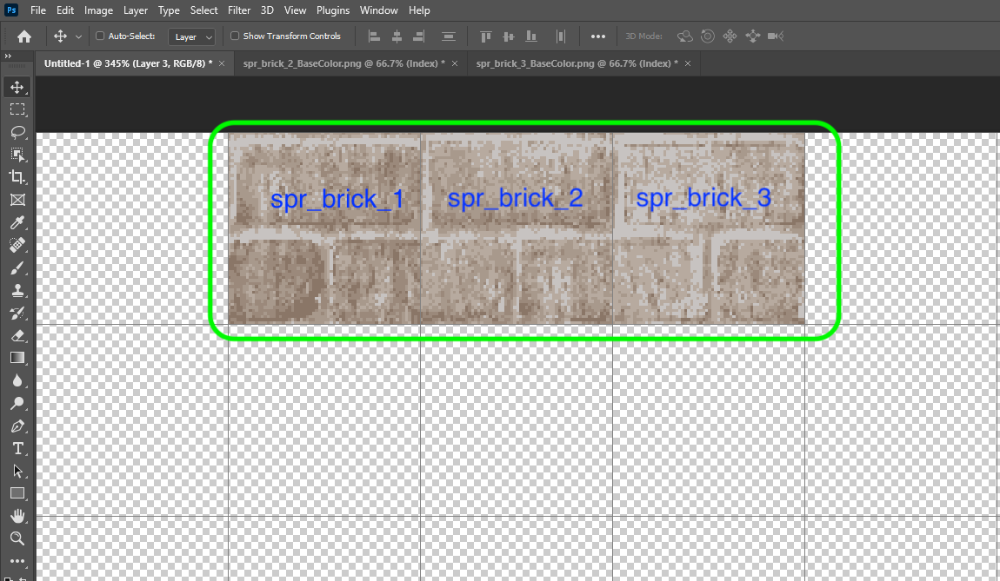
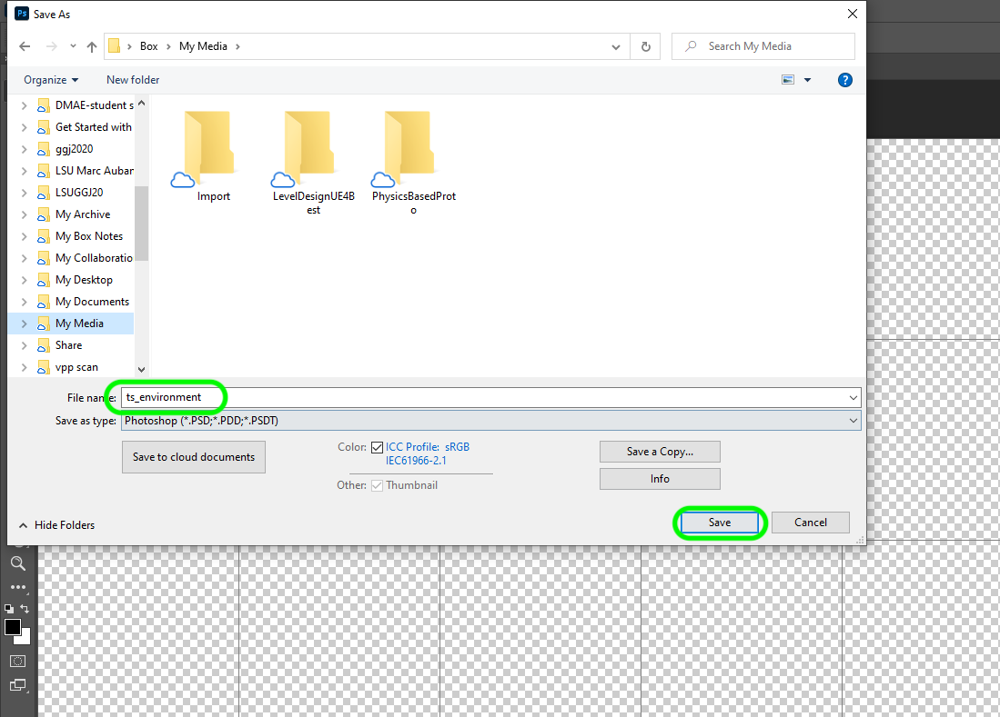

### Creating your First Tileset II

[previous](../first-tileset/README.md#user-content-creating-your-first-tileset) • [home](../README.md#user-content-gms2-background-tiles--sprites---table-of-contents) • [next](../auto-tile/README.md#user-content-auto-tile-template)

Lets make our first tileset and check to see how well our three bricks fit together. 

---

##### `Step 1.`\|`BTS`|:small_blue_diamond:

Repeat the step 19 to 21 on the previous page on **spr_brick_2** and **spr_brick_3**.  This should leave us with three different brick textures that we can check for accuracy. 
		

##### `Step 2.`\|`BTS`|:small_blue_diamond: :small_blue_diamond: 

Press the **File | Save** menu item and save the file as `ts_environment` as a **psd** file.  Store it in a working folder.

##### `Step 3.`\|`BTS`|:small_blue_diamond: :small_blue_diamond: :small_blue_diamond:

Press the **File | Export | Export As** and select **png** and press the <kbd>Export</kbd> button.  Call it `ts_environment` and put it in your working folder.  We cannot use the above **psd** in **GameMaker** so instead we will us a `.png`.

##### `Step 4.`\|`BTS`|:small_blue_diamond: :small_blue_diamond: :small_blue_diamond: :small_blue_diamond:

Open up **GameMaker** and select **Sprites** by right clicking on the title and select **Create | Sprite**.  Press the <kbd>Import</kbd> button and select the **ts_environment** file you just exported and call it `spr_environment_tiles`. Now you have a tileset loaded up in the sprite.

##### `Step 5.`\|`BTS`| :small_orange_diamond:

Now we cannot use a sprite as a tilesheet.  We can only assign it to an **Object** or **Background**.  We can add it as a tile by right clicking on **Tile Sets** and selecting **Create | Tile Set**.  Call is `ts_environment`.  Assign the **spr_environment_tiles** as its image file. Notice it loads up the tile sheet.

##### `Step 6.`\|`BTS`| :small_orange_diamond: :small_blue_diamond:

Now change the **Tile Width** and **Tile Height** to `64`.  The grid should now match the fixed size of our tiles.

##### `Step 7.`\|`BTS`| :small_orange_diamond: :small_blue_diamond: :small_blue_diamond:

*Right click* on **Rooms** and select **New | Room** and name it `rm_tileset`. Change the **Room Order** to place this room on the top of the list. Now create a new **Tile Layer** and call it `Environment`.  Assign the **ts_envirnoment** tileset to this layer.  A window for the **Room Editor** should open up on the right hand side.

##### `Step 8.`\|`BTS`| :small_orange_diamond: :small_blue_diamond: :small_blue_diamond: :small_blue_diamond:

Now you can select the **Pencil** tool in the top menu and select the tile you would like to paint.  Lets paint three zones of tile 1, tile 2 and tile 3.  This will let us see how different they look as a group. YOu paint them by selecting each grid zone and pressin the left mouse button.

##### `Step 9.`\|`BTS`| :small_orange_diamond: :small_blue_diamond: :small_blue_diamond: :small_blue_diamond: :small_blue_diamond:

For the rest of the level randomly select between the three types of tiles, and lets see if they work together.  If there are any issues you will have to go back to the **3D Sampler** files and make edits to them.  Fill as much as you can with the three tiles.  Now *press* the <kbd>Play</kbd> button in the top menu bar to launch the game. Now you can see what they look like on their own and in a group.

https://user-images.githubusercontent.com/5504953/142772461-1047baaf-9cd0-473d-85ff-047139a458a6.mp4

##### `Step 10.`\|`BTS`| :large_blue_diamond:

Now once you are happy with your three tiles go back to **Substance 3D Samper** and turn off **Crop** for the 2nd and 3rd tile and activate **Crop** layer 1.  Turn on visibility on the **Moss** layer.  Press the **Export** icon and call it `spr_brick_1_moss`.  Select just the **Base Color** and use a **png**.  Press the <kbd>Export</kbd> button.

##### `Step 11.`\|`BTS`| :large_blue_diamond: :small_blue_diamond: 

Repeat this for `spr_brick_1_dirt`, `spr_brick_1_dust`, `spr_brick_1_oxid`, `spr_brick_2_moss`, `spr_brick_2_dirt`, `spr_brick_2_dust`, `spr_brick_2_oxid`, `spr_brick_3_moss`, `spr_brick_3_dirt`, `spr_brick_3_dust`, `spr_brick_3_oxid`. Turn on only the layers you need for each effect, and combine them if you like.  There are no rules here, we just want a good variety of different effects.

##### `Step 12.`\|`BTS`| :large_blue_diamond: :small_blue_diamond: :small_blue_diamond: 

Now take all of these exports into **Photoshop** and turn the **Mode | Indexed Color** and reduce the colors.  Be careful as it is set to **Previous**, it will use the previous palette.  We do not want this.  You might notice your moss is not green.  Reselet a setting and make sure there are enough colors to get the green. Rescale the **Image** to `64` by `64` as we did previously.

##### `Step 13.`\|`BTS`| :large_blue_diamond: :small_blue_diamond: :small_blue_diamond:  :small_blue_diamond: 

Duplicate **ts_environment** and call it `ts_environment_2`.  Copy and paste all the above new tiles so that you have all the 5 tiles of each type next to each other.

##### `Step 14.`\|`BTS`| :large_blue_diamond: :small_blue_diamond: :small_blue_diamond: :small_blue_diamond:  :small_blue_diamond: 

##### `Step 15.`\|`BTS`| :large_blue_diamond: :small_orange_diamond: 

##### `Step 16.`\|`BTS`| :large_blue_diamond: :small_orange_diamond:   :small_blue_diamond: 

##### `Step 17.`\|`BTS`| :large_blue_diamond: :small_orange_diamond: :small_blue_diamond: :small_blue_diamond:

##### `Step 18.`\|`BTS`| :large_blue_diamond: :small_orange_diamond: :small_blue_diamond: :small_blue_diamond: :small_blue_diamond:

##### `Step 19.`\|`BTS`| :large_blue_diamond: :small_orange_diamond: :small_blue_diamond: :small_blue_diamond: :small_blue_diamond: :small_blue_diamond:

##### `Step 20.`\|`BTS`| :large_blue_diamond: :large_blue_diamond:

##### `Step 21.`\|`BTS`| :large_blue_diamond: :large_blue_diamond: :small_blue_diamond:

___

| [previous](../first-tileset/README.md#user-content-creating-your-first-tileset)| [home](../README.md#user-content-gms2-background-tiles--sprites---table-of-contents) | [next](../auto-tile/README.md#user-content-auto-tile-template)|
|---|---|---|
