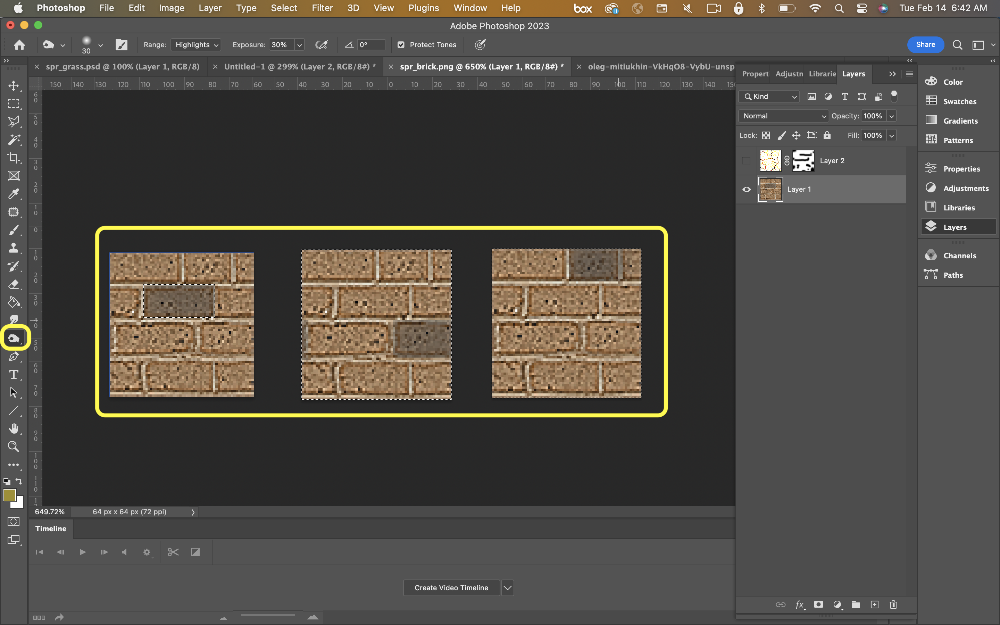
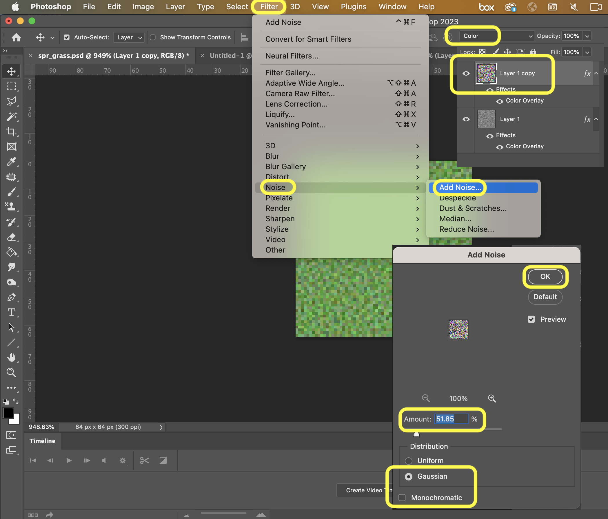
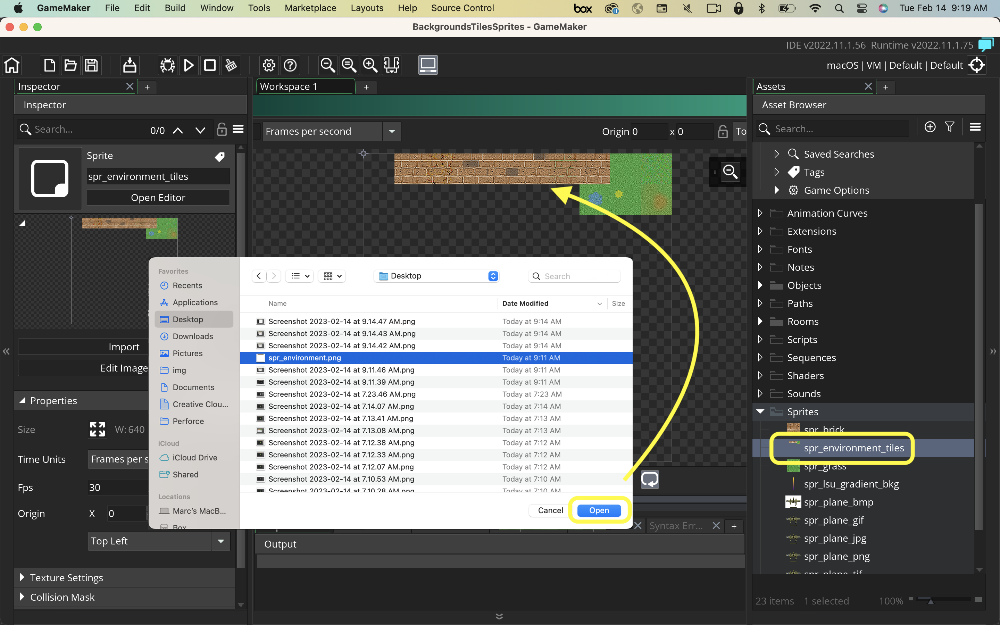

### Creating your First Tileset II

[previous](../first-tileset/README.md#user-content-creating-your-first-tileset) • [home](../README.md#user-content-gms2-background-tiles--sprites---table-of-contents) • [next](../auto-tile/README.md#user-content-auto-tile-template)

Lets extend our first tileset and add some variety to our shapes. 

---

##### `Step 1.`\|`BTS`|:small_blue_diamond:

Lets add some cracks to the brick.  Find a nice cracked texture on your own.  Select a square from it. Crop the square and change the scale to `64` by `64`.
		

##### `Step 2.`\|`BTS`|:small_blue_diamond: :small_blue_diamond: 

Set the **Image | Adjustments | Levels** and crush the whites so we have a dark line of cracks.

##### `Step 3.`\|`BTS`|:small_blue_diamond: :small_blue_diamond: :small_blue_diamond:

Add this as a layer on top of the brick.  Change the blend mode to **Multiply**. Add a **Mask** and paint out the edges as we dont' want to affect the tiling of this texture.

##### `Step 4.`\|`BTS`|:small_blue_diamond: :small_blue_diamond: :small_blue_diamond: :small_blue_diamond:

Select the entire spite and select **Edit | Copy Merged** to copy all layers.  

##### `Step 5.`\|`BTS`| :small_orange_diamond:

Paste and place it into the third column on the first row. 

##### `Step 6.`\|`BTS`| :small_orange_diamond: :small_blue_diamond:

I selected the burn tool with the range set to **Highlights** then darkened three separate bricks.  This will give some more variety to this texture.

##### `Step 7.`\|`BTS`| :small_orange_diamond: :small_blue_diamond: :small_blue_diamond:

Copy the three bricks to the sprite sheet and now we have 5 variety of bricks that are different to give a lot of variety.

##### `Step 8.`\|`BTS`| :small_orange_diamond: :small_blue_diamond: :small_blue_diamond: :small_blue_diamond:

I then added the grass below the brick.  I added a mask and painted in some grass into the grout lines with a black brush.

##### `Step 9.`\|`BTS`| :small_orange_diamond: :small_blue_diamond: :small_blue_diamond: :small_blue_diamond: :small_blue_diamond:

I added this new tile to the sprite sheet.

##### `Step 10.`\|`BTS`| :large_blue_diamond:

That's enough brick, lets add some grass to the tilesheet.  Cut and paste the grass we previously made.

##### `Step 11.`\|`BTS`| :large_blue_diamond: :small_blue_diamond: 

Duplicate the grass layer.  Now on the top layer you can add a **Filter | Noise | Add Noise** and set **Monochromatic** to false and add the desired amount of noise. Changle the overlay type to **Color** and adjust the percentage of the effect you want.  Sort of adds some dirt like noise to my texture.

##### `Step 12.`\|`BTS`| :large_blue_diamond: :small_blue_diamond: :small_blue_diamond: 

Copy and paste the alternate grass with dirt into the tilesheet.

##### `Step 13.`\|`BTS`| :large_blue_diamond: :small_blue_diamond: :small_blue_diamond:  :small_blue_diamond: 

Now paste this into your tilesheet.  I hand painted two flowers onto the grass for some more variety.  I also hand painted some dirt in the middle of the grass with a brown brush where I only affected the color channel. Create three more alternatives so that you have 5 grass textures in all.

##### `Step 14.`\|`BTS`| :large_blue_diamond: :small_blue_diamond: :small_blue_diamond: :small_blue_diamond:  :small_blue_diamond: 

Press the **File | Save** menu item and save the file as `spr_environment` as a **psd** file.  Store it in a working folder.

Press the **File | Export | Quick Export as PNG** and press the <kbd>Export</kbd> button.  Call it `ts_environment` and put it in your working folder.  We cannot use the above **psd** in **GameMaker** so instead we will use a `.png`.

##### `Step 15.`\|`BTS`| :large_blue_diamond: :small_orange_diamond: 

Open up **GameMaker** and select **Sprites** by right clicking on the title and select **Create | Sprite**.  Press the <kbd>Import</kbd> button and select the **spr_environment** file you just exported and call it `spr_environment_tiles`. Now you have a tileset loaded up in the sprite.

##### `Step 16.`\|`BTS`| :large_blue_diamond: :small_orange_diamond:   :small_blue_diamond: 

Now we cannot use a sprite as a tilesheet.  We can only assign it to an **Object** or **Background**.  We can add it as a tile by right clicking on **Tile Sets** and selecting **Create | Tile Set**.  Call is `ts_environment`.  Assign the **spr_environment_tiles** as its image file. Notice it loads up the tile sheet.

##### `Step 17.`\|`BTS`| :large_blue_diamond: :small_orange_diamond: :small_blue_diamond: :small_blue_diamond:

Now change the **Tile Width** and **Tile Height** to `64`.  The grid should now match the fixed size of our tiles.

##### `Step 18.`\|`BTS`| :large_blue_diamond: :small_orange_diamond: :small_blue_diamond: :small_blue_diamond: :small_blue_diamond:

*Right click* on **Rooms** and select **New | Room** and name it `rm_tileset`. Change the **Room Order** to place this room on the top of the list. Now create a new **Tile Layer** and call it `Environment`.  Assign the **ts_envirnoment** tileset to this layer.  A window for the **Room Editor** should open up on the right hand side.

https://user-images.githubusercontent.com/5504953/218786854-5614baf2-fba7-4a99-b5d8-6726e40ab073.mp4

##### `Step 19.`\|`BTS`| :large_blue_diamond: :small_orange_diamond: :small_blue_diamond: :small_blue_diamond: :small_blue_diamond: :small_blue_diamond:

Now you can select the **Pencil** tool in the top menu and select the tile you would like to paint.  Lets paint the edges with the brick and add grass on the inside. You can rotate the brushes to add even more variety and add a smattering of alternate grass and bricks to taste.

https://user-images.githubusercontent.com/5504953/218789866-4ca1d029-d521-4354-bf0d-d6180fbf9bf6.mp4

##### `Step 20.`\|`BTS`| :large_blue_diamond: :large_blue_diamond:

Now when you press the play button I received an error. I had to open the Tilesheet and set **Disable Source Sprite Export** to `false`.

##### `Step 21.`\|`BTS`| :large_blue_diamond: :large_blue_diamond: :small_blue_diamond:

Select the **File | Save Project**, then press **File | Quit** (PC) **Game Maker | Quit** on Mac to make sure everything in the game is saved.

##### `Step 22.`\|`BTS`| :large_blue_diamond: :large_blue_diamond: :small_blue_diamond: :small_blue_diamond:

Open up **P4V**.  Select the top folder and press the **Add** button.  We want to add all the new files we created during this last session.  Add these files to the last change list you used at the begining of the session (in my case it was `Spaceship I portion of walkthrough`). Press the <kbd>OK</kbd> button.

##### `Step 23.`\|`BTS`| :large_blue_diamond: :large_blue_diamond: :small_blue_diamond: :small_blue_diamond: :small_blue_diamond:

Now you can submit the changelist by pressing both <kbd>Submit</kbd> buttons.

<!--  -->

| [previous](../first-tileset/README.md#user-content-creating-your-first-tileset)| [home](../README.md#user-content-gms2-background-tiles--sprites---table-of-contents) | [next](../auto-tile/README.md#user-content-auto-tile-template)|
|---|---|---|
