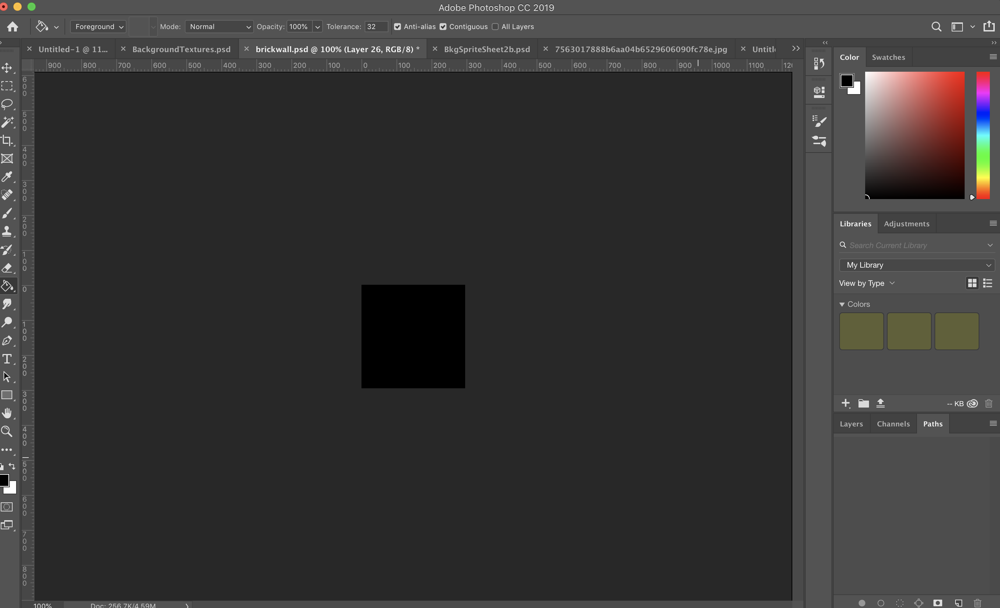
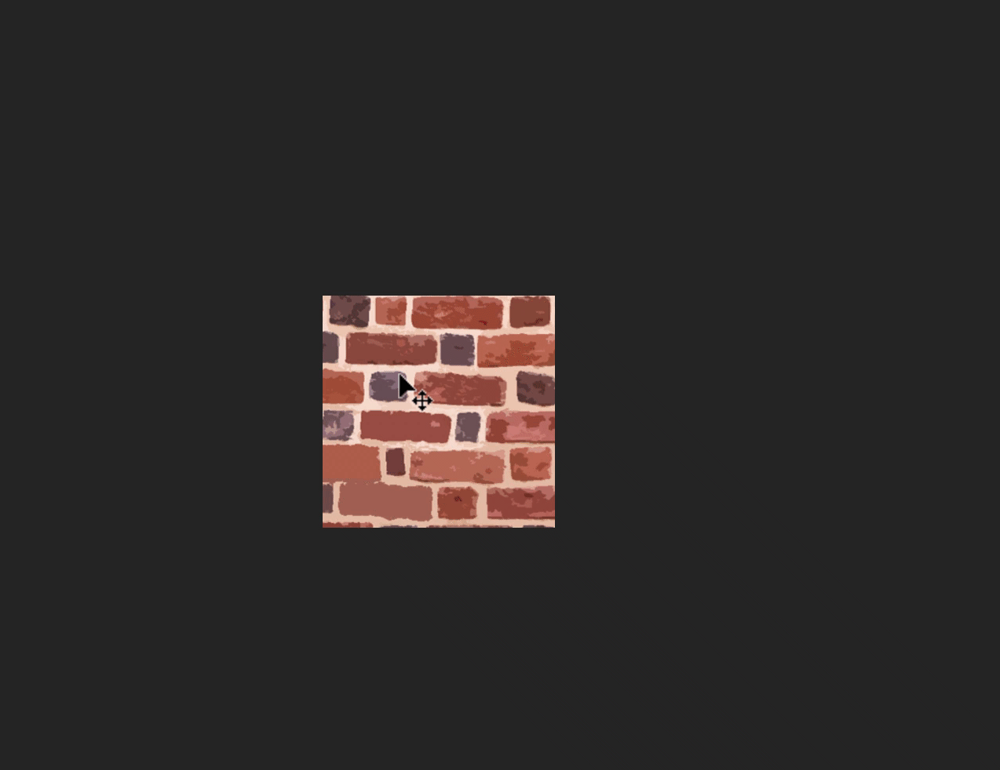
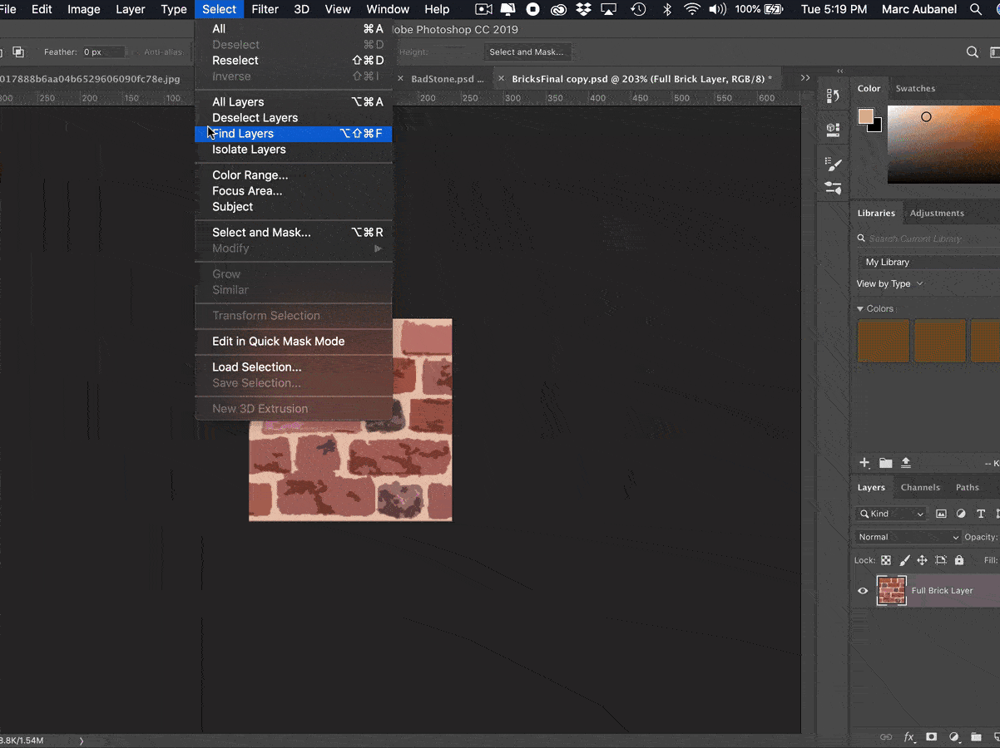
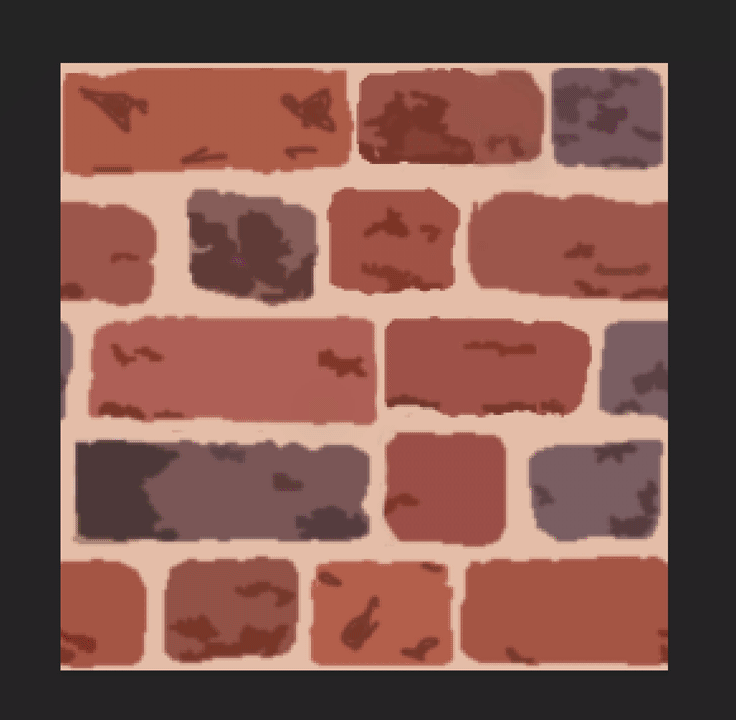

### Creating your First Tileset

[previous](../background-tile/README.md#user-content-background-and-single-tile) • [home](../README.md#user-content-gms2-background-tiles--sprites---table-of-contents) • [next](../auto-tile/README.md#user-content-auto-tile-template)

Now no one wants to play a game with a single tile.  And using the background feature of a room is limited in what we can do with it by assigning a single image.  We are much better off using the tile features in Gamemaker so we can have multiple tiles.  Lets do this and create a variety of tiles that we can choose from for this one shape.  By having variety we wll further break up the repeats when used in game.

 

---

##### `Step 1.`\|`BTS`|:small_blue_diamond:

Lets start over again with a new document.  Practice makes perfect, this time you can take what you have learned and make it even better.  So we go back to our very first original large sheet of art.  Lets apply the color pallette fixes on the entire image as we will be using differrent parts of it.  
		

##### `Step 2.`\|`BTS`|:small_blue_diamond: :small_blue_diamond: 

I create a new photoshop document that is 256 by 256 with a black background.  I first tested out how big I wanted the brick texture by getting it into the game.  If a person who is six foot tall is 64 pixels high, I want the scale of my texture to match.  Note that it doesn't have to be 256 by 256, I like to work in a format that is larger and easier to edit.  The other advantage in working in large sizes is future proofing your work if you redo the game at a higher resolution.

##### `Step 3.`\|`BTS`|:small_blue_diamond: :small_blue_diamond: :small_blue_diamond:

Now copy and paste your bigger texture page into this new document.  Now you can scroll the background around.  This base layer maintains the entire size of the original texture but I can pick different parts of the image.  I premeasured mine so that the cracks vertically would match the seam.  This will make altering the texure to be tilable much easier.  I align it in place.

##### `Step 4.`\|`BTS`|:small_blue_diamond: :small_blue_diamond: :small_blue_diamond: :small_blue_diamond:

Now we don't want to touch this layer as we will create different bricks with it.  Once you lined it up the way you want select all and copy and paste ths onto a new layer. This way it is only a **256 by 256** portion.  Move it around and there should be nothing around it.  Now we can go back to **Filter | Other | Offset** and remove both the horizontal and vertical repeats.

Repeat the same touch ups to remove the obvious tiling problems for both horizontal and vertical wrapping.

##### `Step 5.`\|`BTS`| :small_orange_diamond:

Now double check that it can be scrolled with no obvious lines or problems.

##### `Step 6.`\|`BTS`| :small_orange_diamond: :small_blue_diamond:

One way of breaking up a pattern is to have different versions of the texture.  We can use different shapes and sticth them but they all need to have the exact same edge pixels.  We can cut out the middle and leaving only the edge pixels.  I cut very close to the grout line but left a bit of the overlapping rocks like so::

##### `Step 7.`\|`BTS`| :small_orange_diamond: :small_blue_diamond: :small_blue_diamond:

Now turn on the bottom layer with all of the original texture.  Move it around to pick a completly different part.

##### `Step 8.`\|`BTS`| :small_orange_diamond: :small_blue_diamond: :small_blue_diamond: :small_blue_diamond:

Copy and paste this to a new layer.  **Photoshop** any issues along the edges without affecting the very edge pixels.  Again, *remove all* the tiling lines using the offset filter.  Double check that it can be scrolled with no obvious lines or problems.

##### `Step 9.`\|`BTS`| :small_orange_diamond: :small_blue_diamond: :small_blue_diamond: :small_blue_diamond: :small_blue_diamond:

I then made a third tile variation and fixed the repeat.  So now I have three completely different pieces that can all fit toghether.

##### `Step 10.`\|`BTS`| :large_blue_diamond:

I then made copies of the original three and made changes including, removing bricks, cracks, moss and dirt.  This was all done in photoshop.

##### `Step 11.`\|`BTS`| :large_blue_diamond: :small_blue_diamond: 

Now we need a separate sprite tile sheet to hold the tiles we just created.  Since these are 64 by 64 I made a 16 by 16 tile grid.  I  created a 1024 by 1024 pixel image in Photoshop with a white background.  

##### `Step 12.`\|`BTS`| :large_blue_diamond: :small_blue_diamond: :small_blue_diamond: 

Go to **Preferences | Guides, Grid & Slices**. Adjust the **grid** to `64` and **subdivisions** to `1`.  Pick a color that doesn't clash with your artwork.

##### `Step 13.`\|`BTS`| :large_blue_diamond: :small_blue_diamond: :small_blue_diamond:  :small_blue_diamond: 

Go to **View | Show | Grid** so that the grid appears and makes snapping and moving the tiles much easier. 

##### `Step 14.`\|`BTS`| :large_blue_diamond: :small_blue_diamond: :small_blue_diamond: :small_blue_diamond:  :small_blue_diamond: 

*Copy and paste* each tile into the sheet.  *Rescale* them to **64 by 64** and put like textures next to each other.  Leave the top left blank. GameMaker will **never** display the top left tile, so it doesn't matter what goes there - it will be ignored.

##### `Step 15.`\|`BTS`| :large_blue_diamond: :small_orange_diamond: 

Export the tile sheet as a **PNG** file.  Call it `spr_background_tiles.png`.  Now create another **Sprite** and press the <kbd>Import</kbd> button to bring in the tilesheet and name it `spr_background_tiles`.

##### `Step 16.`\|`BTS`| :large_blue_diamond: :small_orange_diamond:   :small_blue_diamond: 

Now we are gong to create a new Tile Set and call it `ts_background_tiles`.  *Assign* the sprite you just made and click on **Tile Set Properties** and make sure the **Tile Height** and **Tile Width** are both set to `64`.

##### `Step 17.`\|`BTS`| :large_blue_diamond: :small_orange_diamond: :small_blue_diamond: :small_blue_diamond:

Create a new room and move it to the top.  Call it `rm_lvl_test`.  Add a **Tile Layer** and name it `BackgroundTiles`.  Place it *under* the **Instances** layer. Select the **Tileset** you just created.

##### `Step 18.`\|`BTS`| :large_blue_diamond: :small_orange_diamond: :small_blue_diamond: :small_blue_diamond: :small_blue_diamond:

Now you can click on the right hand side and and select one of the 7 tiles.  You then paint them in the room filling up various spaces.
	
Keep adding tiles mixing it up. Try and fool the eye not to notice a pattern.  Take your time and be careful. Fill every last piece of the room.
	
Scatter some of the distressed tiles judiciously.  

##### `Step 19.`\|`BTS`| :large_blue_diamond: :small_orange_diamond: :small_blue_diamond: :small_blue_diamond: :small_blue_diamond: :small_blue_diamond:

Now *press* the <kbd>Play</kbd> button in the top menu bar to launch the game. Notice the tiled brick and the pattern is not as bad. 

##### `Step 20.`\|`BTS`| :large_blue_diamond: :large_blue_diamond:

Select the **File | Save Project** then press **File | Quit** to make sure everything in the game is saved. If you are using **GitHub** open up **GitHub Desktop** and add a title and longer description (if necessary) and press the <kbd>Commit to main</kbd> button. Finish by pressing **Push origin** to update the server with the latest changes.

___

| [previous](../background-tile/README.md#user-content-background-and-single-tile)| [home](../README.md#user-content-gms2-background-tiles--sprites---table-of-contents) | [next](../auto-tile/README.md#user-content-auto-tile-template)|
|---|---|---|
