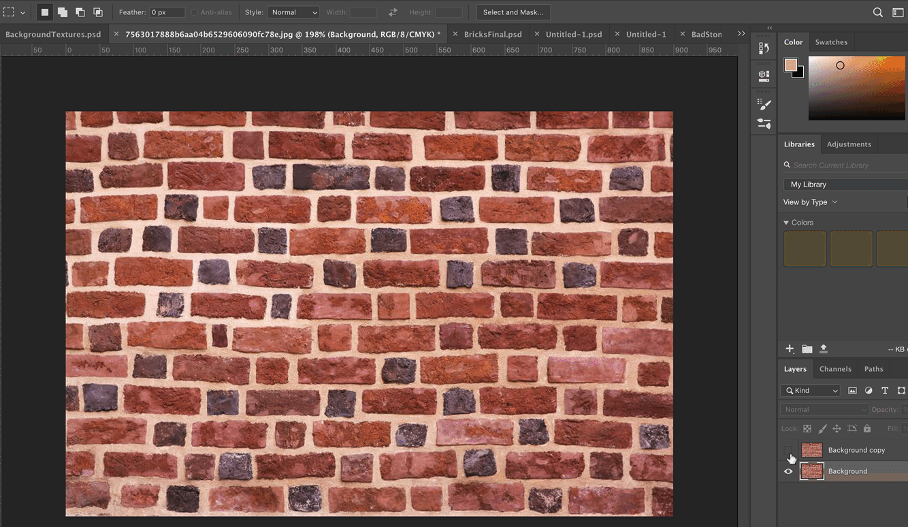

### Creating your First Tileset

[previous](../background-tile/README.md#user-content-background-and-single-tile) • [home](../README.md#user-content-gms2-background-tiles--sprites---table-of-contents) • [next](../auto-tile/README.md#user-content-auto-tile-template)

Now no one wants to play a game with a single tile.  And using the background feature of a room is limited in what we can do with it by assigning a single image.  We are much better off using the tile features in Gamemaker so we can have multiple tiles.  Lets do this and create a variety of tiles that we can choose from for this one shape.  By having variety we wll further break up the repeats when used in game.

 

---

##### `Step 1.`\|`BTS`|:small_blue_diamond:

Lets start over again with a new document.  Practice makes perfect, this time you can take what you have learned and make it even better.  So we go back to our very first original large sheet of art.  Lets apply the color pallette fixes on the entire image as we will be using differrent parts of it.  
		

##### `Step 2.`\|`BTS`|:small_blue_diamond: :small_blue_diamond: 

##### `Step 3.`\|`BTS`|:small_blue_diamond: :small_blue_diamond: :small_blue_diamond:

##### `Step 4.`\|`BTS`|:small_blue_diamond: :small_blue_diamond: :small_blue_diamond: :small_blue_diamond:

##### `Step 5.`\|`BTS`| :small_orange_diamond:

##### `Step 6.`\|`BTS`| :small_orange_diamond: :small_blue_diamond:

##### `Step 7.`\|`BTS`| :small_orange_diamond: :small_blue_diamond: :small_blue_diamond:

##### `Step 8.`\|`BTS`| :small_orange_diamond: :small_blue_diamond: :small_blue_diamond: :small_blue_diamond:

##### `Step 9.`\|`BTS`| :small_orange_diamond: :small_blue_diamond: :small_blue_diamond: :small_blue_diamond: :small_blue_diamond:

##### `Step 10.`\|`BTS`| :large_blue_diamond:

##### `Step 11.`\|`BTS`| :large_blue_diamond: :small_blue_diamond: 

##### `Step 12.`\|`BTS`| :large_blue_diamond: :small_blue_diamond: :small_blue_diamond: 

##### `Step 13.`\|`BTS`| :large_blue_diamond: :small_blue_diamond: :small_blue_diamond:  :small_blue_diamond: 

##### `Step 14.`\|`BTS`| :large_blue_diamond: :small_blue_diamond: :small_blue_diamond: :small_blue_diamond:  :small_blue_diamond: 

##### `Step 15.`\|`BTS`| :large_blue_diamond: :small_orange_diamond: 

##### `Step 16.`\|`BTS`| :large_blue_diamond: :small_orange_diamond:   :small_blue_diamond: 

##### `Step 17.`\|`BTS`| :large_blue_diamond: :small_orange_diamond: :small_blue_diamond: :small_blue_diamond:

##### `Step 18.`\|`BTS`| :large_blue_diamond: :small_orange_diamond: :small_blue_diamond: :small_blue_diamond: :small_blue_diamond:

##### `Step 19.`\|`BTS`| :large_blue_diamond: :small_orange_diamond: :small_blue_diamond: :small_blue_diamond: :small_blue_diamond: :small_blue_diamond:

##### `Step 20.`\|`BTS`| :large_blue_diamond: :large_blue_diamond:

##### `Step 21.`\|`BTS`| :large_blue_diamond: :large_blue_diamond: :small_blue_diamond:

___

| [previous](../background-tile/README.md#user-content-background-and-single-tile)| [home](../README.md#user-content-gms2-background-tiles--sprites---table-of-contents) | [next](../auto-tile/README.md#user-content-auto-tile-template)|
|---|---|---|
