### Creating your First Tileset

[previous](../background-tile/README.md#user-content-background-and-single-tile) • [home](../README.md#user-content-gms2-background-tiles--sprites---table-of-contents) • [next](../first-tileset-ii/README.md#user-content-creating-your-first-tileset-ii)

Now no one wants to play a game with a single tile.  And using the background feature of a room is limited in what we can do with it by assigning a single tiled image.  This would work if the tile is large. We are much better off using the tile features in **GameMaker** so we can have multiple tiles on a layer.  Lets do this and create a variety of tiles that we can choose from for this one shape.  By having variety we wll further break up the repeats when used in game.

We will introduce another way of creating tiles in photoshop that is good for natural textures with a lot more randomness in the forms.

 

---

##### `Step 1.`\|`BTS`|:small_blue_diamond:

Open up **P4v**.  Select the top folder of the **GameMaker** project. Press the <kbd>Checkout</kbd> button.  Checkout out all files in P4V so that they are all writable (otherwise they will be read only and none of the changes will be saved). Select a **New** changelist and add a message describing the unit of work you will be performing. Press the <kbd>OK</kbd> button.

Open up the project you are working on in **GameMaker**. 

##### `Step 2.`\|`BTS`|:small_blue_diamond: :small_blue_diamond: 

Download the enclosed [grass texture](../Assets/PNG/spr_grass.png). Open it up in Photoshop and press the selection tool and press the <kbd>Shift</kbd> key and select a square portion.  We will be reducing the size.
		

##### `Step 3.`\|`BTS`|:small_blue_diamond: :small_blue_diamond: :small_blue_diamond:

Press the <kbd>Crop</kbd> button and cut out this square section. Press **Image | Image Size** and change it to `512` by `512` a nice working scale to start with.

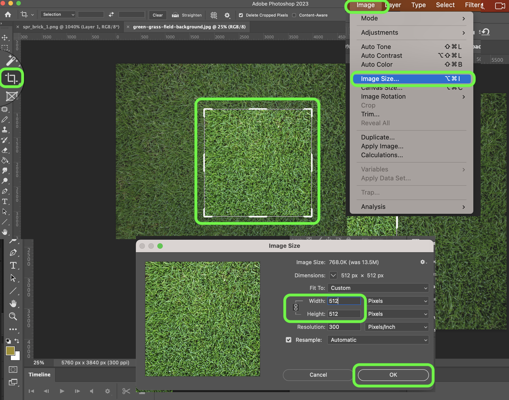

##### `Step 4.`\|`BTS`|:small_blue_diamond: :small_blue_diamond: :small_blue_diamond: :small_blue_diamond:

Select **Filter | Other | Offset** and move the line to the center by select `256` both horizontally and vertically.  It is harder to see the seam but it is still there if you zoom in.  We want to get rid of the two lines and make the wrrapping seamless.

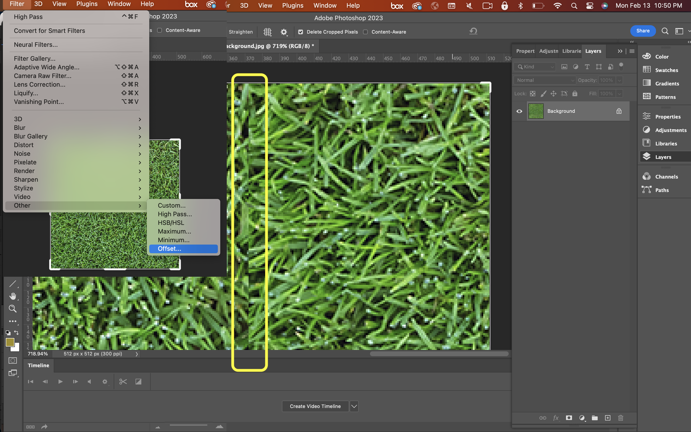

##### `Step 5.`\|`BTS`| :small_orange_diamond:

Select the polygon selection tool and select the area around the vertical line.  Go back to the begining to have the marching ants surround the area with the line.  Press **Edit | Content Aware Fill**.

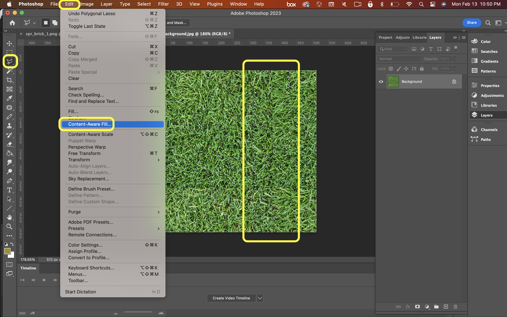

##### `Step 6.`\|`BTS`| :small_orange_diamond: :small_blue_diamond:

This now brings up the content aware tool.  The green area is the part it uses to generate the replacement.  In this case the grass is consistent so we can use the entire area outside our patch (it is green and can be customized with a paintbrush to only use portions that relate to the patched area).  The preview window shows it seamlessly matching and the line is completely gone.

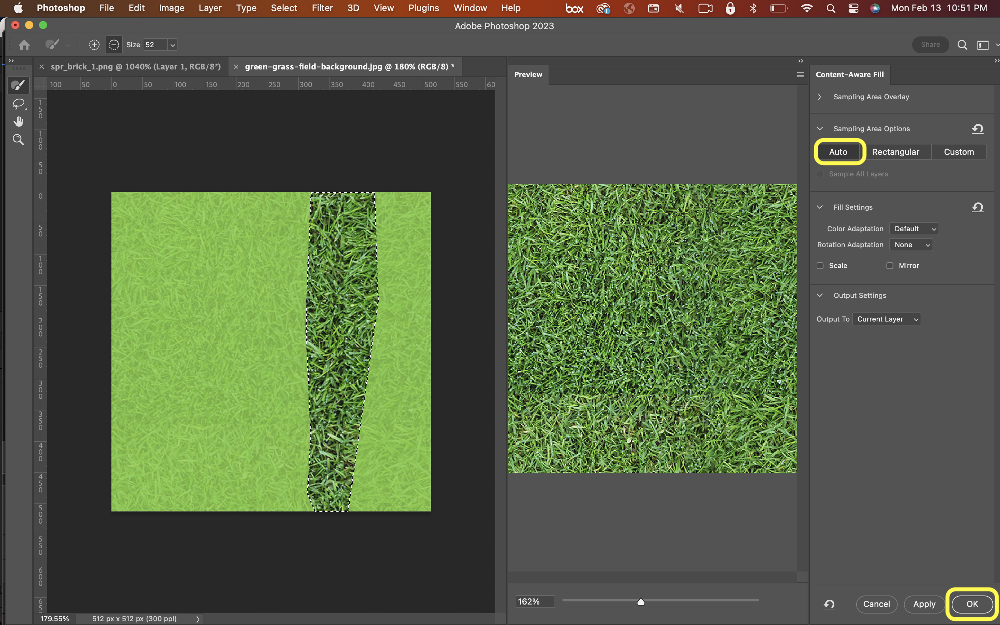

##### `Step 7.`\|`BTS`| :small_orange_diamond: :small_blue_diamond: :small_blue_diamond:

Select a **Brush Size** to your liking.  Paint along the line to hide the joint.  You will then adjust the target of where the cloning is taking place (it was not recorded in the video below).  It is a white circle that you can move by dragging it with your left mouse button. Notice there is no line anymore and will tile horizontally perfectly.

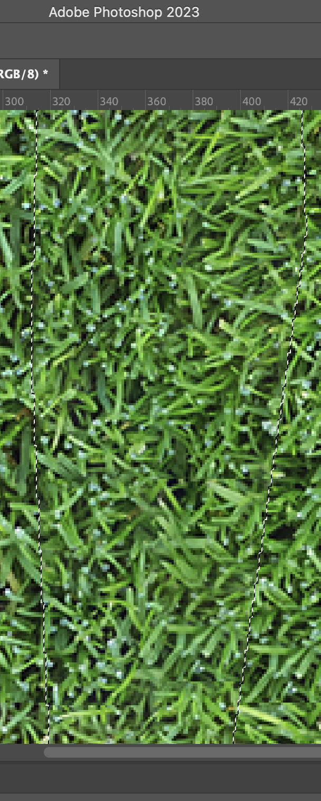

##### `Step 8.`\|`BTS`| :small_orange_diamond: :small_blue_diamond: :small_blue_diamond: :small_blue_diamond:

Repeat this for the horizontal seam by polygon selecting the area then selecting **Edit | Content Aware Fill**.

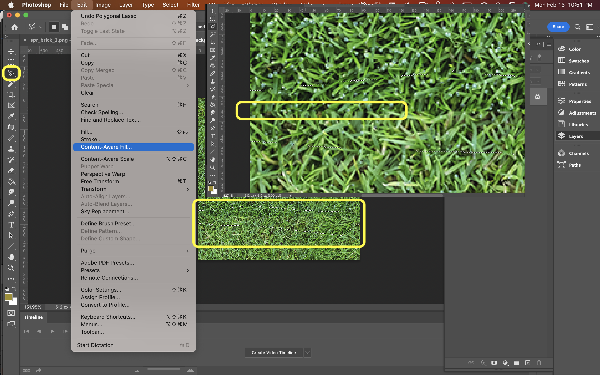

##### `Step 9.`\|`BTS`| :small_orange_diamond: :small_blue_diamond: :small_blue_diamond: :small_blue_diamond: :small_blue_diamond:

This now will perfectly remove the horizontal seam and create a seamless wrapping texture.

##### `Step 10.`\|`BTS`| :large_blue_diamond:

Now adjust the size to our desired target tile size of `64` by `64`.

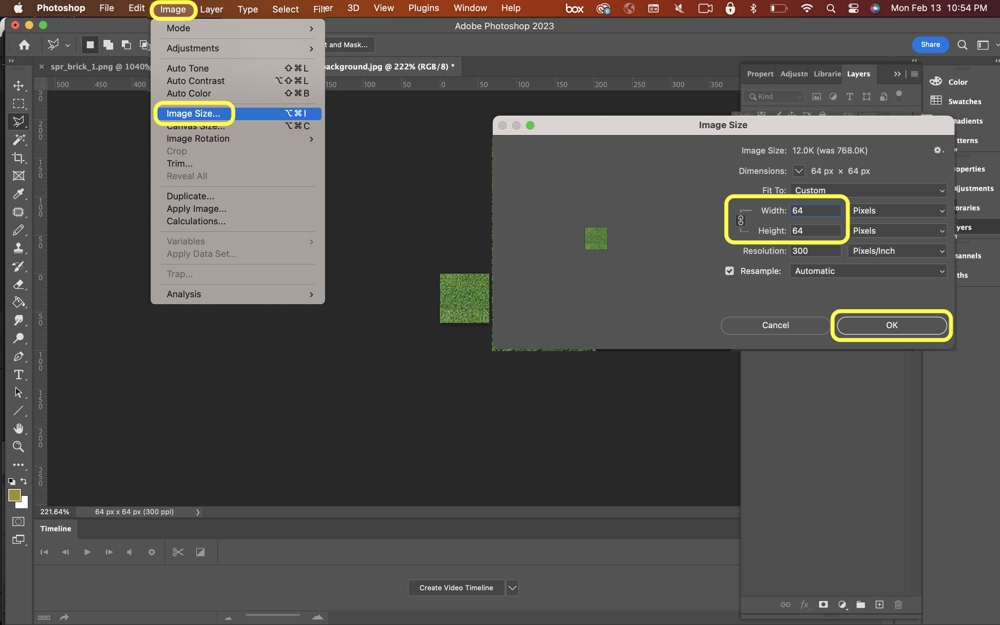

##### `Step 11.`\|`BTS`| :large_blue_diamond: :small_blue_diamond: 

Now press **File | Export | Quick Export as PNG** and call this texture `spr_grass`.  Go to **GameMaker** and highlight the **Sprites** folder, right click and select **Create Sprite**. Press the <kbd>Import</kbd> button and bring in the newly created sprite.

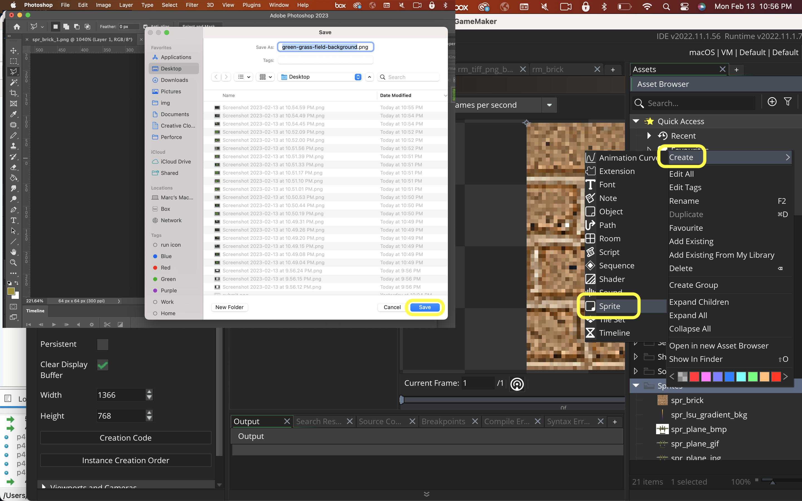

##### `Step 12.`\|`BTS`| :large_blue_diamond: :small_blue_diamond: :small_blue_diamond: 

Add a **Moss** layer.  Make any adjustments to your settings.  I dialed it back too much on my version so I would be more aggressive in the future.  You might want to mask out the moss around the edges as it needs to go next to tiles without moss and we don't want a hard line.  Try and keep the moss away from the edges.

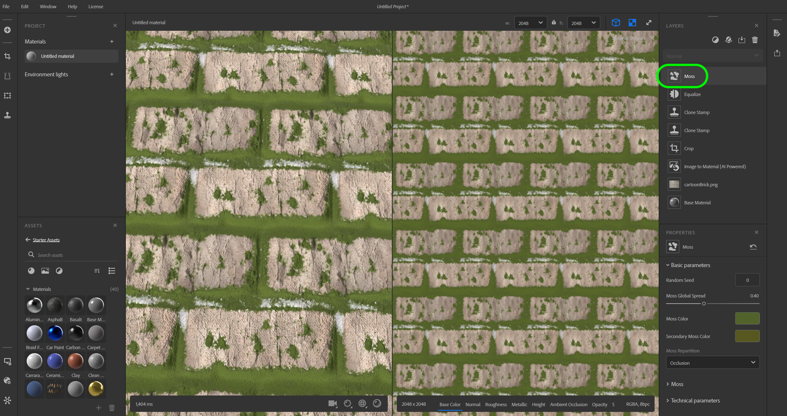

##### `Step 13.`\|`BTS`| :large_blue_diamond: :small_blue_diamond: :small_blue_diamond:  :small_blue_diamond: 

Now create a **Dirt**, **Dust** and **Oxidate** layer.  Adjust the settings so we now have four varieties on the same tile.  This will help make it look more organic when we combine them. Don't be afraid to push it a bit more than this video and mask the edges.  Play with the settings and try and make the changes stick out and localize them to inside the tile.

https://user-images.githubusercontent.com/5504953/142766997-1ed64817-a0a3-4efa-80e7-a83235d9490c.mp4

##### `Step 14.`\|`BTS`| :large_blue_diamond: :small_blue_diamond: :small_blue_diamond: :small_blue_diamond:  :small_blue_diamond: 

Now lets add two more **Crop** layers to the **Substance 3D Sampler** project.  You can only have one active at a time.  So turn off the **Crop** layer(s) you are not using.  Now select a different area of the texture but with the **exact** same positioning.  You can go back and make adjustments but you want all of these three crops to tile perfectly.  So I picked two different areas to use to add variety to our background tiles

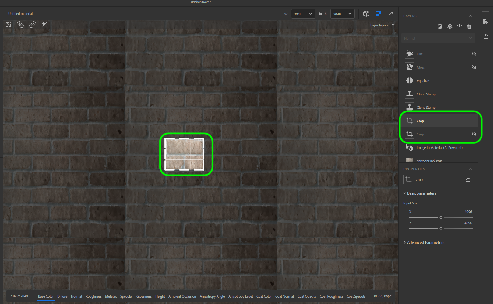

##### `Step 15.`\|`BTS`| :large_blue_diamond: :small_orange_diamond: 

Select **only** the first original **Crop** layer. Press the **Export** button and select a folder and call the tile `spr_brick_1`. Make sure you are only exporting the **Base Color** layer. When you are ready press the <kbd>Export</kbd> button.

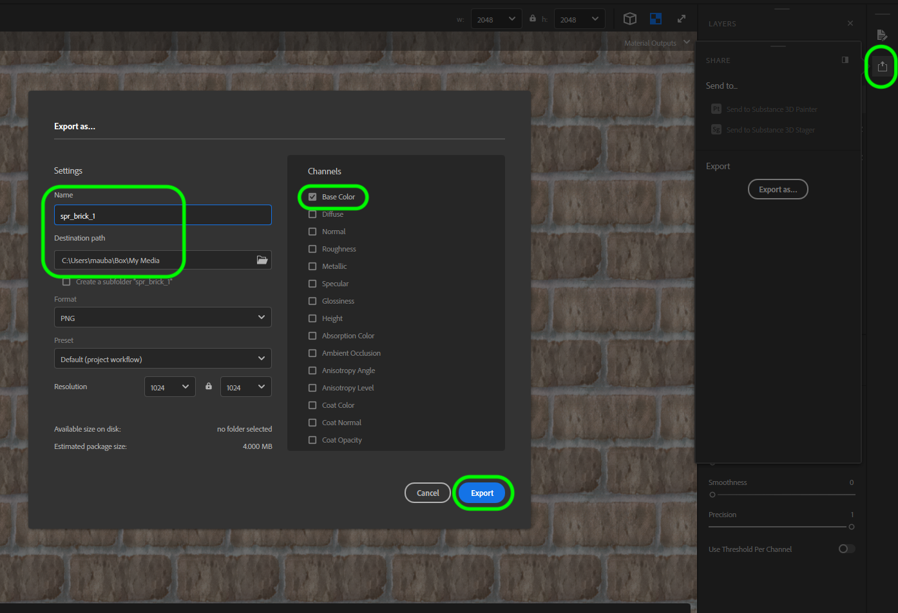

##### `Step 16.`\|`BTS`| :large_blue_diamond: :small_orange_diamond:   :small_blue_diamond: 

Turn off **Crop** layer for the 1st and 3rd tile and activate it for the 2nd tile.  Press the **Export** button and select a folder and call the tile `spr_brick_2`. Make sure you are only exporting the **Base Color** layer. When you are ready press the <kbd>Export</kbd> button.

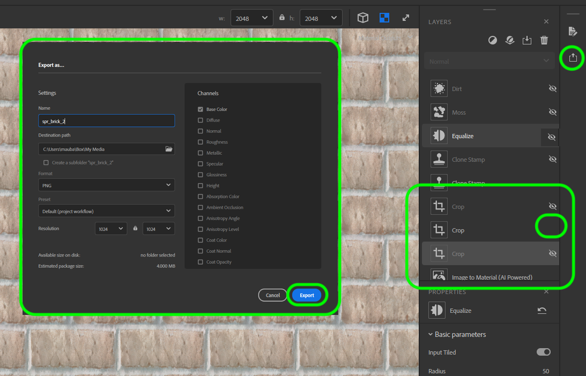

##### `Step 17.`\|`BTS`| :large_blue_diamond: :small_orange_diamond: :small_blue_diamond: :small_blue_diamond:

Turn off **Crop** layer for the 1st and 2nd tile and activate it for the 3rd tile.  Press the **Export** button and select a folder and call the tile `spr_brick_3`. Make sure you are only exporting the **Base Color** layer. When you are ready press the <kbd>Export</kbd> button.

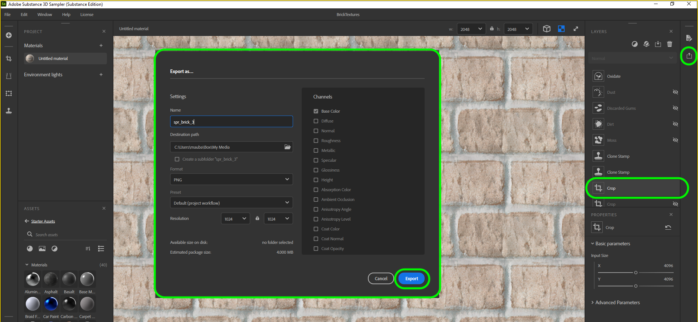

##### `Step 18.`\|`BTS`| :large_blue_diamond: :small_orange_diamond: :small_blue_diamond: :small_blue_diamond: :small_blue_diamond:

Fire up **Photoshop** and press **File | New Document**.  Change the size to **Pixels** and lets make a 10 x 10 grid of 64 x 64 tiles, so select `640` x `640`. Make the **Background** `Transparent`. Press the <kbd>Create</kbd> button.

##### `Step 19.`\|`BTS`| :large_blue_diamond: :small_orange_diamond: :small_blue_diamond: :small_blue_diamond: :small_blue_diamond: :small_blue_diamond:

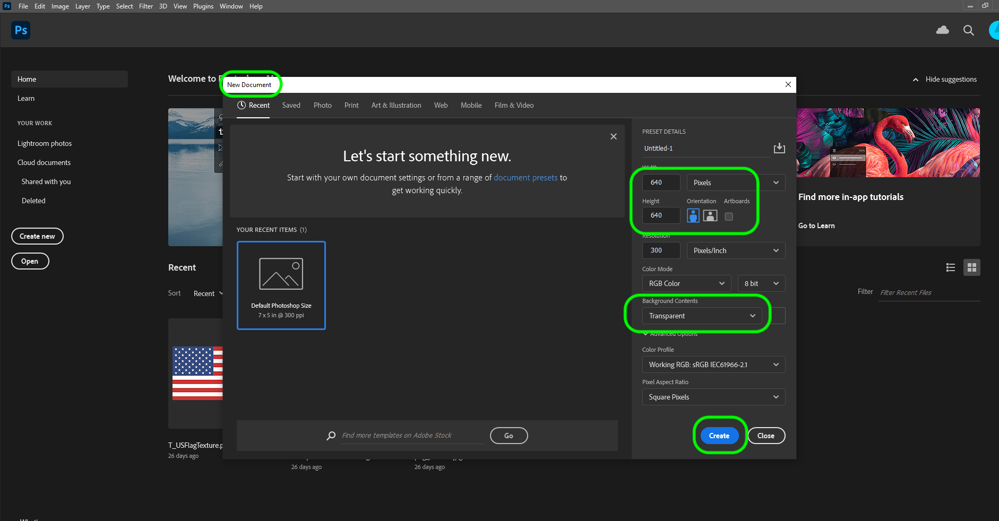

Select **Edit | Preferences | Guides, Grid & Slices...**.  Change the gridlines to **Pixels** and set the **Guideline Every: ** to `64`.  Set the subdivision to `1`. Press the <kbd>OK</kbd> button.

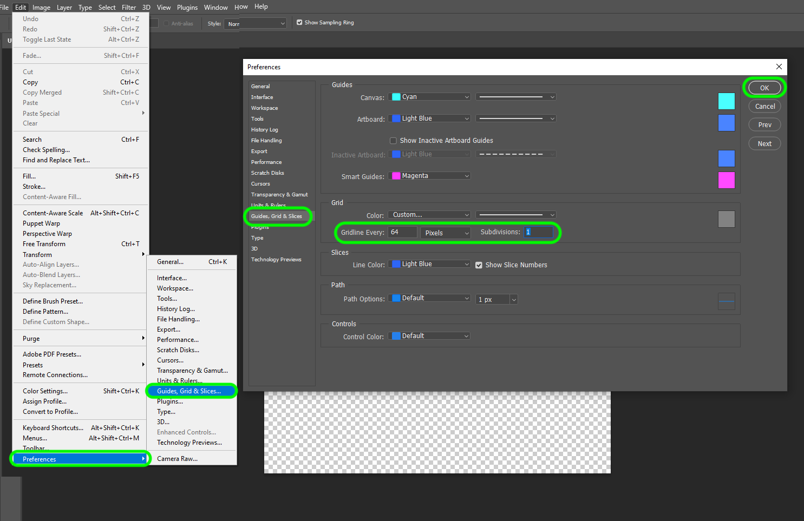

##### `Step 20.`\|`BTS`| :large_blue_diamond: :large_blue_diamond:

Now we need to see the grid. Select **View | Show | Grid**.  Make sure that **Snap to Grid** is activated. 

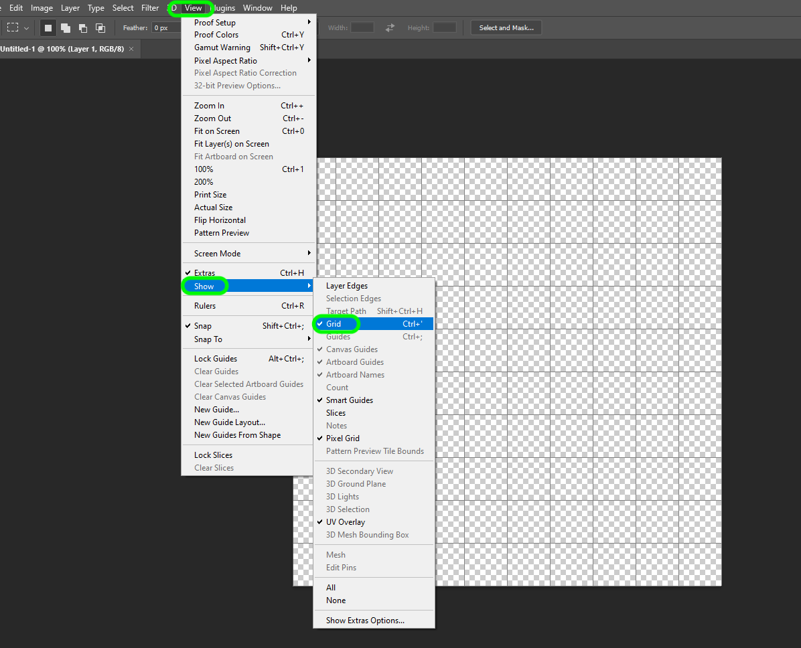

##### `Step 21.`\|`BTS`| :large_blue_diamond: :large_blue_diamond: :small_blue_diamond:

Open up **spr_brick_1** that you previously exported. Select **Image | Mode | Index** and redue the color palette to get that 8-bit look.  Alter settings to your preferences. Press the <kbd>OK</kbd> button.

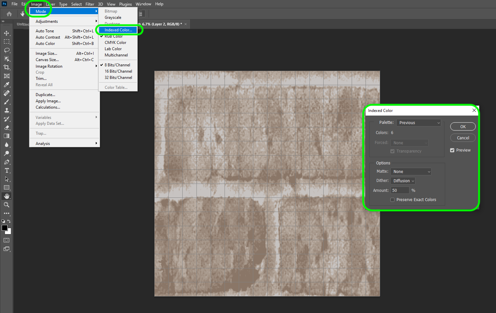

##### `Step 22.`\|`BTS`| :large_blue_diamond: :large_blue_diamond: :small_blue_diamond: :small_blue_diamond:

Select **Image | Image Size** and change the size of the tile to `64` by `64`.  Leave the ??? at `Automatic`.

##### `Step 23.`\|`BTS`| :large_blue_diamond: :large_blue_diamond: :small_blue_diamond: :small_blue_diamond: :small_blue_diamond:

Copy the entire tile and open up the empty tile sheet you previously made.  Paste this new tile and put it in the second slot.  The first slot **has to be kept empty**.  **GameMaker** ignores this first tile so place it in the second slot.

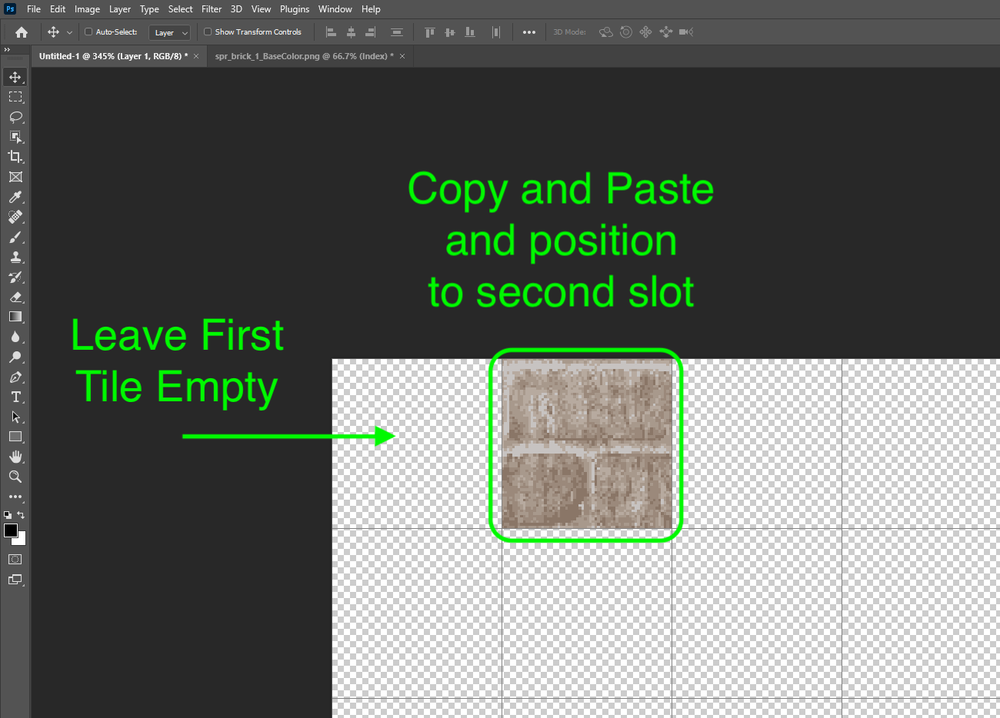

<!--  -->
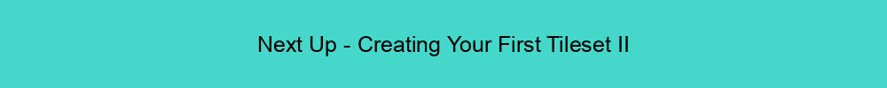

| [previous](../background-tile/README.md#user-content-background-and-single-tile)| [home](../README.md#user-content-gms2-background-tiles--sprites---table-of-contents) | [next](../first-tileset-ii/README.md#user-content-creating-your-first-tileset-ii)|
|---|---|---|
