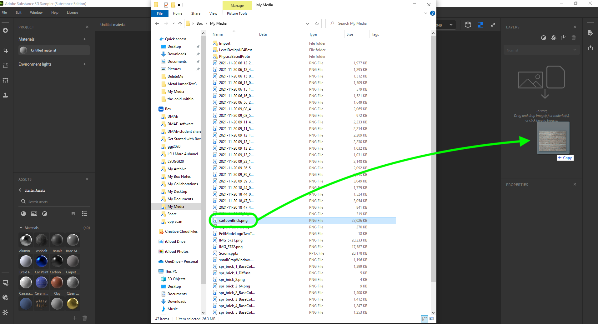

### Creating your First Tileset

[previous](../background-tile/README.md#user-content-background-and-single-tile) • [home](../README.md#user-content-gms2-background-tiles--sprites---table-of-contents) • [next](../auto-tile/README.md#user-content-auto-tile-template)

Now no one wants to play a game with a single tile.  And using the background feature of a room is limited in what we can do with it by assigning a single tiled image.  This would work if the tile is large. We are much better off using the tile features in **GameMaker** so we can have multiple tiles on a layer.  Lets do this and create a variety of tiles that we can choose from for this one shape.  By having variety we wll further break up the repeats when used in game.

 

---

##### `Step 1.`\|`BTS`|:small_blue_diamond:

Lets start over again with a new document.  Open up **Adobe Substance 3D Sampler** and press **File |  New Project**.  Name the projet `Brick Textures`.  Drag and drop the processed brick we used in the last exercise.
		

##### `Step 2.`\|`BTS`|:small_blue_diamond: :small_blue_diamond: 

We will be using some advanced layers in the software that requies it to use the topology (like growing moss in cracks) so we need to create a material that is for a 3-D game, but will not be using anything but the **Base Color** layer.  Select **Image to material** and then press the <kbd>OK</kbd> button.

##### `Step 3.`\|`BTS`|:small_blue_diamond: :small_blue_diamond: :small_blue_diamond:

Add a **Crop** layer.  Deslect **3D** and select **2D** so we can see the texture. Make sure you are on **Layer Inputs**.  Select an area that covers a few bricks.  Remember this will be reduced to `64` by `64` so it will be small.  You need to select an area that naturally tiles as best as it can.  So I work mine around the grout line so it will tile with minimal touch up.

##### `Step 4.`\|`BTS`|:small_blue_diamond: :small_blue_diamond: :small_blue_diamond: :small_blue_diamond:

Press the <kbd>T</kbd> key and you will see it tile.  Now in **Layer Inputs** we see our proper crop markings.  But it is tiling the whole image.  To see the engine tile the actual cropped layer you select **Material Outputs**.  Adjust your crop size to be as square as possible and to stitch with as few issues as possible.

##### `Step 5.`\|`BTS`| :small_orange_diamond:

Notice that when the brick we cut in half join, they don't match up so we have a line.  We can paint this out.  Select a **Clone Stamp** layer.  You have a toolbar at the top left and can adjust the brush size and color.

##### `Step 6.`\|`BTS`| :small_orange_diamond: :small_blue_diamond:

Select a **Brush Size** to your liking.  Paint along the line to hide the joint.  You will then adjust the target of where the cloning is taking place (it was not recorded in the video below).  It is a white circle that you can move by dragging it with your left mouse button.

https://user-images.githubusercontent.com/5504953/142765293-158c64df-cfda-4e47-8955-8e57210ebf23.mp4

Here is what your target should look like that you can move around and see how it moves where the clone stamp is getting its source location.

##### `Step 7.`\|`BTS`| :small_orange_diamond: :small_blue_diamond: :small_blue_diamond:

Now we also have a line on our vertical seam.  I can see the line on the grout line.  Add another **Clone Stamp** to address the grout line.

##### `Step 8.`\|`BTS`| :small_orange_diamond: :small_blue_diamond: :small_blue_diamond: :small_blue_diamond:

Paint a fix along this line and adjust the second target on this new layer to be over grout.  Adjust any settings in the layer that helps get rid of the solid line.

##### `Step 9.`\|`BTS`| :small_orange_diamond: :small_blue_diamond: :small_blue_diamond: :small_blue_diamond: :small_blue_diamond:

Add an **Equalize** layer and tune the settings to knock down the color differences if you need.  I find it a bit noisy and am a bit worried about what it will like scaled down.  So I make some subtle adjustments.

##### `Step 10.`\|`BTS`| :large_blue_diamond:

I then made copies of the original three and made changes including, removing bricks, cracks, moss and dirt.  This was all done in photoshop.

##### `Step 11.`\|`BTS`| :large_blue_diamond: :small_blue_diamond: 

Now we need a separate sprite tile sheet to hold the tiles we just created.  Since these are 64 by 64 I made a 16 by 16 tile grid.  I  created a 1024 by 1024 pixel image in Photoshop with a white background.  

##### `Step 12.`\|`BTS`| :large_blue_diamond: :small_blue_diamond: :small_blue_diamond: 

Go to **Preferences | Guides, Grid & Slices**. Adjust the **grid** to `64` and **subdivisions** to `1`.  Pick a color that doesn't clash with your artwork.

##### `Step 13.`\|`BTS`| :large_blue_diamond: :small_blue_diamond: :small_blue_diamond:  :small_blue_diamond: 

Go to **View | Show | Grid** so that the grid appears and makes snapping and moving the tiles much easier. 

##### `Step 14.`\|`BTS`| :large_blue_diamond: :small_blue_diamond: :small_blue_diamond: :small_blue_diamond:  :small_blue_diamond: 

*Copy and paste* each tile into the sheet.  *Rescale* them to **64 by 64** and put like textures next to each other.  Leave the top left blank. GameMaker will **never** display the top left tile, so it doesn't matter what goes there - it will be ignored.

##### `Step 15.`\|`BTS`| :large_blue_diamond: :small_orange_diamond: 

Export the tile sheet as a **PNG** file.  Call it `spr_background_tiles.png`.  Now create another **Sprite** and press the <kbd>Import</kbd> button to bring in the tilesheet and name it `spr_background_tiles`.

##### `Step 16.`\|`BTS`| :large_blue_diamond: :small_orange_diamond:   :small_blue_diamond: 

Now we are gong to create a new Tile Set and call it `ts_background_tiles`.  *Assign* the sprite you just made and click on **Tile Set Properties** and make sure the **Tile Height** and **Tile Width** are both set to `64`.

##### `Step 17.`\|`BTS`| :large_blue_diamond: :small_orange_diamond: :small_blue_diamond: :small_blue_diamond:

Create a new room and move it to the top.  Call it `rm_lvl_test`.  Add a **Tile Layer** and name it `BackgroundTiles`.  Place it *under* the **Instances** layer. Select the **Tileset** you just created.

##### `Step 18.`\|`BTS`| :large_blue_diamond: :small_orange_diamond: :small_blue_diamond: :small_blue_diamond: :small_blue_diamond:

Now you can click on the right hand side and and select one of the 7 tiles.  You then paint them in the room filling up various spaces.
	
Keep adding tiles mixing it up. Try and fool the eye not to notice a pattern.  Take your time and be careful. Fill every last piece of the room.
	
Scatter some of the distressed tiles judiciously.  

##### `Step 19.`\|`BTS`| :large_blue_diamond: :small_orange_diamond: :small_blue_diamond: :small_blue_diamond: :small_blue_diamond: :small_blue_diamond:

Now *press* the <kbd>Play</kbd> button in the top menu bar to launch the game. Notice the tiled brick and the pattern is not as bad. 

##### `Step 20.`\|`BTS`| :large_blue_diamond: :large_blue_diamond:

Select the **File | Save Project** then press **File | Quit** to make sure everything in the game is saved. If you are using **GitHub** open up **GitHub Desktop** and add a title and longer description (if necessary) and press the <kbd>Commit to main</kbd> button. Finish by pressing **Push origin** to update the server with the latest changes.

___

| [previous](../background-tile/README.md#user-content-background-and-single-tile)| [home](../README.md#user-content-gms2-background-tiles--sprites---table-of-contents) | [next](../auto-tile/README.md#user-content-auto-tile-template)|
|---|---|---|
