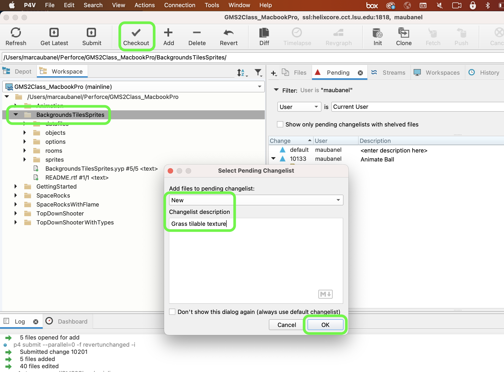
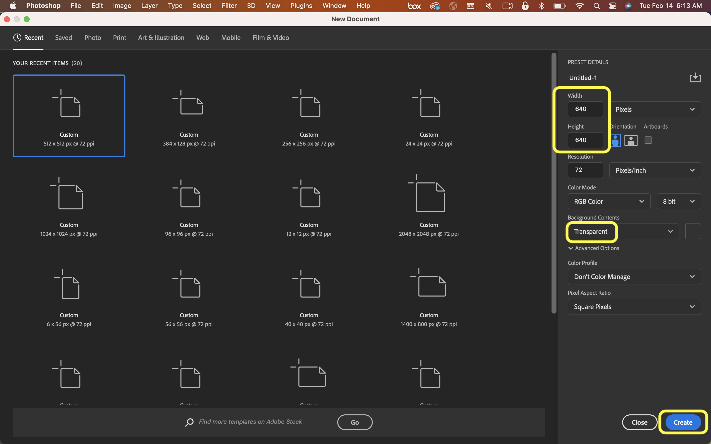
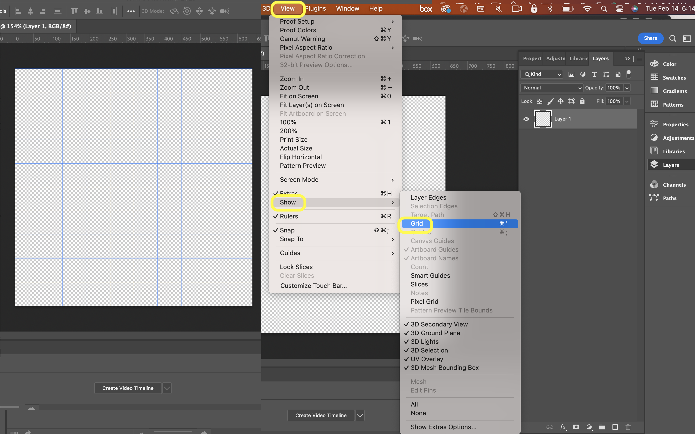

### Creating your First Tileset

[previous](../background-tile/README.md#user-content-background-and-single-tile) • [home](../README.md#user-content-gms2-background-tiles--sprites---table-of-contents) • [next](../first-tileset-ii/README.md#user-content-creating-your-first-tileset-ii)

Now no one wants to play a game with a single tile.  And using the background feature of a room is limited in what we can do with it by assigning a single tiled image.  This would work if the tile is large. We are much better off using the tile features in **GameMaker** so we can have multiple tiles on a layer.  Lets do this and create a variety of tiles that we can choose from for this one shape.  By having variety we wll further break up the repeats when used in game.

We will introduce another way of creating tiles in photoshop that is good for natural textures with a lot more randomness in the forms.

 

---

##### `Step 1.`\|`BTS`|:small_blue_diamond:

Open up **P4v**.  Select the top folder of the **GameMaker** project. Press the <kbd>Checkout</kbd> button.  Checkout out all files in P4V so that they are all writable (otherwise they will be read only and none of the changes will be saved). Select a **New** changelist and add a message describing the unit of work you will be performing. Press the <kbd>OK</kbd> button.

Open up the project you are working on in **GameMaker**. 

##### `Step 2.`\|`BTS`|:small_blue_diamond: :small_blue_diamond: 

Download the enclosed [grass texture](../Assets/PNG/spr_grass.png). Open it up in Photoshop and press the selection tool and press the <kbd>Shift</kbd> key and select a square portion.  We will be reducing the size.
		

##### `Step 3.`\|`BTS`|:small_blue_diamond: :small_blue_diamond: :small_blue_diamond:

Press the <kbd>Crop</kbd> button and cut out this square section. Press **Image | Image Size** and change it to `512` by `512` a nice working scale to start with.

##### `Step 4.`\|`BTS`|:small_blue_diamond: :small_blue_diamond: :small_blue_diamond: :small_blue_diamond:

Select **Filter | Other | Offset** and move the line to the center by select `256` both horizontally and vertically.  It is harder to see the seam but it is still there if you zoom in.  We want to get rid of the two lines and make the wrrapping seamless.

##### `Step 5.`\|`BTS`| :small_orange_diamond:

Select the polygon selection tool and select the area around the vertical line.  Go back to the begining to have the marching ants surround the area with the line.  Press **Edit | Content Aware Fill**.

##### `Step 6.`\|`BTS`| :small_orange_diamond: :small_blue_diamond:

This now brings up the content aware tool.  The green area is the part it uses to generate the replacement.  In this case the grass is consistent so we can use the entire area outside our patch (it is green and can be customized with a paintbrush to only use portions that relate to the patched area).  The preview window shows it seamlessly matching and the line is completely gone.

##### `Step 7.`\|`BTS`| :small_orange_diamond: :small_blue_diamond: :small_blue_diamond:

Select a **Brush Size** to your liking.  Paint along the line to hide the joint.  You will then adjust the target of where the cloning is taking place (it was not recorded in the video below).  It is a white circle that you can move by dragging it with your left mouse button. Notice there is no line anymore and will tile horizontally perfectly.

##### `Step 8.`\|`BTS`| :small_orange_diamond: :small_blue_diamond: :small_blue_diamond: :small_blue_diamond:

Repeat this for the horizontal seam by polygon selecting the area then selecting **Edit | Content Aware Fill**.

##### `Step 9.`\|`BTS`| :small_orange_diamond: :small_blue_diamond: :small_blue_diamond: :small_blue_diamond: :small_blue_diamond:

This now will perfectly remove the horizontal seam and create a seamless wrapping texture.

##### `Step 10.`\|`BTS`| :large_blue_diamond:

Now adjust the size to our desired target tile size of `64` by `64`.

##### `Step 11.`\|`BTS`| :large_blue_diamond: :small_blue_diamond: 

Now press **File | Export | Quick Export as PNG** and call this texture `spr_grass`.  Go to **GameMaker** and highlight the **Sprites** folder, right click and select **Create Sprite**. Press the <kbd>Import</kbd> button and bring in the newly created sprite.

##### `Step 12.`\|`BTS`| :large_blue_diamond: :small_blue_diamond: :small_blue_diamond: 

Now duplicate **rm_brick** and call this new room `rm_grass`.

##### `Step 13.`\|`BTS`| :large_blue_diamond: :small_blue_diamond: :small_blue_diamond:  :small_blue_diamond: 

Open up **rm_grass** and change the sprite to `spr_grass`.

##### `Step 14.`\|`BTS`| :large_blue_diamond: :small_blue_diamond: :small_blue_diamond: :small_blue_diamond:  :small_blue_diamond: 

Change the **Room Order** and move **rm_grass** to the top and press the <kbd>Play</kbd> button.  Again, there color variation creates a discernable pattern.

##### `Step 15.`\|`BTS`| :large_blue_diamond: :small_orange_diamond: 

I tried changing the brightness and contrast and re-imported the sprite into **GameMaker** and replaced the old grass sprite.  This still did not hide the seam enough to my liking.  I could still see the repeat.

##### `Step 16.`\|`BTS`| :large_blue_diamond: :small_orange_diamond:   :small_blue_diamond: 

Now I went back to photoshop and tried duplicating the layer and applying a gaussian blur to the top layer.  I then changed the blend mode to **Luminosity** and changed the opacity to `67%`.  I re-exported and imported the texture and still the same problem.

##### `Step 17.`\|`BTS`| :large_blue_diamond: :small_orange_diamond: :small_blue_diamond: :small_blue_diamond:

I go back to the trusty **High Pass Filter** and this knocks out all the color variation.  It looks black and white.

##### `Step 18.`\|`BTS`| :large_blue_diamond: :small_orange_diamond: :small_blue_diamond: :small_blue_diamond: :small_blue_diamond:

Add an **Fx | Color Overlay** to the layer and select a green color and effect the **Color** channel by a green color of your liking.

##### `Step 19.`\|`BTS`| :large_blue_diamond: :small_orange_diamond: :small_blue_diamond: :small_blue_diamond: :small_blue_diamond: :small_blue_diamond:

This will create a nice evenly colored grass texture.

##### `Step 20.`\|`BTS`| :large_blue_diamond: :large_blue_diamond:

Export and re-import this texture into **GameMkaer** and press play.  Now finally the texture wraps seamlessly.

##### `Step 21.`\|`BTS`| :large_blue_diamond: :large_blue_diamond: :small_blue_diamond:

Fire up **Photoshop** and press **File | New Document**.  Change the size to **Pixels** and lets make a 10 x 10 grid of 64 x 64 tiles, so select `640` x `640`. Make the **Background** `Transparent`. Press the <kbd>Create</kbd> button.

##### `Step 22.`\|`BTS`| :large_blue_diamond: :large_blue_diamond: :small_blue_diamond: :small_blue_diamond:

Select **Edit | Preferences | Guides, Grid & Slices...**.  Change the gridlines to **Pixels** and set the **Guideline Every: ** to `64`.  Set the subdivision to `1`. Press the <kbd>OK</kbd> button.

##### `Step 23.`\|`BTS`| :large_blue_diamond: :large_blue_diamond: :small_blue_diamond: :small_blue_diamond: :small_blue_diamond:

Now we need to see the grid. Select **View | Show | Grid**.  Make sure that **Snap to Grid** is activated. 

##### `Step 24.`\|`BTS`| :large_blue_diamond: :large_blue_diamond: :small_blue_diamond: :small_blue_diamond: :small_blue_diamond: :small_blue_diamond:

Copy the entire brick tile that you made at the begining.  Paste this new tile and put it in the second slot.  The first slot **has to be kept empty**.  **GameMaker** ignores this first tile so place it in the second slot on the first row. Make sure that your **Snap** settings work on the **Grid** and the tile will snap into that place perfectly.

https://user-images.githubusercontent.com/5504953/218738160-64253d1c-fd8e-4a05-86b3-478c5daf62ba.mp4

<!--  -->

| [previous](../background-tile/README.md#user-content-background-and-single-tile)| [home](../README.md#user-content-gms2-background-tiles--sprites---table-of-contents) | [next](../first-tileset-ii/README.md#user-content-creating-your-first-tileset-ii)|
|---|---|---|
