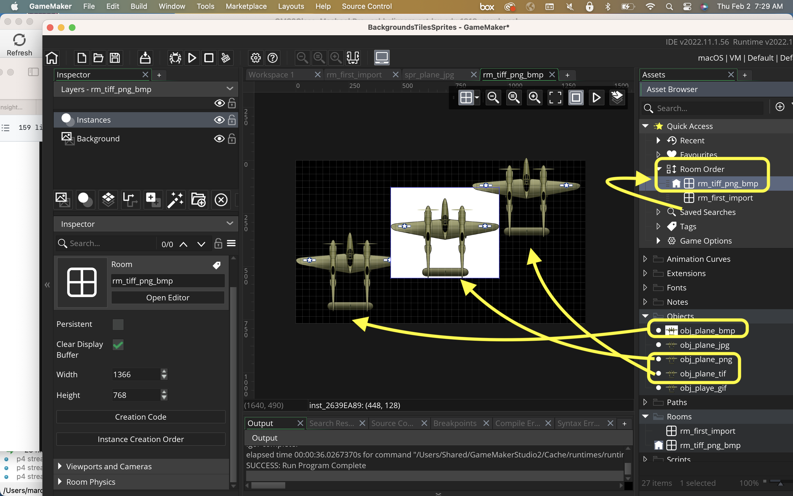

### Handling GIFs and Other Formats

[previous](../handling-jpg/README.md#user-content-handling-jpgs) • [home](../README.md#user-content-gms2-background-tiles--sprites---table-of-contents) • [next](../raster-vector/README.md#user-content-raster-and-vector)

**GIFs** are sometimes used as it supports animation.  It also has a reduced pallete which enforces an **old school** look (which can be achieved in other formats as well).  

 

---

##### `Step 1.`\|`BTS`|:small_blue_diamond:

Open up **P4v**.  Select the top folder of the **GameMaker** project. Press the <kbd>Checkout</kbd> button.  Checkout out all files in P4V so that they are all writable (otherwise they will be read only and none of the changes will be saved). Select a **New** changelist and add a message describing the unit of work you will be performing. Press the <kbd>OK</kbd> button.

Open up the project you are working on in **GameMaker**. 

Download [spr_plane_gif.gif](../Assets/GIF/spr_plane_gif.gif).

Add a new **Sprite** and press the <kbd>Import</kbd> button. Import the above **spr_plane_gif** sprite.  Name the Sprite `spr_plane_gif`. 

##### `Step 2.`\|`BTS`|:small_blue_diamond: :small_blue_diamond: 

Open up **spr_plane_gif** and zoom in. That looks normal and hey there is an alpha, unlike with the jpg! With a GIF you can have one pixel be an alpha but there are no gradients. Some people like this clean edge look.  In a *GIF* the transparent pixel is either an alpha or it isn't (can't have a percentage). Here is the sprite in a close-up showing the degradation.

##### `Step 3.`\|`BTS`|:small_blue_diamond: :small_blue_diamond: :small_blue_diamond:

*Create* a **Game Object** called `obj_plane_gif` and assign the `spr_plane_gif` sprite.

##### `Step 4.`\|`BTS`|:small_blue_diamond: :small_blue_diamond: :small_blue_diamond: :small_blue_diamond:

Drag **obj_plane_gif** in the room over the previous plane so we can see the difference in **rm_first_import**.

##### `Step 5.`\|`BTS`| :small_orange_diamond:

Now *press* the <kbd>Play</kbd> button in the top menu bar to launch the game. Now look how each plane is different.

##### `Step 6.`\|`BTS`| :small_orange_diamond: :small_blue_diamond:

If you zoom in you will notice that the **GIF** version has more banding on the wing as a **GIF** is not a 24 bit format. It uses a maximum palette 256 colors for each frame.  This creates banding. There is also a 1 bit alpha so the line does not anti-alias and has a jaggy edge (some people like the 8 bit aesthetic) 

 I don't recommend using **GIFs** but many animations come in this format and it is the only raster format that supports animation in Gamemaker currently.

##### `Step 7.`\|`BTS`| :small_orange_diamond: :small_blue_diamond: :small_blue_diamond:

*Download* [spr_plane_png.png](../Assets/Misc/spr_plane_png.png), [spr_plane_bmp.bmp](../Assets/Misc/spr_plane_bmp.bmp), [spr_plane_tif.tif](../Assets/Misc/spr_plane_tif.tif).  There is a TIFF format, a native PNG format (not changed from a JPG like we did previously) and a BMP format.  These are all the formats we will be looking at in this tutorial.

##### `Step 8.`\|`BTS`| :small_orange_diamond: :small_blue_diamond: :small_blue_diamond: :small_blue_diamond:

Press the <kbd>Import</kbd> button after creating three new sprites and call them `spr_plane_bmp`, `spr_plane_png` and `spr_plane_tif`.

##### `Step 9.`\|`BTS`| :small_orange_diamond: :small_blue_diamond: :small_blue_diamond: :small_blue_diamond: :small_blue_diamond:

Create three new game objects and assign the three sprites calling them the same name with prefix `obj_`.

##### `Step 10.`\|`BTS`| :large_blue_diamond:

Create a new room called `rm_tiff_bmp_png` and drag it to the top of the room list.  If it is not the game will not load this room.  Now *drag and drop* the three plane objects you just created.
        

Drag the room to the top of the **Room Order** list to select this as the room that the game starts with.

##### `Step 11.`\|`BTS`| :large_blue_diamond: :small_blue_diamond: 

Now *press* the <kbd>Play</kbd> button in the top menu bar to launch the game. Notice that the **BMP** format does not preserve an alpha (another format that we would like to avoid).  I cannot tell the difference between the PNG and TIFF in **GameMaker** as they are both lossless.

##### `Step 12.`\|`BTS`| :large_blue_diamond: :small_blue_diamond: :small_blue_diamond: 

Select the **File | Save Project**, then press **File | Quit** (PC) **Game Maker | Quit** on Mac to make sure everything in the game is saved.

Open up **P4V**.  Select the top folder and press the **Add** button.  We want to add all the new files we created during this last session.  Add these files to the last change list you used at the begining of the session (in my case it was `Spaceship I portion of walkthrough`). Press the <kbd>OK</kbd> button.

Now you can submit the changelist by pressing both <kbd>Submit</kbd> buttons.

___

<!--  -->

| [previous](../handling-jpg/README.md#user-content-handling-jpgs)| [home](../README.md#user-content-gms2-background-tiles--sprites---table-of-contents) | [next](../raster-vector/README.md#user-content-raster-and-vector)|
|---|---|---|
