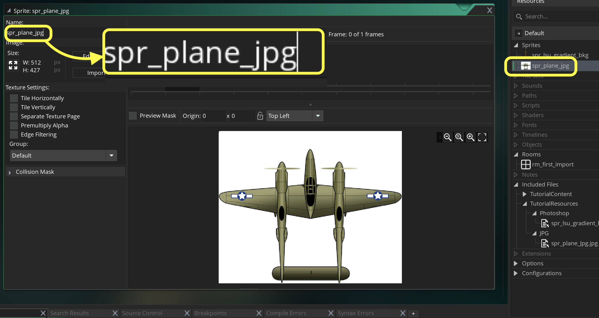

### Handling JPGs

[previous](../pixel-graphics/README.md#user-content-pixel-graphics-formats) • [home](../README.md#user-content-gms2-background-tiles--sprites---table-of-contents) • [next](../handling-gif/README.md#user-content-handling-gifs-and-other-formats)

JPEGS suffer from lossy compression (artifacting including banding) as well as no alpha.  In game sprites need to have the background removed so this is not a great method for dealing with them. 

 

---

##### `Step 1.`\|`BTS`|:small_blue_diamond:

Hopefully you will never have to handle a jpg file as they are really inconvenient.  But I will show you want to do if you do need to use one or any file with a missing Alpha.  *Download* [spr_plane_Jpg.jpg](../Assets/JPG/spr_plane_Jpg.jpg). Create new **Sprite** and press the <kbd>Import</kbd> button and select spr_plane_jpg.jpg you just downloaded. Call the sprite `spr_plane_jpg` and it should look like.

##### `Step 2.`\|`BTS`|:small_blue_diamond: :small_blue_diamond: 

##### `Step 3.`\|`BTS`|:small_blue_diamond: :small_blue_diamond: :small_blue_diamond:

##### `Step 4.`\|`BTS`|:small_blue_diamond: :small_blue_diamond: :small_blue_diamond: :small_blue_diamond:

##### `Step 5.`\|`BTS`| :small_orange_diamond:

##### `Step 6.`\|`BTS`| :small_orange_diamond: :small_blue_diamond:

##### `Step 7.`\|`BTS`| :small_orange_diamond: :small_blue_diamond: :small_blue_diamond:

##### `Step 8.`\|`BTS`| :small_orange_diamond: :small_blue_diamond: :small_blue_diamond: :small_blue_diamond:

##### `Step 9.`\|`BTS`| :small_orange_diamond: :small_blue_diamond: :small_blue_diamond: :small_blue_diamond: :small_blue_diamond:

##### `Step 10.`\|`BTS`| :large_blue_diamond:

##### `Step 11.`\|`BTS`| :large_blue_diamond: :small_blue_diamond: 

##### `Step 12.`\|`BTS`| :large_blue_diamond: :small_blue_diamond: :small_blue_diamond: 

##### `Step 13.`\|`BTS`| :large_blue_diamond: :small_blue_diamond: :small_blue_diamond:  :small_blue_diamond: 

##### `Step 14.`\|`BTS`| :large_blue_diamond: :small_blue_diamond: :small_blue_diamond: :small_blue_diamond:  :small_blue_diamond: 

##### `Step 15.`\|`BTS`| :large_blue_diamond: :small_orange_diamond: 

##### `Step 16.`\|`BTS`| :large_blue_diamond: :small_orange_diamond:   :small_blue_diamond: 

##### `Step 17.`\|`BTS`| :large_blue_diamond: :small_orange_diamond: :small_blue_diamond: :small_blue_diamond:

##### `Step 18.`\|`BTS`| :large_blue_diamond: :small_orange_diamond: :small_blue_diamond: :small_blue_diamond: :small_blue_diamond:

##### `Step 19.`\|`BTS`| :large_blue_diamond: :small_orange_diamond: :small_blue_diamond: :small_blue_diamond: :small_blue_diamond: :small_blue_diamond:

##### `Step 20.`\|`BTS`| :large_blue_diamond: :large_blue_diamond:

##### `Step 21.`\|`BTS`| :large_blue_diamond: :large_blue_diamond: :small_blue_diamond:

___

| [previous](../pixel-graphics/README.md#user-content-pixel-graphics-formats)| [home](../README.md#user-content-gms2-background-tiles--sprites---table-of-contents) | [next](../handling-gif/README.md#user-content-handling-gifs-and-other-formats)|
|---|---|---|
