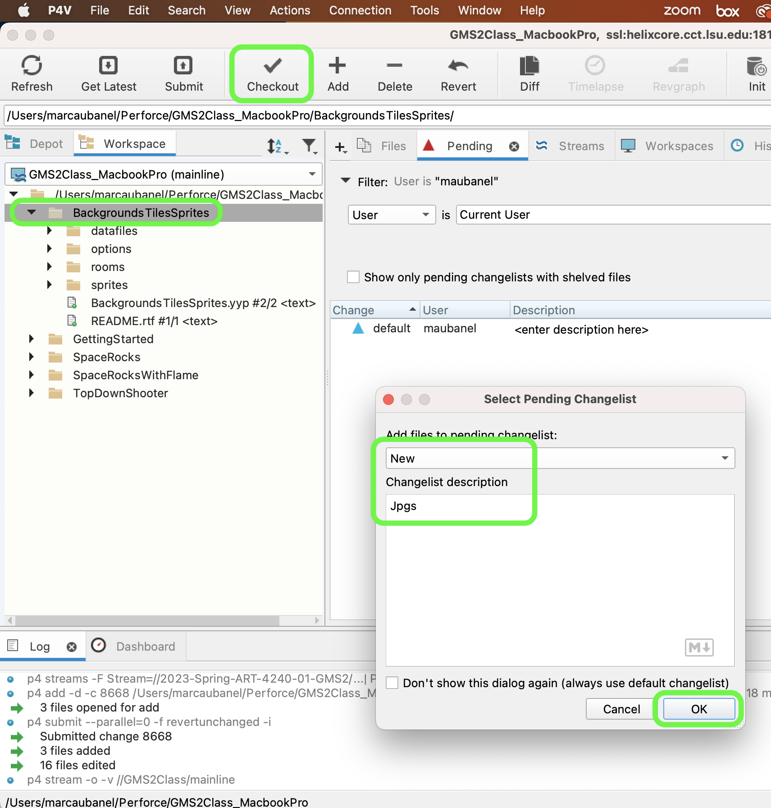
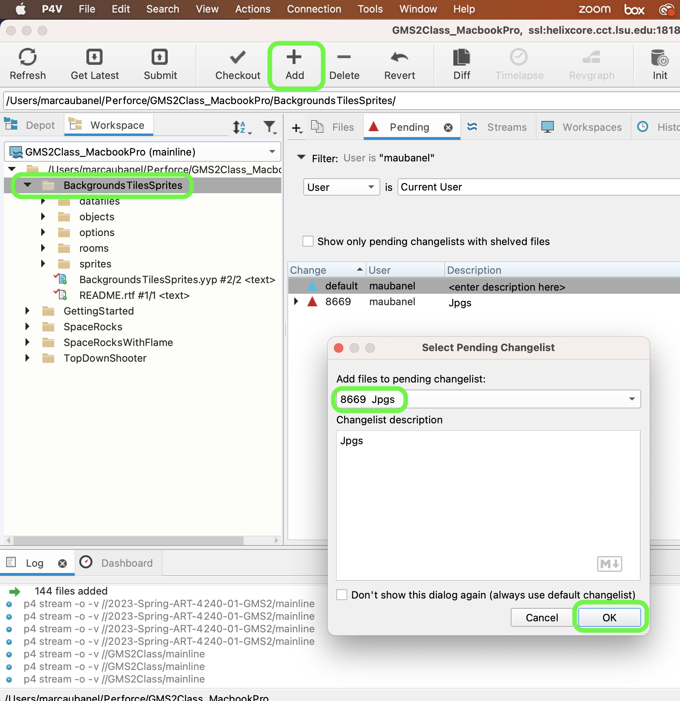
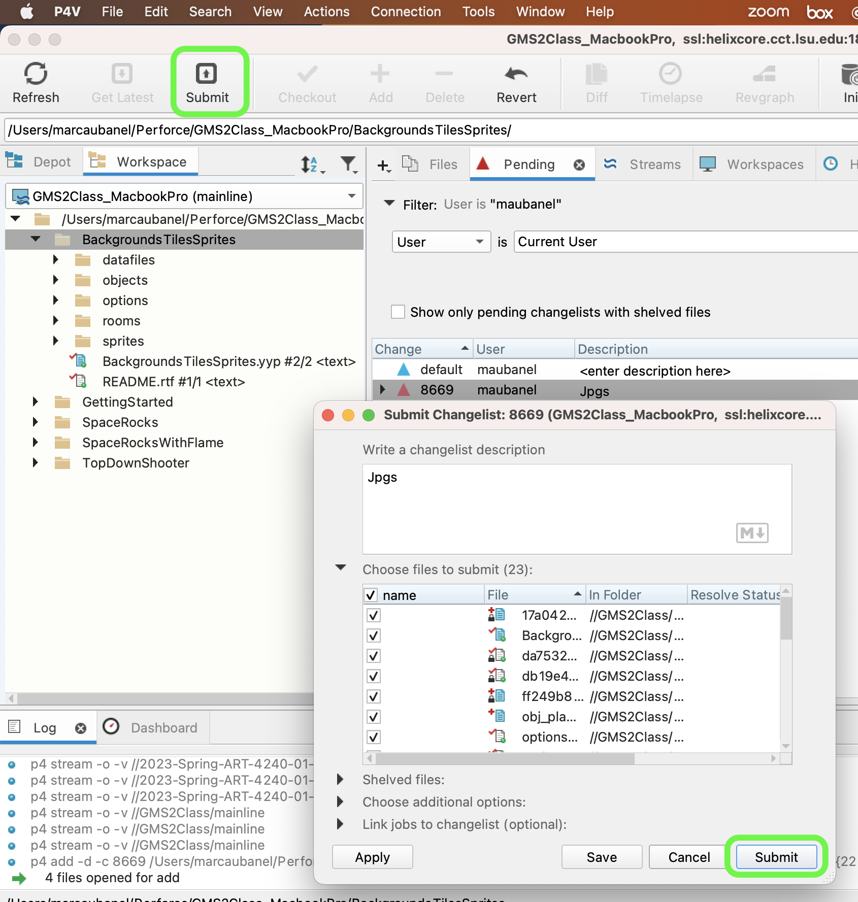

### Handling JPGs

[previous](../pixel-graphics/README.md#user-content-pixel-graphics-formats) • [home](../README.md#user-content-gms2-background-tiles--sprites---table-of-contents) • [next](../handling-gif/README.md#user-content-handling-gifs-and-other-formats)

JPEGS suffer from lossy compression (artifacting including banding) as well as no alpha.  In game sprites need to have the background removed so this is not a great method for dealing with them. 

 

---

##### `Step 1.`\|`BTS`|:small_blue_diamond:

Open up **P4v**.  Select the top folder of the **GameMaker** project. Press the <kbd>Checkout</kbd> button.  Checkout out all files in P4V so that they are all writable (otherwise they will be read only and none of the changes will be saved). Select a **New** changelist and add a message describing the unit of work you will be performing. Press the <kbd>OK</kbd> button.

Open up the project you are working on in **GameMaker**. 

Hopefully you will never have to handle a jpg file as they are really inconvenient.  But I will show you want to do if you do need to use one or any file with a missing Alpha.  *Download* [spr_plane_Jpg.jpg](../Assets/JPG/spr_plane_Jpg.jpg). Create new **Sprite** and press the <kbd>Import</kbd> button and select spr_plane_jpg.jpg you just downloaded. Call the sprite `spr_plane_jpg` and it should look like.

##### `Step 2.`\|`BTS`|:small_blue_diamond: :small_blue_diamond: 

Create a **Game Object**, attach the `spr_plane_jpg` as a **Sprite** and call it `obj_plane_jpg`.

##### `Step 3.`\|`BTS`|:small_blue_diamond: :small_blue_diamond: :small_blue_diamond:

Place the **obj_plane_jpg**  in the room and make sure you on the **Instances** layer.

##### `Step 4.`\|`BTS`|:small_blue_diamond: :small_blue_diamond: :small_blue_diamond: :small_blue_diamond:

Now *press* the <kbd>Play</kbd> button in the top menu bar to launch the game. You can see that there is no alpha on the sprite, the white background is rendered in the game window.

##### `Step 5.`\|`BTS`| :small_orange_diamond:

Now not only do we have a lossy image format but it does not save the *Alpha*. Open up **spr_plane_jpg** and press the <kbd>Edit Image</kbd> button.  What can we do? Select the Color Remove tool. I click on the white background then let go.  This gets rid of some of the color But the edges are anti-aliased which now go to the background white.

##### `Step 6.`\|`BTS`| :small_orange_diamond: :small_blue_diamond:

Here is one possible quick fix.  Open up Photoshop and load the **spr_plane_jpg.jpg** file you downloaded above. Select the **magic lasso tool** and press the outside white and inside the tail white so that all the white is selected like so.

##### `Step 7.`\|`BTS`| :small_orange_diamond: :small_blue_diamond: :small_blue_diamond:

We want to get rid of the white over an alpha.  To do this add a new layer and double click the backgroud layer to change it to a regular layer. Move the plane to the top layer:

##### `Step 8.`\|`BTS`| :small_orange_diamond: :small_blue_diamond: :small_blue_diamond: :small_blue_diamond:

*Press* **delete** and the black background dissapears leaving an alpha or an empty layer beneath the ship:

##### `Step 9.`\|`BTS`| :small_orange_diamond: :small_blue_diamond: :small_blue_diamond: :small_blue_diamond: :small_blue_diamond:

We still have a problem.  We have a white halo around the edge.  This becomes apparent if we put a dark background behind the plane.

##### `Step 10.`\|`BTS`| :large_blue_diamond:

Select the **Layer** with the plane and add a **Layer Style**. Press the **Inner Glow** effect on the layer style.  *Change* the color to **black** (solid). ,the **Size** to `1px` and the **Blend Mode** to `Normal`, and **Source** to `edge`.  This will put a black inner glow to get rid of the white anti-aliasing.

##### `Step 11.`\|`BTS`| :large_blue_diamond: :small_blue_diamond: 

Now against black it looks better.

##### `Step 12.`\|`BTS`| :large_blue_diamond: :small_blue_diamond: :small_blue_diamond: 

Now export this newly fixed up sprite with an alpha as a background (you can hide the black background layer) as a **PNG** format.  This way it will preserve the alpha.

##### `Step 13.`\|`BTS`| :large_blue_diamond: :small_blue_diamond: :small_blue_diamond:  :small_blue_diamond: 

Go back to Gamemaker and open the **spr_plane_jpg** and press the <kbd>Import</kbd> button.  Now select the **png** file you just exported.  You should now see a plane with an alpha.

##### `Step 14.`\|`BTS`| :large_blue_diamond: :small_blue_diamond: :small_blue_diamond: :small_blue_diamond:  :small_blue_diamond: 

Run the game by pressing the  Play Button. Now look how nicely it goes over our background in the room.

##### `Step 15.`\|`BTS`| :large_blue_diamond: :small_orange_diamond: 

Select the **File | Save Project**, then press **File | Quit** (PC) **Game Maker | Quit** on Mac to make sure everything in the game is saved.

Open up **P4V**.  Select the top folder and press the **Add** button.  We want to add all the new files we created during this last session.  Add these files to the last change list you used at the begining of the session (in my case it was `Spaceship I portion of walkthrough`). Press the <kbd>OK</kbd> button.

Now you can submit the changelist by pressing both <kbd>Submit</kbd> buttons.

___

<!--  -->

| [previous](../pixel-graphics/README.md#user-content-pixel-graphics-formats)| [home](../README.md#user-content-gms2-background-tiles--sprites---table-of-contents) | [next](../handling-gif/README.md#user-content-handling-gifs-and-other-formats)|
|---|---|---|
