### Importing Animations

[previous](../animations/README.md#user-content-animations) • [home](../README.md#user-content-gms2-background-tiles--sprites---table-of-contents) • [next](../player-movement/README.md#user-content-player-movement)

Lets look at how to import an animation sheet!

 

---

##### `Step 1.`\|`BTS`|:small_blue_diamond:

Open up **P4v**.  Select the top folder of the **GameMaker** project. Press the <kbd>Checkout</kbd> button.  Checkout out all files in P4V so that they are all writable (otherwise they will be read only and none of the changes will be saved). Select a **New** changelist and add a message describing the unit of work you will be performing. Press the <kbd>OK</kbd> button.

Open up the project you are working on in **GameMaker**. 

If you made a sprite sheet, you can use it.  Or, you can download the one I have created for you. I have included a PSD (photoshop file) [MonkeyAnim.png](../Assets/Animation/MonkeyAnim.png).

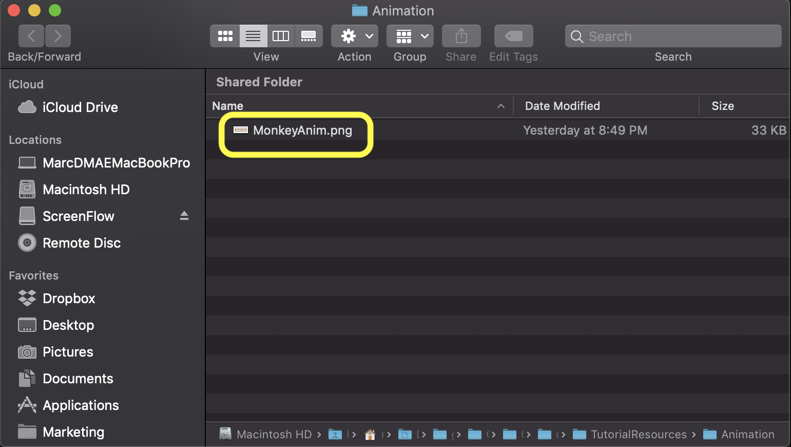

Select the **File | Save Project**, then press **File | Quit** (PC) **Game Maker | Quit** on Mac to make sure everything in the game is saved.

##### `Step 2.`\|`BTS`|:small_blue_diamond: :small_blue_diamond: 

There are many sprite sheets that are not geometrically consistent.  Some sheets have each sprite separated by how tightly they can be packed as opposed to a logical grid.  You can import an animation though one frame at a time if you need.  We need to make sure we know what the dimensions of a single sprite is. In this case it was done by me so I know they are 64 x 64. Each row is a separate animation and contains 8 frames. I have animated upwards, downwards and left/right motion. I did not do a separate left as we can just mirror the sprite in code and save some memory to have both left and right. In some cases we can mirror the animation, in other cases it is not symmetrical and you need a seperate animation for running left.

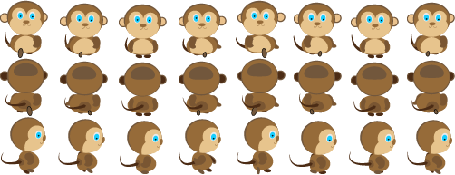

##### `Step 3.`\|`BTS`|:small_blue_diamond: :small_blue_diamond: :small_blue_diamond:

We can import the entire sheet as one animation but it will be easier if each movement gets its own animation file. So we create a new Sprite by right clicking on the **Sprite** title in the Resource menu and press **Create | Sprite**.

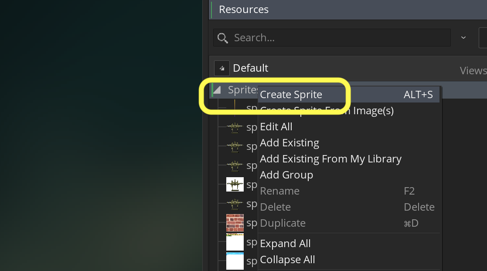

##### `Step 4.`\|`BTS`|:small_blue_diamond: :small_blue_diamond: :small_blue_diamond: :small_blue_diamond:

Now press the <kbd>Edit Image</kbd> button so we can get access to the image menu.

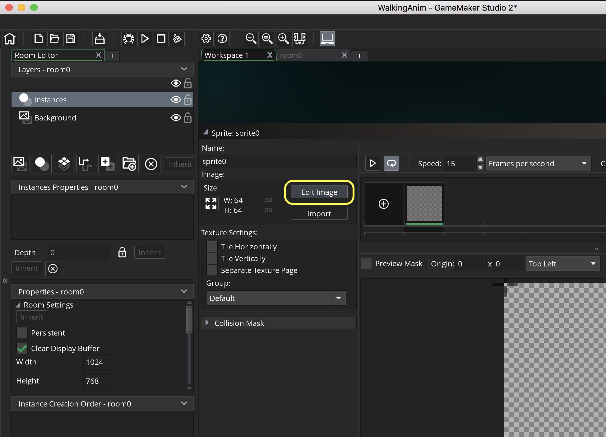

##### `Step 5.`\|`BTS`| :small_orange_diamond:

Go to the Image menu item and select **Image | Import Strip Image** and select the file you want. If you are using mine, select: **MonkeyAnim.png**.

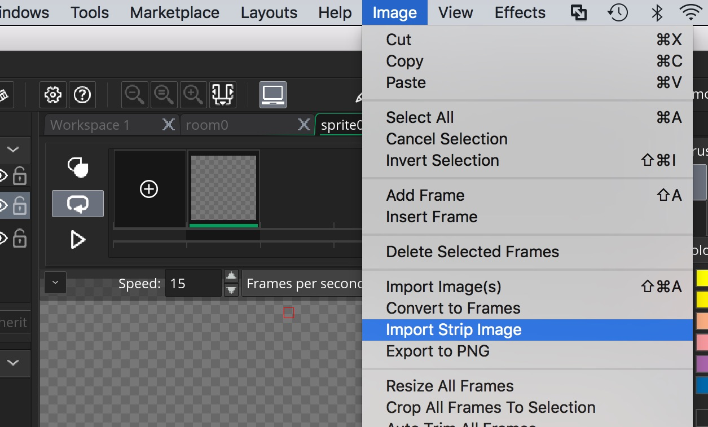

##### `Step 6.`\|`BTS`| :small_orange_diamond: :small_blue_diamond:

Now a **Convert to Frames** window appears. This is where we will select the number of framews and the size. We have 8 animations in a single row.  So, we fill in `8` for  **Number of Frames** and **Numbers per Row**.  Our sprites are 64 x 64 so we will input `64` for **Frame Width** and **Frame Height**.

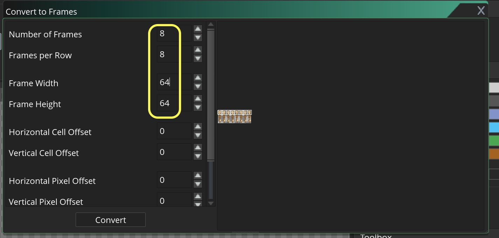

##### `Step 7.`\|`BTS`| :small_orange_diamond: :small_blue_diamond: :small_blue_diamond:

Press the **Convert** button and select yes for the pop-up.

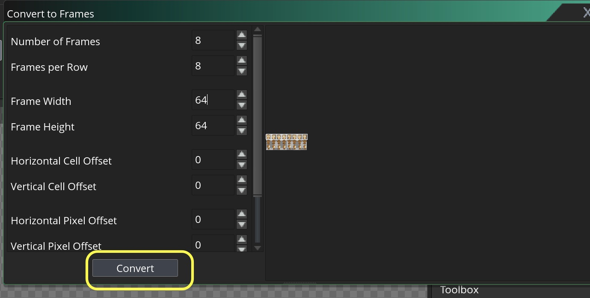

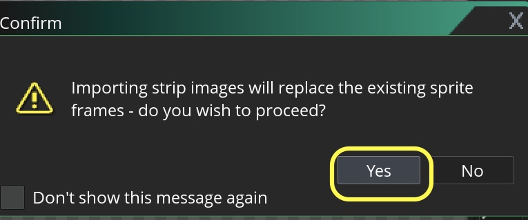

##### `Step 8.`\|`BTS`| :small_orange_diamond: :small_blue_diamond: :small_blue_diamond: :small_blue_diamond:

The animation is imported zoomed in so you press the **Reset Zoom** button to resize it and call the file `spr_player_down`.

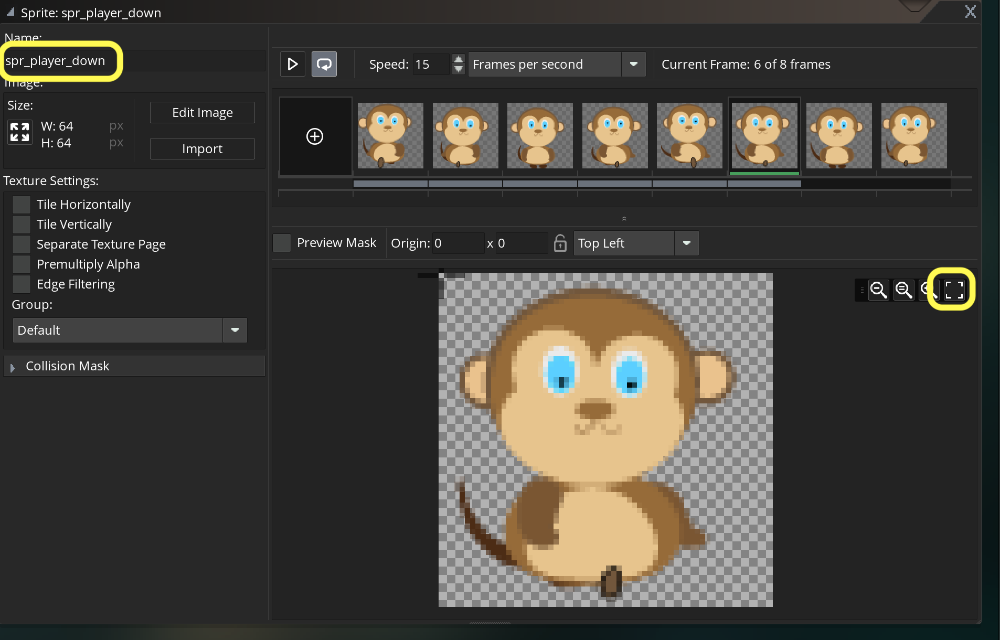

##### `Step 9.`\|`BTS`| :small_orange_diamond: :small_blue_diamond: :small_blue_diamond: :small_blue_diamond: :small_blue_diamond:

You can now adjust the speed to your liking. It should look like.  We will have to look at it in game.  Since we are moving the character in code we need to make sure that the animation speed matches the game speed the player runs at otherwise their foot contact will not look right. I have tested this before so I know that `12` will work.

##### `Step 10.`\|`BTS`| :large_blue_diamond:

We also need to pick an animation frame for the idle animation. Normally we would have an idle with a breathing animation or some personality, but for time's sake will just pick an existing animation from our sheet. I like the third frame with its neutral pose and both feet on the ground.

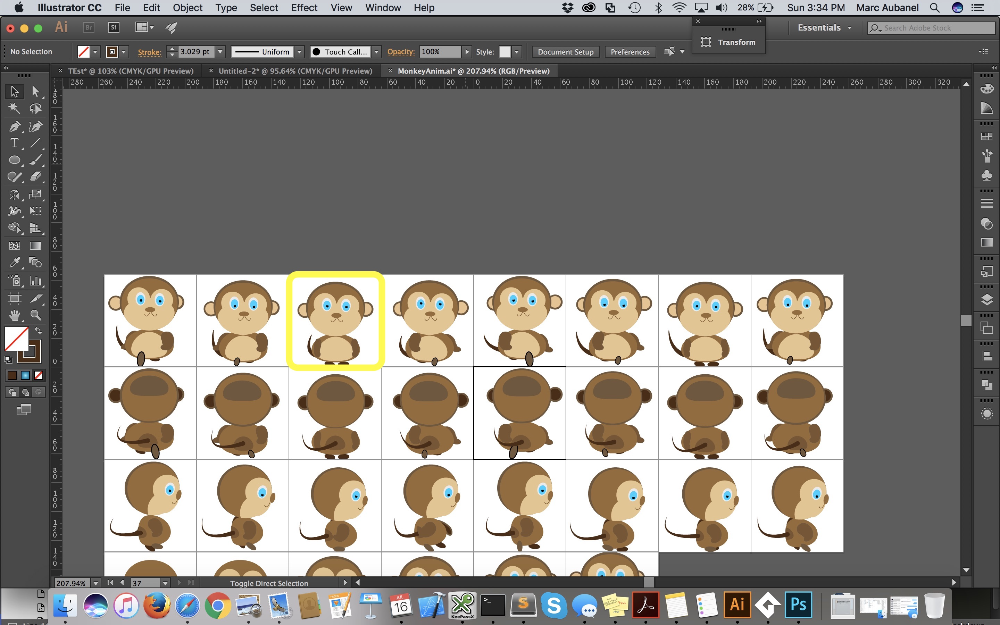

##### `Step 11.`\|`BTS`| :large_blue_diamond: :small_blue_diamond: 

*Create* a new **Sprite**, call it `spr_player_down_idle` and press the <kbd>Edit Image</kbd> button.

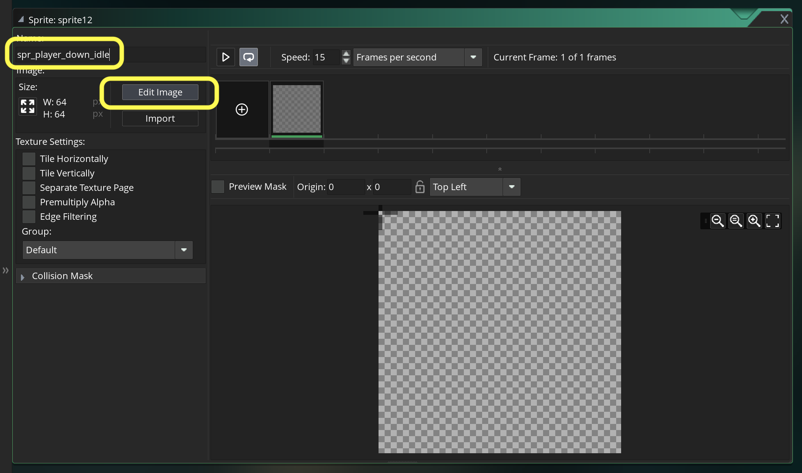

##### `Step 12.`\|`BTS`| :large_blue_diamond: :small_blue_diamond: :small_blue_diamond: 

Go to the **Image** menu item and select **Image | Import Strip Image**. Now a **Convert to Frames** window appears. This is where we will select the number of framews and the size. We fill in `64` for **Frame Width** and **Frame Height** and `2` for **Horizontal Cell Offset**.

##### `Step 13.`\|`BTS`| :large_blue_diamond: :small_blue_diamond: :small_blue_diamond:  :small_blue_diamond: 

Repeat by creating a new Sprite called spr_player_up and import the second row of sprites.  The biggest change is to *adjust* the **Vertical Cell** Offset to `1`.  Make sure you change the **speed** to `12` fps.

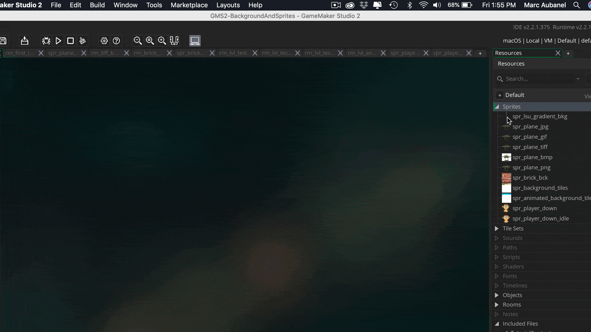

##### `Step 14.`\|`BTS`| :large_blue_diamond: :small_blue_diamond: :small_blue_diamond: :small_blue_diamond:  :small_blue_diamond: 

Create a new **Sprite**, call it `spr_player_up_idle` and press the <kbd>Edit Image</kbd> button. Now import the third frame from the second row.

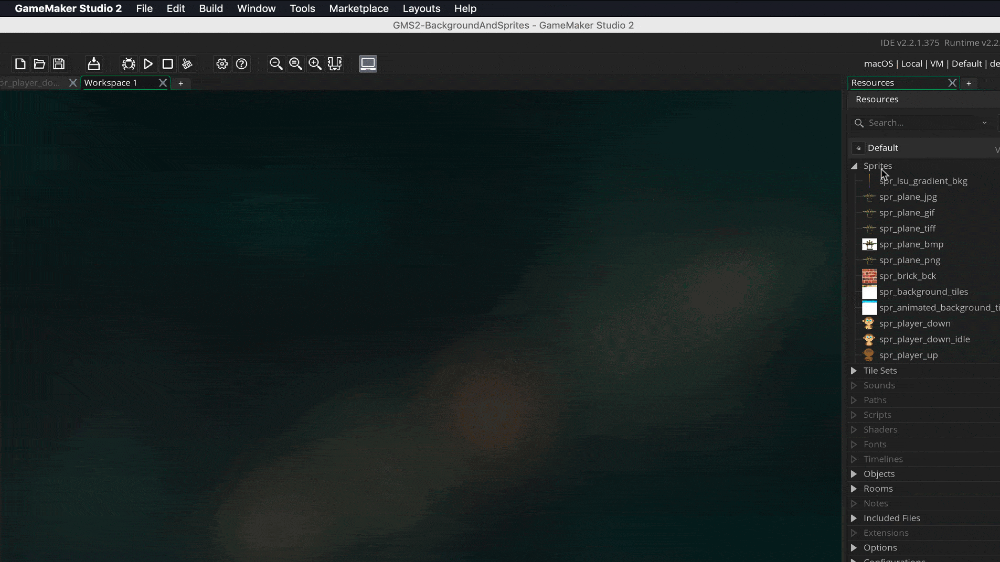

##### `Step 15.`\|`BTS`| :large_blue_diamond: :small_orange_diamond: 

*Create* a 2 new **Sprites**, called `spr_player_right` and `spr_player_right_idle` and import the appropriate animation frame(s) on the third row.

##### `Step 16.`\|`BTS`| :large_blue_diamond: :small_orange_diamond:   :small_blue_diamond: 

The last step is to set the origin in the middle center for **ALL** the sprites.  Here is an example.

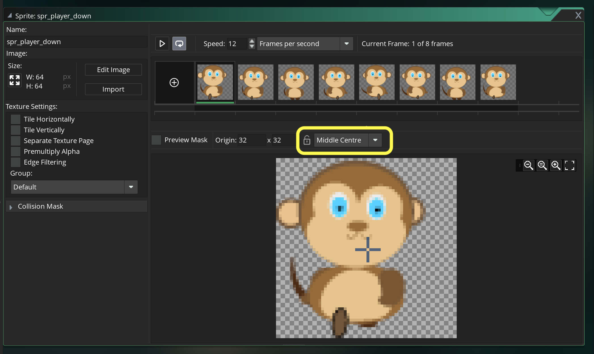

##### `Step 17.`\|`BTS`| :large_blue_diamond: :small_orange_diamond: :small_blue_diamond: :small_blue_diamond:

Select the **File | Save Project**, then press **File | Quit** (PC) **Game Maker | Quit** on Mac to make sure everything in the game is saved.

Open up **P4V**.  Select the top folder and press the **Add** button.  We want to add all the new files we created during this last session.  Add these files to the last change list you used at the begining of the session (in my case it was `Spaceship I portion of walkthrough`). Press the <kbd>OK</kbd> button.

Now you can submit the changelist by pressing both <kbd>Submit</kbd> buttons.

___

<!--  -->

| [previous](../animations/README.md#user-content-animations)| [home](../README.md#user-content-gms2-background-tiles--sprites---table-of-contents) | [next](../player-movement/README.md#user-content-player-movement)|
|---|---|---|
