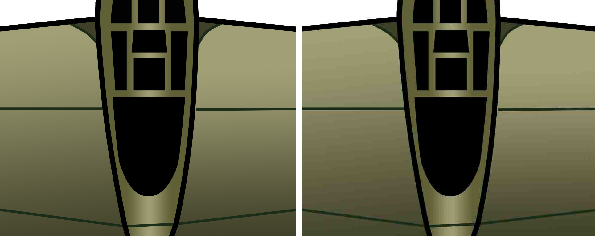
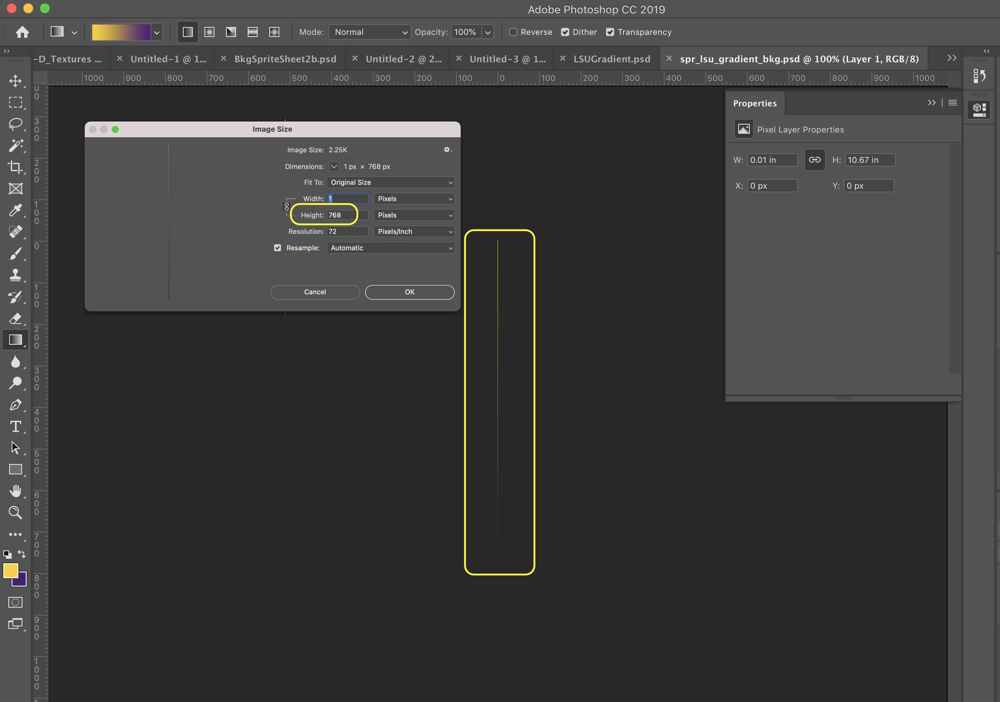

### Pixel Graphics Formats

[previous](../setting-up/README.md#user-content-setting-up) • [home](../README.md#user-content-gms2-background-tiles--sprites---table-of-contents) • [next](../handling-jpg/README.md#user-content-handling-jpgs)

We will be looking at techniques for creating animations for GameMaker video games. We will look at pixel art, vector art and some common techniques when building characters and levels.

 

---

##### `Step 1.`\|`BTS`|:small_blue_diamond:

We will be looking at techniques for creating animations for GameMaker video games. We will look at pixel art, vector art and some common techniques when building characters and levels.

With bitmaps we have a series of pixels. This is sometimes refered to as [raster](https://www.customink.com/help_center/raster-vs-vector-art) art.  In a 32 x 32 sprite we have: 32 x 32 = 1,024 total pixels. The pixel is most likely to contain 32 bits of data (8 bit red, 8 bit green, 8 bit blue, and 8 bit alpha). 8 bits is a [binary](https://en.wikipedia.org/wiki/Binary_number) representation of decimal 256. An 8 bit binary number can hold 256 individual decimal values.
		
So we typically have 256 values for each of the the R, G, B, A channels. Some art styles can be saved a lower rates such as 16 bits where we have 4 bits per channel or 32 bit values for R, G, B, A. For an old school look some people will restrict to a smaller size and force into a 4 bit pallette for example.

So a 32 x 32 pixel image would be 1,024 pixels * 4 bytes which is 4,096 bytes or 4.096 kilobytes. 

Look at the **PNG** format supporting different bit depths and channels. This table is from the wikipedia webpage.

##### `Step 2.`\|`BTS`|:small_blue_diamond: :small_blue_diamond: 

There are many different raster formats that images can be saved in. I have highlighted a few in **Photoshop** that are common: *psd*, *gif*, *jpg*, *png*, *tiff*, & *targa*.

##### `Step 3.`\|`BTS`|:small_blue_diamond: :small_blue_diamond: :small_blue_diamond:

They all have different abilities and there are good reasons to use or not use them in a game. Let's first look at *lossy* versus *lossless* images. A **lossy** image is one where the image size is shrunk by algorithms that change (hopefully not noticably) to save space. **Jpeg** (`.jpg`) files is a common compressed file type. Here is an example of the plane from the WW2 shooter with the least compression on the left and most on the right:
	 
Please note:  Even though you can compress a texture **GameMaker** decompresses them into the GPU.  We save on storage but use cpu to decompress it into video memory.  Since games are large, there is lots of room for uncompressed art.

Look at the below image on the right, you can see some banding in the colors.  This is a common side effect of 2D compression like Jpeg.

##### `Step 4.`\|`BTS`|:small_blue_diamond: :small_blue_diamond: :small_blue_diamond: :small_blue_diamond:

Lets zoom in a bit to see the banding better.

##### `Step 5.`\|`BTS`| :small_orange_diamond:

It is important to note that the format will need to be sent to the GPU in its raw decompressed state so ultimately the entire size is required to display the image. Each game will have different demands for either aesthetic or performance reasons. In most cases **png** or **bmp** is the default format to use and is recommended by **GameMaker**. Lets look at various formats:
	
[JPEG](https://en.wikipedia.org/wiki/JPEG). It is a good format for complex images like digital photographs.  This saves storage space by applying compression. It is less effective for simpler graphics (images from Illustrator) with well defined lines. Not only does a jpeg alter the image it also has **NO** alpha. You need to pick a unique color for a background to remove it later in the sprite editor in Gamemaker.

[Portable Network Graphics(png)](https://en.wikipedia.org/wiki/Portable_Network_Graphics) is a compressed and uncompressed lossless format. What losselss means is that you will lose no quality when it is applied.  It can save some room on your hard drive but Gamemaker will store it in an uncompressed state. It supports both *24 bit RGB* and *32 bit RGBA* formats as well as **indexed** and **monochromatic** as well.
		
[Graphics Interchange Format(GIF)](https://en.wikipedia.org/wiki/GIF) is commonly used to store animations as it is one of the few formats that supports them. It only supports only *8-bit RGB* color space and does not support alpha channels. This is far less than jpgs or png's *24 bit* colors which makes it only suitable to very simple images. **GIF** compression is better for simpler art like line art or Illustrator files. **GIFs** are also good for storing low-color sprite data to save size. Some use this format to get an old school look.

[bitmap image file(bmp)](https://en.wikipedia.org/wiki/BMP_file_format) is a raster graphics format that supports various color depths, and optionally with data compression, alpha channels, and color profiles.

[PSD](https://en.wikipedia.org/wiki/Adobe_Photoshop) is the best format to keep all your original artwork in. I make a lot of sprites in Photoshop and save all the layers and original work. Unfortunately **GameMaker** does not support **PSD** so they need to be exported to one of the above formats.

##### `Step 6.`\|`BTS`| :small_orange_diamond: :small_blue_diamond:

Let's look at some of this in action. I have included a **PSD (photoshop file)** and please download [spr_lsu_gradient_bkg.psd](../Assets/Photoshop/spr_lsu_gradient_bkg.psd) Find it in the file explorer and load it in **Photoshop**.

##### `Step 7.`\|`BTS`| :small_orange_diamond: :small_blue_diamond: :small_blue_diamond:

Now lets look at it in **Photoshop**. It is really hard to see what is going on.  What I have done is created a gradient spread between the two LSU school colors.  Now instead of filling the whole background I am making it one pixel wide.  This way we can repeat this texture horizontally and will get an endlessly long level with this gradient.  It is currently set at the height of the default room size which we will leave the same. In games we want to keep graphics as small as we can.

##### `Step 8.`\|`BTS`| :small_orange_diamond: :small_blue_diamond: :small_blue_diamond: :small_blue_diamond:

Here it is zoomed in.

##### `Step 9.`\|`BTS`| :small_orange_diamond: :small_blue_diamond: :small_blue_diamond: :small_blue_diamond: :small_blue_diamond:

There is no need to alter this graphic.  *Select* **File | Export | Quick Export as PNG** .  Save it to a location of your choice.

##### `Step 10.`\|`BTS`| :large_blue_diamond:

*Add* a new Sprite by right clicking the **Sprites** title in the **Resources** tab and select **Create | Sprite** and press the <kbd>Import</kbd> button. *Select* the png that you just exported then press the <kbd>Yes</kbd> button at the menu prompt.

##### `Step 11.`\|`BTS`| :large_blue_diamond: :small_blue_diamond: 

Name the new sprite: `spr_lsu_gradient_bkg`. 

##### `Step 12.`\|`BTS`| :large_blue_diamond: :small_blue_diamond: :small_blue_diamond: 

Double click the room and change the name to `rm_first_import`. Go to the **Background Layer** on the left hand menu and select `spr_lsu_gradient_bkg` as the background sprite. Now it is very hard to see because it is only one pixel wide.

##### `Step 13.`\|`BTS`| :large_blue_diamond: :small_blue_diamond: :small_blue_diamond:  :small_blue_diamond: 

Why did I make it 1 pixel wide and not just create a sprite that was the size of the room? We want to be as efficient with the size of the sprites as possible. Every video card has maximum texture sizes that it can hold and we can go through that barrier quickly. 

Good game art in either 2D or 3D games is about breaking artwork down to their smallest component and using instances (copies of them). 

We are creating a gradient background with as little data as possible. So how do we tile this texture horizontally so it fills the whole background? Just select the **Horizontal Tile** box in the **Background Properties** panel on the left.

##### `Step 14.`\|`BTS`| :large_blue_diamond: :small_blue_diamond: :small_blue_diamond: :small_blue_diamond:  :small_blue_diamond: 

Now *press* the <kbd>Play</kbd> button in the top menu bar to launch the game. You can see a perfectly uncompressed gradient that went from a PSD, to a PNG to a GameMaker Sprite with no degradation in quality.

##### `Step 15.`\|`BTS`| :large_blue_diamond: :small_orange_diamond: 

Select the **File | Save Project** then press **File | Quit** to make sure everything in the game is saved. If you are using **GitHub** open up **GitHub Desktop** and add a title and longer description (if necessary) and press the <kbd>Commit to main</kbd> button. Finish by pressing **Push origin** to update the server with the latest changes.

___

| [previous](../setting-up/README.md#user-content-setting-up)| [home](../README.md#user-content-gms2-background-tiles--sprites---table-of-contents) | [next](../handling-jpg/README.md#user-content-handling-jpgs)|
|---|---|---|
