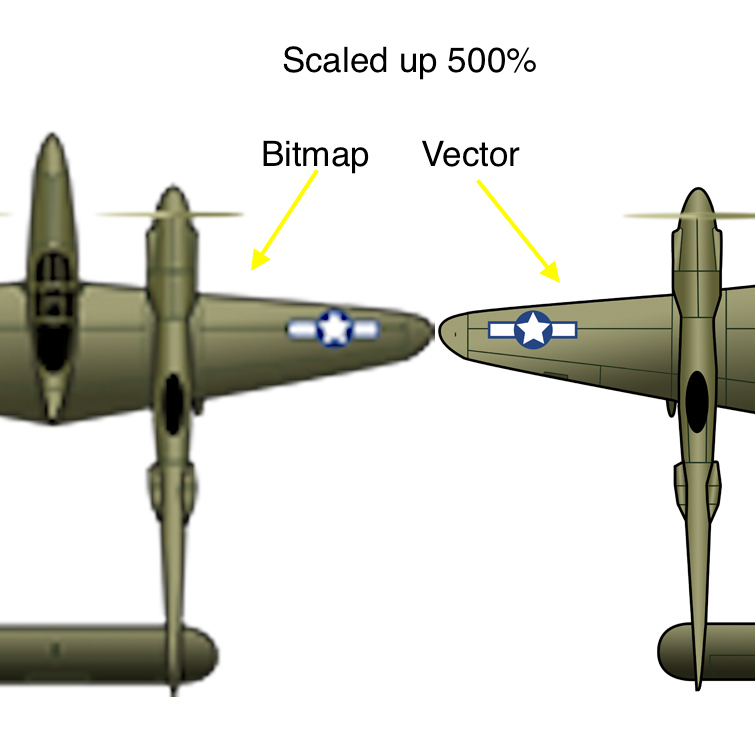

### Raster and Vector

[previous](../handling-gif/README.md#user-content-handling-gifs-and-other-formats) • [home](../README.md#user-content-gms2-background-tiles--sprites---table-of-contents) • [next](../background-tile/README.md#user-content-background-and-single-tile)

> A raster image is an image that is built using pixels. Any image taken with a digital camera or scanned into a computer is constructed using pixels. They use an abundance of different shades and colors of pixels to piece together a complete complex image, and the dimensions are measured using pixels. Paintings and images created in software such as PaintShop Pro result in raster images. The use of pixels to gradually shade images creates the appearance of a brush dipped in paint.  A vector image, however, is built using mathematical formula - not pixels. The file dictates several points and creates a line between them to form a specific shape. These are usually geometric shapes and makeup images that have bold lines and strong colors, like logos and abstract artwork. - [Corel Draw](https://www.coreldraw.com/en/tips/vector-images/raster-vs-vector/) 
 

---

##### `Step 1.`\|`BTS`|:small_blue_diamond:

I would be remiss not to quickly discuss raster versus vector artwork.  Now this plane I created was done in Illustrator as a vector art.  I exported it as a raster pixel art from the software.

Vector graphics unlike bitmap graphics can scale endlessly without pixilating. Here is the plane from the game in bitmap scaled up 500% and in vectors scaled up 500%.

These planes were created in **Adobe Illustrator** as vector graphics so I could output any raster scale without degradation.

##### `Step 2.`\|`BTS`|:small_blue_diamond: :small_blue_diamond: 

For a vector look there is nothing wrong using vector art software to create vector assets, then rasterising the graphics. This future proofs your artwork as it will scale to any high density future format.

There are some payoffs between using raster and vector artwork. GameMaker supports **SWF** animations as well as bitmaps. Their vector pipeline is limited and the engine was most likely built for bitmap artwork. **GameMaker** also support Skeletal animations with **[Spine](https://docs2.yoyogames.com/source/_build/1_overview/3_additional_information/importing_non_bitmap_sprites.html)**.

##### `Step 3.`\|`BTS`|:small_blue_diamond: :small_blue_diamond: :small_blue_diamond:

##### `Step 4.`\|`BTS`|:small_blue_diamond: :small_blue_diamond: :small_blue_diamond: :small_blue_diamond:

##### `Step 5.`\|`BTS`| :small_orange_diamond:

##### `Step 6.`\|`BTS`| :small_orange_diamond: :small_blue_diamond:

##### `Step 7.`\|`BTS`| :small_orange_diamond: :small_blue_diamond: :small_blue_diamond:

##### `Step 8.`\|`BTS`| :small_orange_diamond: :small_blue_diamond: :small_blue_diamond: :small_blue_diamond:

##### `Step 9.`\|`BTS`| :small_orange_diamond: :small_blue_diamond: :small_blue_diamond: :small_blue_diamond: :small_blue_diamond:

##### `Step 10.`\|`BTS`| :large_blue_diamond:

##### `Step 11.`\|`BTS`| :large_blue_diamond: :small_blue_diamond: 

##### `Step 12.`\|`BTS`| :large_blue_diamond: :small_blue_diamond: :small_blue_diamond: 

##### `Step 13.`\|`BTS`| :large_blue_diamond: :small_blue_diamond: :small_blue_diamond:  :small_blue_diamond: 

##### `Step 14.`\|`BTS`| :large_blue_diamond: :small_blue_diamond: :small_blue_diamond: :small_blue_diamond:  :small_blue_diamond: 

##### `Step 15.`\|`BTS`| :large_blue_diamond: :small_orange_diamond: 

##### `Step 16.`\|`BTS`| :large_blue_diamond: :small_orange_diamond:   :small_blue_diamond: 

##### `Step 17.`\|`BTS`| :large_blue_diamond: :small_orange_diamond: :small_blue_diamond: :small_blue_diamond:

##### `Step 18.`\|`BTS`| :large_blue_diamond: :small_orange_diamond: :small_blue_diamond: :small_blue_diamond: :small_blue_diamond:

##### `Step 19.`\|`BTS`| :large_blue_diamond: :small_orange_diamond: :small_blue_diamond: :small_blue_diamond: :small_blue_diamond: :small_blue_diamond:

##### `Step 20.`\|`BTS`| :large_blue_diamond: :large_blue_diamond:

##### `Step 21.`\|`BTS`| :large_blue_diamond: :large_blue_diamond: :small_blue_diamond:

___

| [previous](../handling-gif/README.md#user-content-handling-gifs-and-other-formats)| [home](../README.md#user-content-gms2-background-tiles--sprites---table-of-contents) | [next](../background-tile/README.md#user-content-background-and-single-tile)|
|---|---|---|
