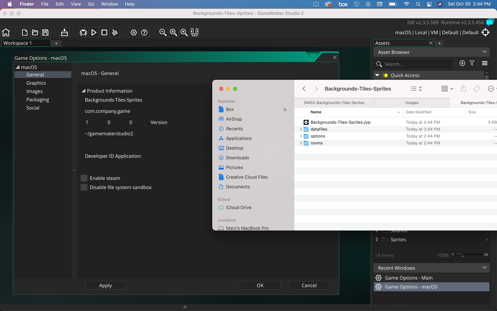
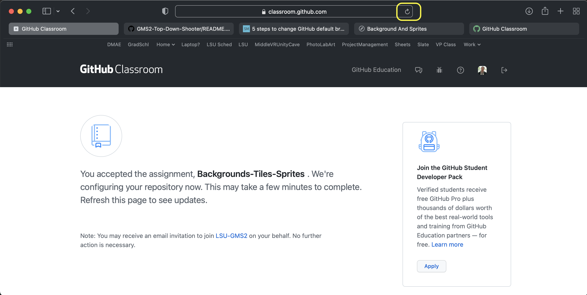
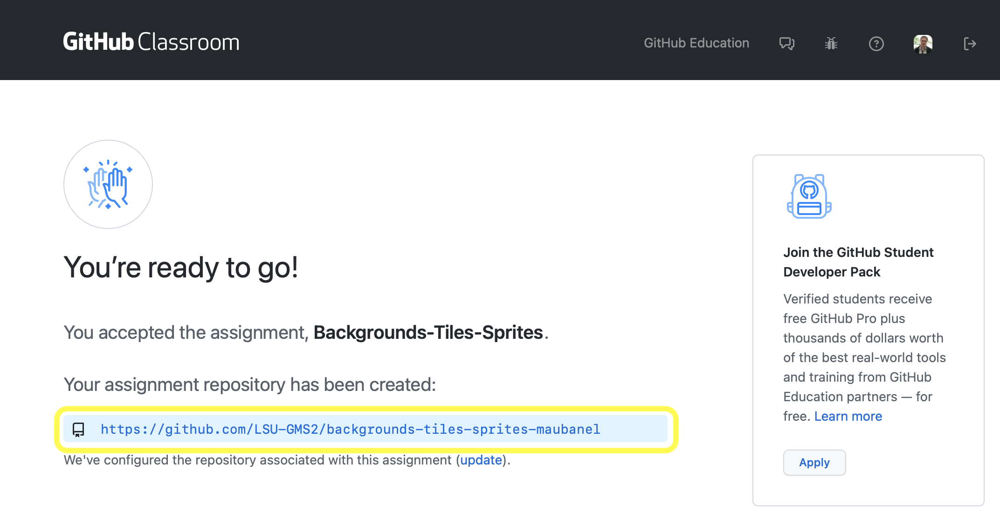
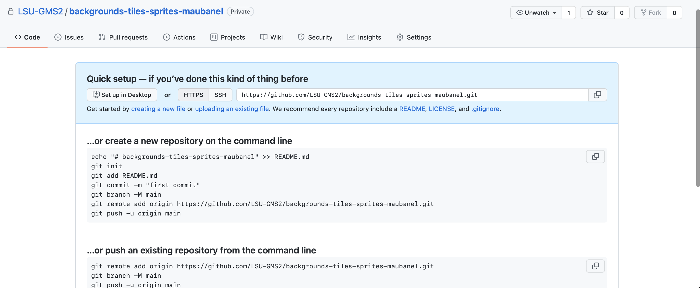
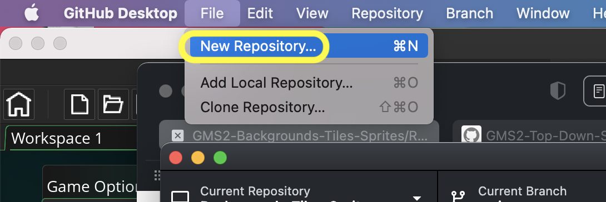
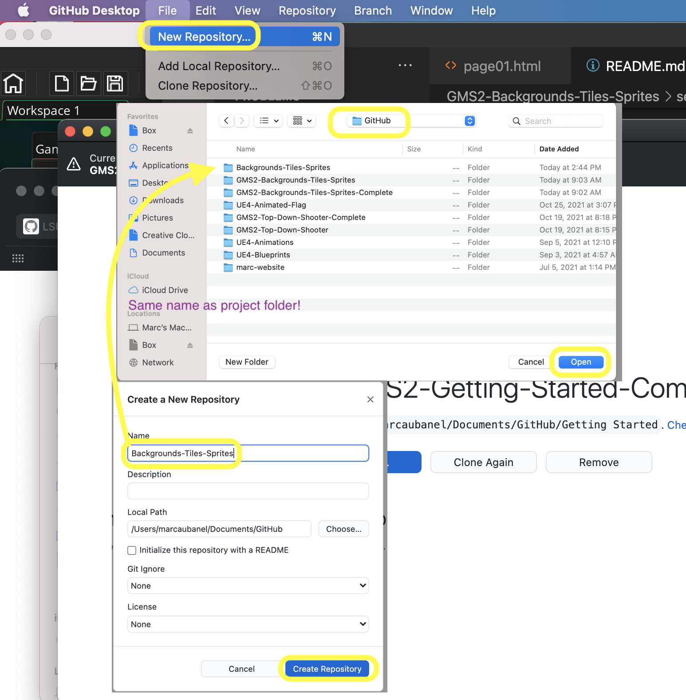
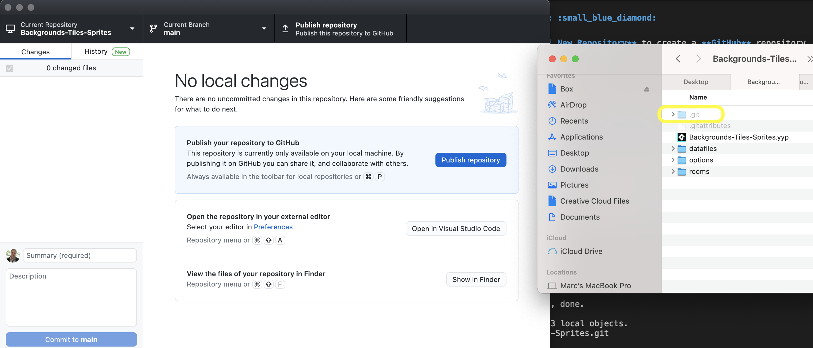
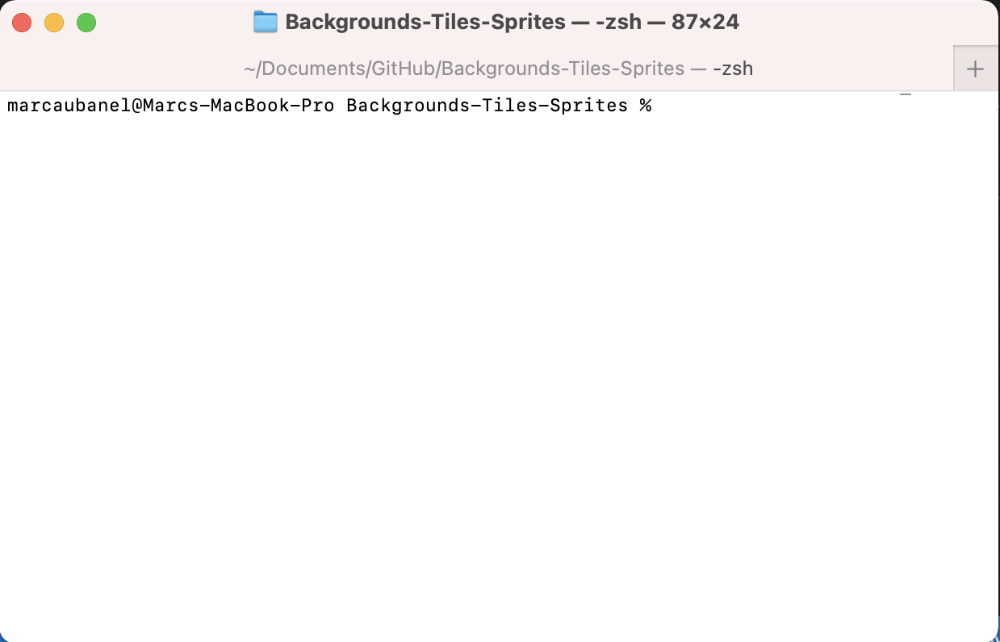
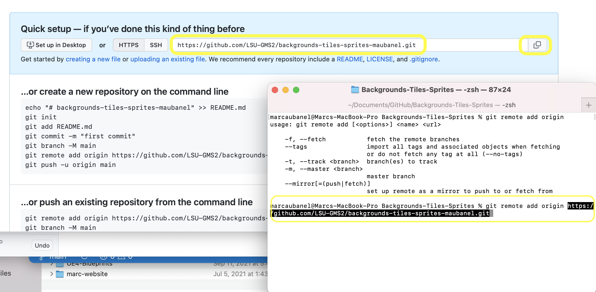
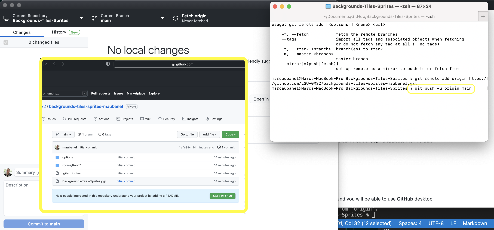

### Setting Up

[home](../README.md#user-content-gms2-background-tiles--sprites---table-of-contents) • [next](../pixel-graphics/README.md#user-content-pixel-graphics-formats)

Lets get set up to start our work in backgrounds, image formats and animation.

 

---

##### `Step 1.`\|`BTS`|:small_blue_diamond:

Go to [New GML Project](https://github.com/maubanel/GMS2-Snippets/blob/main/new-gml/README.md#user-content-new-gml-project) and create a project called `Backgrounds-Tiles-Sprites`. Click on the <kbd>Settings</kbd> button and change the name of the **Display Name** on macOS and/or Windows to `Backgrounds-Tiles-Sprites`.  Check the directory and double check that it created the files where you expected.

##### `Step 2.`\|`BTS`|:small_blue_diamond: :small_blue_diamond: 

Click on the **[GitHub Classroom Link](https://classroom.github.com/a/nOy4s54Y)** if you want a repository to use for the game. Press the <kbd>Accept this assignment</kbd> button. 

##### `Step 3.`\|`BTS`|:small_blue_diamond: :small_blue_diamond: :small_blue_diamond:

You will now be sent to a message that says the repository is being configured.  Wait a few seconds then press the refresh button.

##### `Step 4.`\|`BTS`|:small_blue_diamond: :small_blue_diamond: :small_blue_diamond: :small_blue_diamond:

Eventually you will get a link to the repository that **GitHub Classroom** has created.  *Click* on the link to your new repository.

##### `Step 5.`\|`BTS`| :small_orange_diamond:

You get to your empty repository on **GitHub**.

##### `Step 6.`\|`BTS`| :small_orange_diamond: :small_blue_diamond:

Open up **GitHub Desktop** and select **File | New Repository** to create a **GitHub** repository inside the **Top-Down-Shooter** project you just created.

##### `Step 7.`\|`BTS`| :small_orange_diamond: :small_blue_diamond: :small_blue_diamond:

Now we want the project to be in the same folder as the `.yyp` project filename (in this case Top-Down-Shooter).  You then need to set the **name** the exact name of the folder that holds the project.  So in my case the folder that contained the project was **Documents | GitHub**.  So I use this as the **Local Path**.  For the **Name** I use the project folder `Top-Down-Shooter`. It has to be spelled EXACTLY the same way as the one that holds the **GameMaker** project. This way it will create a git repository in this folder without creating a new folder.

##### `Step 8.`\|`BTS`| :small_orange_diamond: :small_blue_diamond: :small_blue_diamond: :small_blue_diamond:

When you see them there has to be a `.git` hidden folder in the **same** directory as the project file (in my case **Backgrounds-Tiles-Sprites.yyp**).

##### `Step 9.`\|`BTS`| :small_orange_diamond: :small_blue_diamond: :small_blue_diamond: :small_blue_diamond: :small_blue_diamond:

**Open in Terminal** on mac and **Repository | Open in ???** on PC. Go to the directory holding the file.  In my case I had to type in `cd Documents/GitHub/Backgrounds-Tiles-Sprites`.

##### `Step 10.`\|`BTS`| :large_blue_diamond:

You now need to connect this new repository to the one you created in the second step in this walk through.  Copy and paste the line that includes `git remote add origin`... and press enter.

##### `Step 11.`\|`BTS`| :large_blue_diamond: :small_blue_diamond: 

Now type `git push -u origin main` to push your work to **GitHub**.  The project is now set up and you will be able to use **GitHub** desktop without command line for the rest of the project.

___

<!--  -->

| [home](../README.md#user-content-gms2-background-tiles--sprites---table-of-contents) | [next](../pixel-graphics/README.md#user-content-pixel-graphics-formats)|
|---|---|
