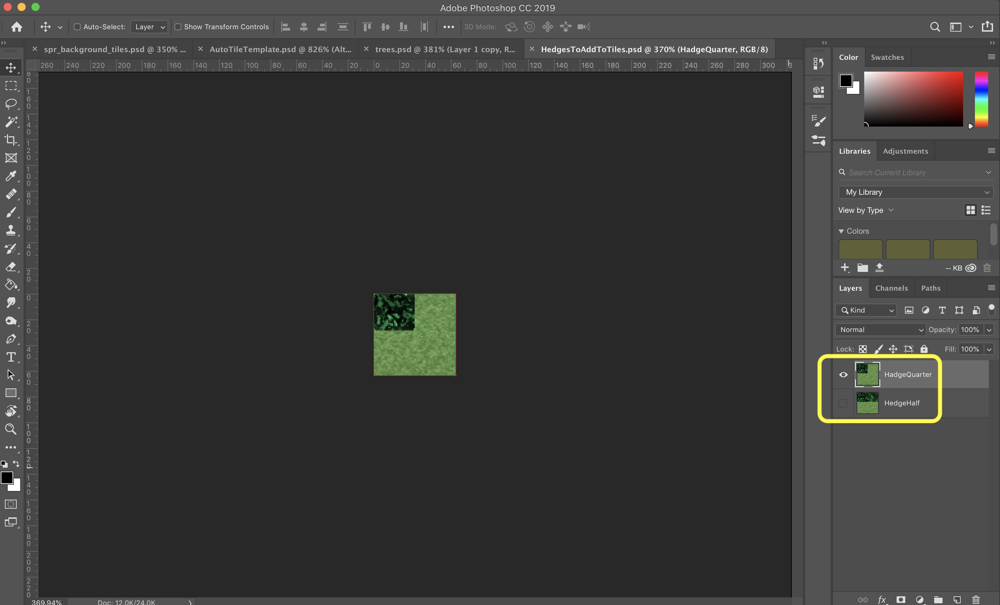
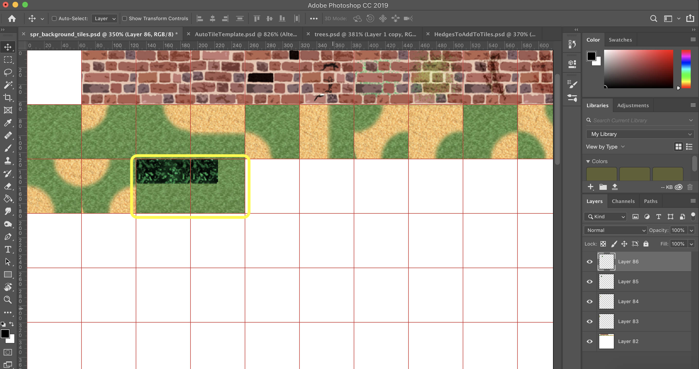
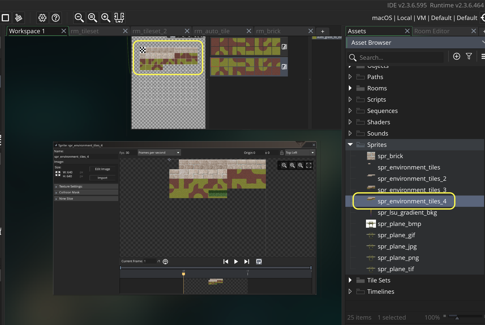
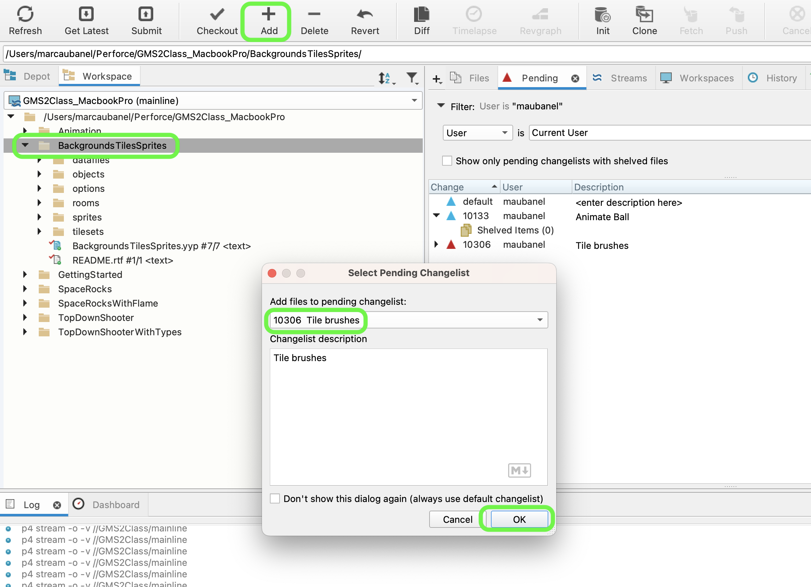
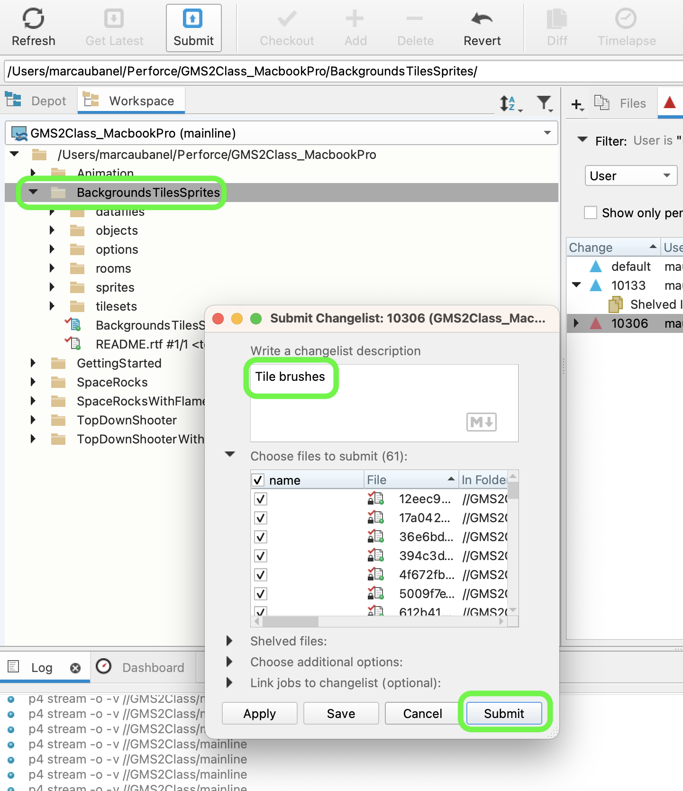

### Tile Brushes

[previous](../auto-tile/README.md#user-content-auto-tile-template) • [home](../README.md#user-content-gms2-background-tiles--sprites---table-of-contents) • [next](../animated-tiles/README.md#user-content-animated-tiles)

There are some simple tricks to making it look like we have more art than we do.  One, is to rotate the tiles. There is another way we can paint tiles that saves us a lot of space and repetition in our art creation.  We can have tile brushes.  This allows us to alter existing tiles by flipping axis or rotating them.  This takes the one tile and creates a variety of alternatives that can be used.

 

---

##### `Step 1.`\|`BTS`|:small_blue_diamond:

*Download* [HedgesToAddToTiles.psd](../Assets/Photoshop/HedgesToAddToTiles.psd). I have included this PSD (photoshop file) with two more tiles to use as brushes. 

##### `Step 2.`\|`BTS`|:small_blue_diamond: :small_blue_diamond: 

Duplicate **ts_environment_3.psd** and call the new file `ts_environment_4.psd`. Copy both of the tiles above and add them to the end of your tilesheet. Remember to always leave the first slot empty.

##### `Step 3.`\|`BTS`|:small_blue_diamond: :small_blue_diamond: :small_blue_diamond:

**Export** your tilesheet as a **PNG** and right click on **Sprites** and select **Create Sprite**. Call it `spr_environment_tiles_4`. Press the <kbd>Import</kbd> button and select the above sprite. 

##### `Step 4.`\|`BTS`|:small_blue_diamond: :small_blue_diamond: :small_blue_diamond: :small_blue_diamond:

Right click on **Tilesets** and selet **Create | Tileset** and call it `tls_environment_4`. Assing **spr_envrionment_sprites_4**. Set the **Tile Width** and **Tile Height** to `64`. Press the **Brush Builder** button.  

We do not need to waste storage and sprite space by having to store rotated sprites.  We can take our hedge and rotate it in all diretions allowing it to work in all axis for any scenario.

Now we need spaces in between each brush. Lets create a hedge in all 4 directions by rotating it pressing the *Rotate* button.  Add a brush with 4 hedge pieces making it quicker to draw in all 4 directions.  Then add our end pieces in all diretions as well. We also need to mirror the x axis and rotate it with the hedge ending on the other side.

https://user-images.githubusercontent.com/5504953/143160956-6b46d484-cc32-49c9-baa1-4adc755cfa56.mp4

##### `Step 5.`\|`BTS`| :small_orange_diamond:

*Right click* on **Rooms** and select **New | Room** and name it `rm_brushes`. Change the **Room Order** to place this room on the top of the list. Add a new **Tile** layer and call it `Environment` and move it under the **Instances** layer.  Select the brushes tab and the pencil tool.  Then select a brush and start painting the bushes in a way that works best for you. Put the hedge ends on both sides.

Now *press* the <kbd>Play</kbd> button in the top menu bar to launch the game and see your work.

https://user-images.githubusercontent.com/5504953/143161607-bf0eba3e-ecb4-4ed2-9bfe-28616a45c1f8.mp4

##### `Step 6.`\|`BTS`| :small_orange_diamond: :small_blue_diamond:

Select the **File | Save Project**, then press **File | Quit** (PC) **Game Maker | Quit** on Mac to make sure everything in the game is saved.

Open up **P4V**.  Select the top folder and press the **Add** button.  We want to add all the new files we created during this last session.  Add these files to the last change list you used at the begining of the session (in my case it was `Spaceship I portion of walkthrough`). Press the <kbd>OK</kbd> button.

Now you can submit the changelist by pressing both <kbd>Submit</kbd> buttons.

___

<!--  -->

| [previous](../auto-tile/README.md#user-content-auto-tile-template)| [home](../README.md#user-content-gms2-background-tiles--sprites---table-of-contents) | [next](../animated-tiles/README.md#user-content-animated-tiles)|
|---|---|---|
