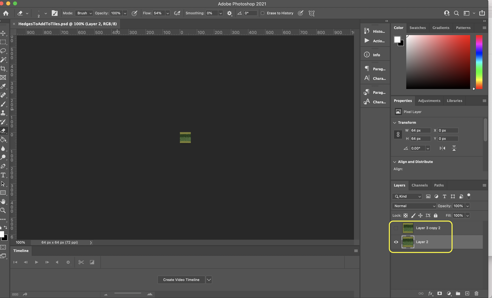
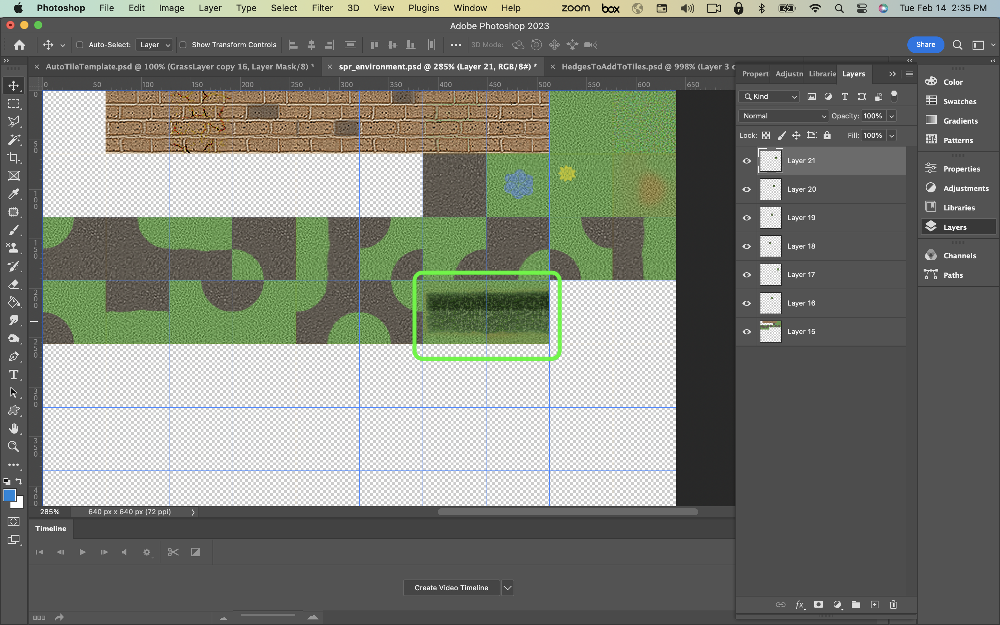

### Tile Brushes

[previous](../auto-tile/README.md#user-content-auto-tile-template) • [home](../README.md#user-content-gms2-background-tiles--sprites---table-of-contents) • [next](../animated-tiles/README.md#user-content-animated-tiles)

There are some simple tricks to making it look like we have more art than we do.  One, is to rotate the tiles. There is another way we can paint tiles that saves us a lot of space and repetition in our art creation.  We can have tile brushes.  This allows us to alter existing tiles by flipping axis or rotating them.  This takes the one tile and creates a variety of alternatives that can be used.

 

---

##### `Step 1.`\|`BTS`|:small_blue_diamond:

*Download* [HedgesToAddToTiles.psd](../Assets/Photoshop/HedgesToAddToTiles.psd). I have included this PSD (photoshop file) with two more tiles to use as brushes. 

##### `Step 2.`\|`BTS`|:small_blue_diamond: :small_blue_diamond: 

Duplicate **ts_environment_3.psd** and call the new file `ts_environment_4.psd`. Copy both of the tiles above and add them to the end of your tilesheet. Remember to always leave the first slot empty.

##### `Step 3.`\|`BTS`|:small_blue_diamond: :small_blue_diamond: :small_blue_diamond:

**Export** your tilesheet as a **PNG** and right click on **Sprites** and select **Create Sprite**. Call it `spr_environment_tiles_4`. Press the <kbd>Import</kbd> button and select the above sprite. 

##### `Step 4.`\|`BTS`|:small_blue_diamond: :small_blue_diamond: :small_blue_diamond: :small_blue_diamond:

Right click on **Tilesets** and selet **Create | Tileset** and call it `tls_environment_4`. Assing **spr_envrionment_sprites_4**. Set the **Tile Width** and **Tile Height** to `64`. Press the **Brush Builder** button.  Now we need spaces in between each brush and a brush can be more than one tile.  Lets create a hedge in all 4 directions by rotating it pressing the Rotate button.  Add a brush with 3 hedge pieces making it quicker to draw in all 4 directions.  Then add our end pieces in all diretions as well.

https://user-images.githubusercontent.com/5504953/143160136-0aa42325-2790-4852-bed1-24f5e752957a.mp4

##### `Step 5.`\|`BTS`| :small_orange_diamond:

Go back to **rm_lvl_2** and select the brushes tab and the pencil tool.  Then select a brush and start painting the bushes in a way that works best for you.

##### `Step 6.`\|`BTS`| :small_orange_diamond: :small_blue_diamond:

Select the **File | Save Project** then press **File | Quit** to make sure everything in the game is saved. If you are using **GitHub** open up **GitHub Desktop** and add a title and longer description (if necessary) and press the <kbd>Commit to main</kbd> button. Finish by pressing **Push origin** to update the server with the latest changes.

___

| [previous](../auto-tile/README.md#user-content-auto-tile-template)| [home](../README.md#user-content-gms2-background-tiles--sprites---table-of-contents) | [next](../animated-tiles/README.md#user-content-animated-tiles)|
|---|---|---|
