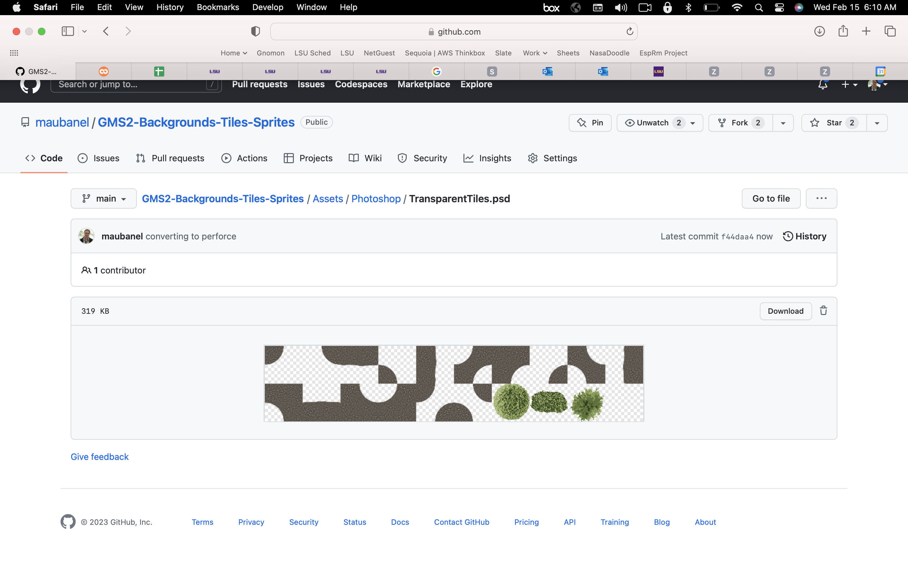

### Transparent Tiles

[previous](../animated-tiles/README.md#user-content-animated-tiles) • [home](../README.md#user-content-gms2-background-tiles--sprites---table-of-contents) • [next](../animations/README.md#user-content-animations)

We can also have tiles that don't take up the entire volume.  We can put an alpha channel so that we can add a layer on top of an existing tile.  So we can put a tree on top of a grass tile.

 

---

##### `Step 1.`\|`BTS`|:small_blue_diamond:

Tiles do not have to be opaque.  We can have transparent shapes that sit on top of other tiles.  I have included a tree as an example.  *Download* [TransparentTree.psd](../Assets/Photoshop/TransparentTree.psd).

##### `Step 2.`\|`BTS`|:small_blue_diamond: :small_blue_diamond: 

Now go copy and paste the tree into **spr_background_tiles.psd** but make sure it has no background (delete any pixels in the 64 by 64 quadrant you are placing it in).  

##### `Step 3.`\|`BTS`|:small_blue_diamond: :small_blue_diamond: :small_blue_diamond:

##### `Step 4.`\|`BTS`|:small_blue_diamond: :small_blue_diamond: :small_blue_diamond: :small_blue_diamond:

##### `Step 5.`\|`BTS`| :small_orange_diamond:

##### `Step 6.`\|`BTS`| :small_orange_diamond: :small_blue_diamond:

##### `Step 7.`\|`BTS`| :small_orange_diamond: :small_blue_diamond: :small_blue_diamond:

##### `Step 8.`\|`BTS`| :small_orange_diamond: :small_blue_diamond: :small_blue_diamond: :small_blue_diamond:

##### `Step 9.`\|`BTS`| :small_orange_diamond: :small_blue_diamond: :small_blue_diamond: :small_blue_diamond: :small_blue_diamond:

##### `Step 10.`\|`BTS`| :large_blue_diamond:

##### `Step 11.`\|`BTS`| :large_blue_diamond: :small_blue_diamond: 

##### `Step 12.`\|`BTS`| :large_blue_diamond: :small_blue_diamond: :small_blue_diamond: 

##### `Step 13.`\|`BTS`| :large_blue_diamond: :small_blue_diamond: :small_blue_diamond:  :small_blue_diamond: 

##### `Step 14.`\|`BTS`| :large_blue_diamond: :small_blue_diamond: :small_blue_diamond: :small_blue_diamond:  :small_blue_diamond: 

##### `Step 15.`\|`BTS`| :large_blue_diamond: :small_orange_diamond: 

##### `Step 16.`\|`BTS`| :large_blue_diamond: :small_orange_diamond:   :small_blue_diamond: 

##### `Step 17.`\|`BTS`| :large_blue_diamond: :small_orange_diamond: :small_blue_diamond: :small_blue_diamond:

##### `Step 18.`\|`BTS`| :large_blue_diamond: :small_orange_diamond: :small_blue_diamond: :small_blue_diamond: :small_blue_diamond:

##### `Step 19.`\|`BTS`| :large_blue_diamond: :small_orange_diamond: :small_blue_diamond: :small_blue_diamond: :small_blue_diamond: :small_blue_diamond:

##### `Step 20.`\|`BTS`| :large_blue_diamond: :large_blue_diamond:

##### `Step 21.`\|`BTS`| :large_blue_diamond: :large_blue_diamond: :small_blue_diamond:

___

| [previous](../animated-tiles/README.md#user-content-animated-tiles)| [home](../README.md#user-content-gms2-background-tiles--sprites---table-of-contents) | [next](../animations/README.md#user-content-animations)|
|---|---|---|
