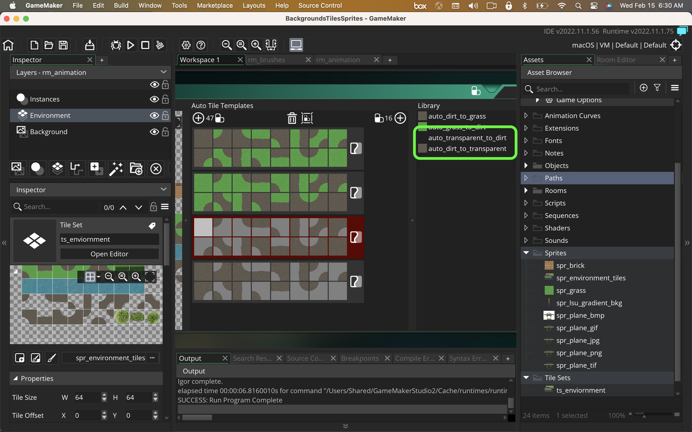

### Transparent Tiles

[previous](../animated-tiles/README.md#user-content-animated-tiles) • [home](../README.md#user-content-gms2-background-tiles--sprites---table-of-contents)

We can also have tiles that don't take up the entire volume.  We can put an alpha channel so that we can add a layer on top of an existing tile.  So we can put a tree on top of a grass tile.

 

---

##### `Step 1.`\|`BTS`|:small_blue_diamond:

Open up **P4v**.  Select the top folder of the **GameMaker** project. Press the <kbd>Checkout</kbd> button.  Checkout out all files in P4V so that they are all writable (otherwise they will be read only and none of the changes will be saved). Select a **New** changelist and add a message describing the unit of work you will be performing. Press the <kbd>OK</kbd> button.

Open up the project you are working on in **GameMaker**. 

##### `Step 2.`\|`BTS`|:small_blue_diamond: :small_blue_diamond: 

Tiles do not have to be opaque.  We can have transparent shapes that sit on top of other tiles.  I have included a tree as an example.  *Download* [TransparentTiles.psd](../Assets/Photoshop/TransparentTiles.psd).

##### `Step 3.`\|`BTS`|:small_blue_diamond: :small_blue_diamond: :small_blue_diamond:

*Copy and paste* the content of these new transparent tiles to the next free line in **sprite_environment.psd**.

##### `Step 4.`\|`BTS`|:small_blue_diamond: :small_blue_diamond: :small_blue_diamond: :small_blue_diamond:

 *Press* **File | Export | Quick Export as PNG**.  Save it in your working folder. *Opent* **spr_environment**. Press the <kbd>Import</kbd> button and select the image you exported above. *Open* up **ts_environment** and select another sprite then reassign the tile sprite to rebind the graphic.

https://user-images.githubusercontent.com/5504953/219025623-49990e9a-49fb-46a6-8904-edecc5c40b69.mp4

##### `Step 5.`\|`BTS`| :small_orange_diamond:

Clik on the the **ts_environment_6** and press the <kbd>Auto Tiling</kbd> button. Add four **16** auto tile templates for grass to dirt, dirt to grass, transparent to dirt and dirt to transparent.

https://user-images.githubusercontent.com/5504953/144304962-15ab28ab-7fd8-4eb8-af47-522974233cd7.mp4

##### `Step 6.`\|`BTS`| :small_orange_diamond: :small_blue_diamond:

Name the **Auto Tile Templates** `dirt_in_grass`, `grass_in_dirt`, `alpha_in_dirt` and `dirt_in_alpha`.

##### `Step 7.`\|`BTS`| :small_orange_diamond: :small_blue_diamond: :small_blue_diamond:

Right click on **rm_water_animation** and call it `rm_transparency`.  Move the room to the top of the **Room Order** list. Add another **Tile Layer** and call it **Environments** and **Alpha** - put them inbetween **Instances** and **Animation**.

https://user-images.githubusercontent.com/5504953/144310442-5d51cb1e-faa0-46fa-b9bc-a35814793f6e.mp4

##### `Step 8.`\|`BTS`| :small_orange_diamond: :small_blue_diamond: :small_blue_diamond: :small_blue_diamond:

*Select* the **Environments** layers and select the **ts_environment_6** tileset for the layer.  Select the **Libraries** tab and select the **grass_in_dirt** auto tile. Paint an island of grass inside the water. Select the **Alpha** layer and select the **ts_environment_6** tileset. Select the **dirt_in_alpha** layer and draw on the outside of the boundary between dirt and water.  Now go to the **Tiles** layer and add some trees on the grass.  Now *press* the <kbd>Play</kbd> button in the top menu bar to launch the game. Now we have the animation, brushes, autotiling and transparency working on the three tile layers.

https://user-images.githubusercontent.com/5504953/144313426-d170d198-0eae-4180-8824-3f09c8ca717e.mp4

##### `Step 9.`\|`BTS`| :small_orange_diamond: :small_blue_diamond: :small_blue_diamond: :small_blue_diamond: :small_blue_diamond:

Select the **File | Save Project**, then press **File | Quit** (PC) **Game Maker | Quit** on Mac to make sure everything in the game is saved.

##### `Step 10.`\|`BTS`| :large_blue_diamond:

Open up **P4V**.  Select the top folder and press the **Add** button.  We want to add all the new files we created during this last session.  Add these files to the last change list you used at the begining of the session (in my case it was `Spaceship I portion of walkthrough`). Press the <kbd>OK</kbd> button.

##### `Step 11.`\|`BTS`| :large_blue_diamond: :small_blue_diamond: 

Now you can submit the changelist by pressing both <kbd>Submit</kbd> buttons.

<!--  -->

| [previous](../animated-tiles/README.md#user-content-animated-tiles)| [home](../README.md#user-content-gms2-background-tiles--sprites---table-of-contents) | 
|---|---|
